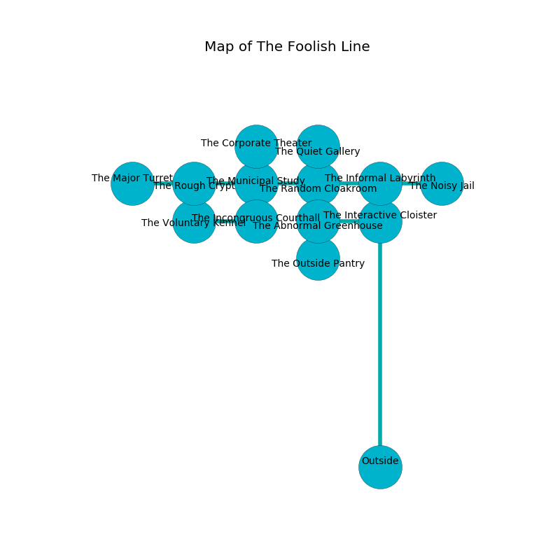

%Ruin Dogs

##The Foolish Line
###Overview
The Foolish Line is located on a cursed plain. Parts of it are incredibly cold. A massive flood is happening outside. It is occupied by Sahuagins. Forest Harrison The Inconsiderate, a Cloud Giant is here. The Sahuagins worship Forest Harrison The Inconsiderate. He  is founding a new religion. 

###Artifact
####Deda

Deda has the form of a mushy gem. It smells like currant bud. When gazed upon it projects energy. 

###Locations

####the informal labyrinth
The mirrored walls are scratched. Gray moss is growing from the walls. 

* To the south is the entrance.
* To the east a flooded pathway connects to [the noisy jail](#the-noisy-jail).
* To the west a dripping threshold connects to [the random cloakroom](#the-random-cloakroom).

####the random cloakroom
The obsidion walls are covered in mold. There are five Sahuagin Priestesses here. One of the Sahuagins is pointing a ballista at the entrance. 

* To the south a narrow passageway opens to [the abnormal greenhouse](#the-abnormal-greenhouse).
* To the east a dripping threshold connects to [the informal labyrinth](#the-informal-labyrinth).
* To the north a twisted passageway leads to [the quiet gallery](#the-quiet-gallery).
* To the west a dark artery connects to [the municipal study](#the-municipal-study).

####the municipal study
The floor is flooded with eight inch deep cold water. There are five Sahuagin Priestesses here. The stone walls are pristine. One of the Sahuagins is on watch, the rest are caring for babies. 

* There is a berry here.
* [Forest Harrison The Inconsiderate](#Forest-Harrison-The-Inconsiderate) is here.
* To the south a torchlit artery connects to [the incongruous courthall](#the-incongruous-courthall).
* To the east a dark artery opens to [the random cloakroom](#the-random-cloakroom).
* To the north a dripping pathway connects to [the corporate theater](#the-corporate-theater).
* To the west a narrow walkway connects to [the rough crypt](#the-rough-crypt).

####the noisy jail
There are five Sahuagin Priestesses here. Green mushrooms are decaying in broken urns. The air smells like vetiver here. The Sahuagins are celebrating. 

* To the west a flooded pathway connects to [the informal labyrinth](#the-informal-labyrinth).

####the abnormal greenhouse
There are five Sahuagin Priestesses here. The glass walls are covered in mold. The floor is flooded with four inch deep cold water. The Sahuagins are performing a ritual. If not interrupted, [Forest Harrison](#Forest-Harrison) will be magically alarmed. 

* [Deda](#Deda) is here.
* To the south a hazy hall connects to [the outside pantry](#the-outside-pantry).
* To the east a dark opening opens to [the interactive cloister](#the-interactive-cloister).
* To the north a narrow passageway connects to [the random cloakroom](#the-random-cloakroom).

####the quiet gallery
The floor is glossy. The metallic walls are bloodstained. The air tastes like green apple here. 

* There is a match here.
* To the south a twisted passageway connects to [the random cloakroom](#the-random-cloakroom).

####the rough crypt
There are five Sahuagin Priestesses here. If the Sahuagins notice the Ruin Dogs, one of them will retreat and alert [Forest Harrison](#Forest-Harrison). 

* To the east a narrow walkway connects to [the municipal study](#the-municipal-study).
* To the west a long gap leads to [the major turret](#the-major-turret).

####the incongruous courthall
The obsidion walls are scratched. Blue mushrooms are growing from the ceiling. 

There is an engraving on a stone written in common. 

> Oh my! cruel soul
>
> eloquent and legal
>
> it is never whole
>
> sadness is illegal
>

* There is a shirt here.
* There is a breastplate here.
* To the north a torchlit artery connects to [the municipal study](#the-municipal-study).
* To the west a dark cavern opens to [the voluntary kennel](#the-voluntary-kennel).

####the voluntary kennel
The floor is smooth. The glass walls are unsettled. White ferns are decaying from the walls. 

* To the east a dark cavern leads to [the incongruous courthall](#the-incongruous-courthall).

####the corporate theater
The air smells like bergamot here. 

* To the south a dripping pathway leads to [the municipal study](#the-municipal-study).

####the interactive cloister
There are a Tiger, a Piercer, a Lizardfolk Shaman, a Reef Shark, a Cyclops, a Giant Owl, and a Giant Toad here. The obsidion walls are unsettled. 

There is an engraving on a tablet written in common. 

> Dear me! my fate is sadistic
>
> physical, progressive, optimistic
>
> yet never ugly
>
> all is optimistic
>

* To the west a dark opening connects to [the abnormal greenhouse](#the-abnormal-greenhouse).

####the major turret
There are five Sahuagin Priestesses here. The glass walls are covered in mold. The floor is bloodstained. Yellow ferns are swaying from the ceiling. The air tastes like seashore here. If the Sahuagins notice the Ruin Dogs, one of them will retreat and alert [Forest Harrison](#Forest-Harrison). 

* To the east a long gap opens to [the rough crypt](#the-rough-crypt).

####the outside pantry
The obsidion walls are pristine. There are a Swarm of Rats, a Kuo-Toa, a Blink Dog, a Centaur, a Gelatinous Cube, and a Young Black Dragon here. 

* To the north a hazy hall connects to [the abnormal greenhouse](#the-abnormal-greenhouse).

