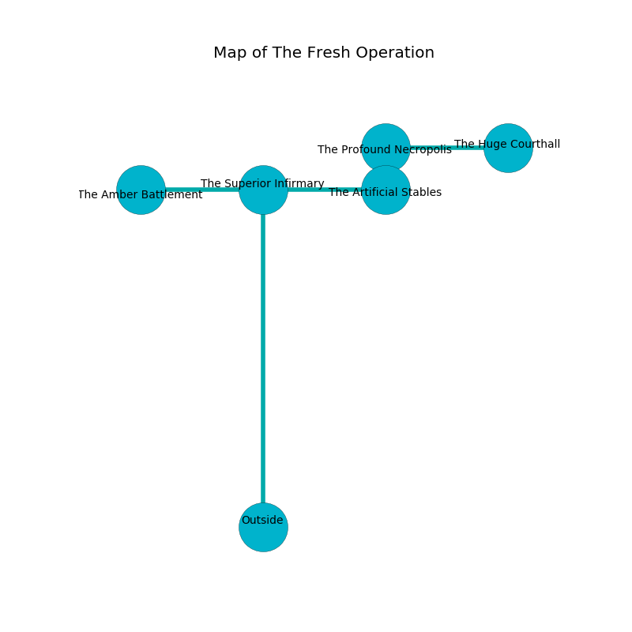

%Ruin Dogs

##The Fresh Operation
###Overview
The Fresh Operation is located in a poisoned rift. Parts of it are foggy. A solar eclipse is happening outside. It is occupied by Thri-Kreens. Bunny Dutton The Detached, a Cyclops is here. The Thri-Kreens are the minions of Bunny Dutton The Detached. She  is founding a new religion. 

###Artifact
####The Secure Skill

The Secure Skill looks like a soft meteorite. Air bends near it. When picked up it levitates surrounding objects. 

###Locations

####the superior infirmary
The floor is glossy. The crystal walls are scratched. 

* [The Secure Skill](#The-Secure-Skill) is here.
* To the south is the entrance.
* To the east a flooded cavern opens to [the artificial stables](#the-artificial-stables).
* To the west a windy opening connects to [the amber battlement](#the-amber-battlement).

####the artificial stables
The obsidion walls are unsettled. The floor is flooded with two inch deep hot water. There are five Thri-Kreens here. White moss is decaying in a patch on the floor. The air tastes like balsamic here. The Thri-Kreens are performing a ritual. If not interrupted, a powerful monster will be summoned. 

There is an engraving on a stone written in Thri-Kreens Script. 

> O! our fate is poor
>
> mature, conscious, pure
>
> integrated and genetic
>
> fate is pure
>

* There is a church here.
* To the north a dripping cavern connects to [the profound necropolis](#the-profound-necropolis).
* To the west a flooded cavern leads to [the superior infirmary](#the-superior-infirmary).

####the profound necropolis
There are a Nothic and a Beholder Zombie here. The air tastes like milk here. The floor is bloodstained. Green mushrooms are growing from the ceiling. 

* [Bunny Dutton The Detached](#Bunny-Dutton-The-Detached) is here.
* To the south a dripping cavern connects to [the artificial stables](#the-artificial-stables).
* To the east a twisted artery connects to [the huge courthall](#the-huge-courthall).

####the huge courthall
The concrete walls are bloodstained. The air tastes like honeydew here. There is a trap here. When activated, a pressure plate will fire a scything blade. 

* To the west a twisted artery leads to [the profound necropolis](#the-profound-necropolis).

####the amber battlement
Gray moss is swaying in broken urns. 

* To the east a windy opening leads to [the superior infirmary](#the-superior-infirmary).

