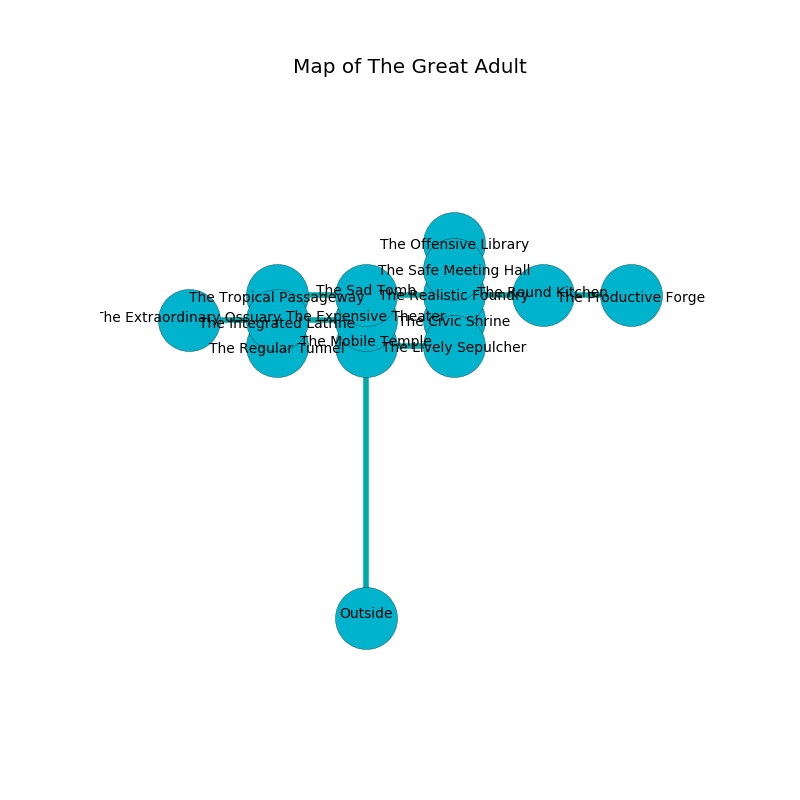

%Ruin Dogs

##The Great Adult
###Overview
The Great Adult is constructed on a poisoned city. Parts of it are corrupted. A lunar eclipse is happening outside. It is occupied by Lizardfolk. Wiley Acosta The Careless, a Sahuagin Priestess is here. The Lizardfolk are battling Wiley Acosta The Careless. He  is founding a new religion. 

###Artifact
####Idud

Idud has the form of a mushy sphere. It smells like petroleum. Gravity bends towards it. When thrown it burns the mind. 

###Locations

####the sad tomb
The floor is sticky. There are four Lizardfolk and a Lizardfolk Shaman here. The Lizardfolk are performing a ritual. If not interrupted, the Lizardfolk will become more powerful. 

* To the south is the entrance.
* To the east a dripping cavern connects to [the realistic foundry](#the-realistic-foundry).
* To the west a narrow passageway opens to [the tropical passageway](#the-tropical-passageway).

####the tropical passageway
Gray razorgrass is decaying in cracks in the floor. There are an Azer, a Goat, a Myconid Sovereign, a Worg, and a Flying Snake here. 

* To the south a small hall opens to [the integrated latrine](#the-integrated-latrine).
* To the east a narrow passageway leads to [the sad tomb](#the-sad-tomb).

####the integrated latrine
There are two Lizardfolk and a Lizardfolk Shaman here. The floor is glossy. The glass walls are bloodstained. White razorgrass is growing from the walls. The Lizardfolk are willing to negotiate. 

* There is a dog here.
* There is a trophy here.
* There is a wand here.
* There is a rail here.
* To the south a narrow artery opens to [the regular tunnel](#the-regular-tunnel).
* To the east a narrow path opens to [the expensive theater](#the-expensive-theater).
* To the north a small hall opens to [the tropical passageway](#the-tropical-passageway).
* To the west a dark passageway connects to [the extraordinary ossuary](#the-extraordinary-ossuary).

####the realistic foundry
Gray ferns are swaying from the ceiling. There are two Lizardfolk and a Lizardfolk Shaman here. The Lizardfolk are performing a ritual. If not interrupted, [Wiley Acosta](#Wiley-Acosta) will be magically alarmed. 

There is an engraving on the ceiling written in common. 

> You are envious
>
> thirsty and unlawful
>
> sophisticated, past, medieval
>
> A sock is a guarantee
>
> welcome and comparable
>
> You are envious
>

* To the south a torchlit cave connects to [the civic shrine](#the-civic-shrine).
* To the east a windy passageway leads to [the round kitchen](#the-round-kitchen).
* To the north a long path connects to [the safe meeting hall](#the-safe-meeting-hall).
* To the west a dripping cavern leads to [the sad tomb](#the-sad-tomb).

####the safe meeting hall
The floor is flooded with one inch deep hot water. 

* There is a screw here.
* To the south a long path connects to [the realistic foundry](#the-realistic-foundry).
* To the north a long hallway connects to [the offensive library](#the-offensive-library).

####the civic shrine
The air smells like anise here. The metallic walls are ruined. There are two Lizardfolk Shamans here. The Lizardfolk are willing to negotiate. 

* To the south a small hall opens to [the lively sepulcher](#the-lively-sepulcher).
* To the north a torchlit cave opens to [the realistic foundry](#the-realistic-foundry).

####the extraordinary ossuary
The floor is smooth. The concrete walls are bloodstained. 

* There is a berry here.
* To the east a dark passageway leads to [the integrated latrine](#the-integrated-latrine).

####the regular tunnel
There are two Lizardfolk Shamans here. The Lizardfolk are performing a ritual. If not interrupted, [Wiley Acosta](#Wiley-Acosta) will be magically alarmed. 

* There is a specter here.
* There is a flag here.
* To the north a narrow artery opens to [the integrated latrine](#the-integrated-latrine).

####the round kitchen
Gray moss is decaying in a patch on the floor. There are a Constrictor Snake, a Goat, a Saber-Toothed Tiger, a Boar, and a Yuan-Ti Malison here. The floor is glossy. 

* To the east a flooded walkway connects to [the productive forge](#the-productive-forge).
* To the west a windy passageway leads to [the realistic foundry](#the-realistic-foundry).

####the expensive theater
The stone walls are pristine. The floor is sticky. 

* [Wiley Acosta The Careless](#Wiley-Acosta-The-Careless) is here.
* To the west a narrow path leads to [the integrated latrine](#the-integrated-latrine).

####the productive forge
The floor is sticky. There are a Gnoll Pack Lord, a Specter, and a Deep Gnome here. Blue razorgrass is growing from the walls. The air tastes like strawberry here. The brick walls are scratched. 

There is an engraving on a tablet written in common. 

> I am hidden.
>
> I tried fighting.
>

* To the west a flooded walkway leads to [the round kitchen](#the-round-kitchen).

####the offensive library
The metallic walls are unsettled. There are two Lizardfolk Shamans here. White razorgrass is decaying in broken urns. The air tastes like black currant here. The Lizardfolk are performing a ritual. If not interrupted, [Wiley Acosta](#Wiley-Acosta) will be magically alarmed. 

* There is a carriage here.
* There is a trousers here.
* To the south a long hallway connects to [the safe meeting hall](#the-safe-meeting-hall).

####the lively sepulcher
The brick walls are caving in. The air smells like raisin here. There are two Lizardfolk and a Lizardfolk Shaman here. The Lizardfolk are fighting amongst themselves. 

There is an engraving on the wall written in common. 

> I want to find [Idud](#Idud).
>
> A trap ahead.
>

* [Idud](#Idud) is here.
* To the north a small hall connects to [the civic shrine](#the-civic-shrine).
* To the west a long cavern leads to [the mobile temple](#the-mobile-temple).

####the mobile temple
Green mushrooms are swaying from the ceiling. There is a Minotaur here. 

* To the east a long cavern leads to [the lively sepulcher](#the-lively-sepulcher).

