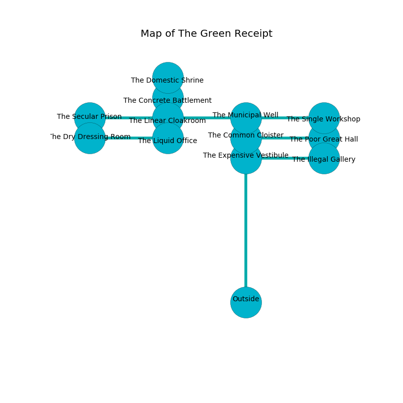

%Ruin Dogs

##The Green Receipt
###Overview
The Green Receipt is located in a poisoned rift. Regions of it are inaccessible. A massive storm is happening outside. It is occupied by Orc. Elton Renner The Stupid, a Quaggoth is here. The Orc are battling Elton Renner The Stupid. He  is trying to discover [Emmuomcabamd](#Emmuomcabamd). 

###Artifact
####Emmuomcabamd

Emmuomcabamd is a powerful artifact in the shape of a cold orb. It smells like basil. When worn it destroys others. 

###Locations

####the common cloister
Yellow razorgrass is sprouting in broken urns. There are six Orcs here. One of the Orc is on watch, the rest are fighting amongst themselves. 

* [Elton Renner The Stupid](#Elton-Renner-The-Stupid) is here.
* To the south is the entrance.
* To the east a torchlit path connects to [the poor great hall](#the-poor-great-hall).
* To the north a windy artery opens to [the municipal well](#the-municipal-well).

####the municipal well
The floor is glossy. The air smells like ylang here. There are six Orcs here. The crystal walls are bloodstained. One of the Orc is pointing a ballista at the entrance. 

* To the south a windy artery leads to [the common cloister](#the-common-cloister).
* To the east a dark threshold opens to [the single workshop](#the-single-workshop).
* To the west a twisted cavern leads to [the linear cloakroom](#the-linear-cloakroom).

####the linear cloakroom
The floor is bloodstained. The wooden walls are unsettled. White ferns are swaying in cracks in the floor. There are a Bandit Captain and an Old Faerie Dragon here. 

* To the south a narrow opening opens to [the liquid office](#the-liquid-office).
* To the east a twisted cavern opens to [the municipal well](#the-municipal-well).
* To the north a narrow walkway connects to [the concrete battlement](#the-concrete-battlement).
* To the west a dark walkway opens to [the secular prison](#the-secular-prison).

####the liquid office
White mushrooms are sprouting from the walls. The floor is cluttered with ashes. There are a Tiger and a Nothic here. The concrete walls are pristine. 

* [Emmuomcabamd](#Emmuomcabamd) is here.
* To the north a narrow opening connects to [the linear cloakroom](#the-linear-cloakroom).
* To the west a torchlit hall opens to [the dry dressing room](#the-dry-dressing-room).

####the poor great hall
The air tastes like orris here. 

There is an engraving on a monolith written in Orc Script. 

> Leave at once.
>

* To the south a torchlit passageway leads to [the illegal gallery](#the-illegal-gallery).
* To the west a torchlit path connects to [the common cloister](#the-common-cloister).

####the illegal gallery
Green ferns are growing in a patch on the floor. 

* To the north a torchlit passageway connects to [the poor great hall](#the-poor-great-hall).
* To the west a hazy passageway connects to [the expensive vestibule](#the-expensive-vestibule).

####the concrete battlement
The brick walls are ruined. The air tastes like soup here. 

* To the south a narrow walkway opens to [the linear cloakroom](#the-linear-cloakroom).
* To the north a torchlit artery opens to [the domestic shrine](#the-domestic-shrine).

####the single workshop
The floor is cluttered with debris. The air tastes like cornmeal here. The stone walls are pristine. 

There is an engraving on the ceiling written in Orc Script. 

> I am the best.
>

* To the west a dark threshold opens to [the municipal well](#the-municipal-well).

####the secular prison
The wooden walls are scratched. Blue mushrooms are decaying from the ceiling. 

There is an engraving on the wall written in Orc Script. 

> Dig here.
>

* There is a bell here.
* To the east a dark walkway leads to [the linear cloakroom](#the-linear-cloakroom).

####the expensive vestibule
The brick walls are scratched. There is a trap here. When activated, a tripwire will launch a ceiling pendulum. Blue lichens are sprouting in broken urns. The floor is cluttered with broken glass. 

* To the east a hazy passageway leads to [the illegal gallery](#the-illegal-gallery).

####the domestic shrine
Red ferns are decaying in a patch on the floor. The air tastes like boysenberry here. There are six Orcs here. One of the Orc is on watch, the rest are caring for babies. 

* To the south a torchlit artery connects to [the concrete battlement](#the-concrete-battlement).

####the dry dressing room
Gray lichens are growing in broken urns. The floor is sticky. The air tastes like wormwood here. 

* To the east a torchlit hall opens to [the liquid office](#the-liquid-office).

