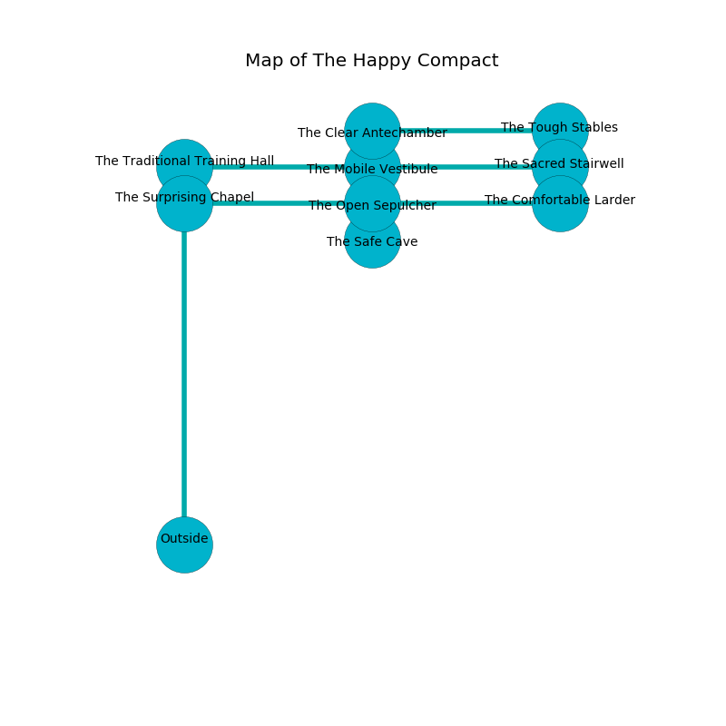

%Ruin Dogs

##The Happy Compact
###Overview
The Happy Compact is located on a cursed rift. Regions of it are cursed. A battle between raiders is happening outside. It is occupied by Centaurs. Hal Kearns The Ruthless, an Ogre is here. The Centaurs are ruled by Hal Kearns The Ruthless. He  is founding a new religion. 

###Artifact
####The Offensive Round

The Offensive Round is a powerful artifact in the shape of a sharp rock. It is a pale pink color. Psychic energy slides towards it. When rubbed it makes its owner invisible. 

###Locations

####the surprising chapel
The air tastes like oak wood here. There are two Centaurs here. The floor is cluttered with rocks. The concrete walls are caving in. One of the Centaurs is pointing a ballista at the entrance. 

There is an engraving on the floor written in common. 

> Leave now.
>

* To the south is the entrance.
* To the east a narrow gap opens to [the open sepulcher](#the-open-sepulcher).

####the open sepulcher
Blue mushrooms are decaying in cracks in the floor. There are two Centaurs here. The Centaurs are feasting. 

There is an engraving on a stone written in common. 

> I am seeking [The Offensive Round](#The-Offensive-Round).
>
> I thought about leaving.
>

* To the south a dripping cavern opens to [the safe cave](#the-safe-cave).
* To the east a hazy pathway connects to [the comfortable larder](#the-comfortable-larder).
* To the north a windy pathway leads to [the mobile vestibule](#the-mobile-vestibule).
* To the west a narrow gap opens to [the surprising chapel](#the-surprising-chapel).

####the safe cave
The air smells like marshmallow here. There are two Centaurs here. The Centaurs are performing a ritual. If not interrupted, a powerful monster will be summoned. 

* To the north a dripping cavern leads to [the open sepulcher](#the-open-sepulcher).

####the mobile vestibule
White lichens are sprouting in broken urns. There are a Camel, a Drow, a Lizardfolk, a Giant Crab, a Giant Frog, and an Ogre Zombie here. 

* [The Offensive Round](#The-Offensive-Round) is here.
* To the south a windy pathway leads to [the open sepulcher](#the-open-sepulcher).
* To the east a dark cavern opens to [the sacred stairwell](#the-sacred-stairwell).
* To the north a hazy threshold leads to [the clear antechamber](#the-clear-antechamber).
* To the west a twisted pathway leads to [the traditional training hall](#the-traditional-training-hall).

####the clear antechamber
The mirrored walls are scratched. There are two Centaurs here. The Centaurs are willing to negotiate. 

* To the south a hazy threshold connects to [the mobile vestibule](#the-mobile-vestibule).
* To the east a windy cavern connects to [the tough stables](#the-tough-stables).

####the sacred stairwell
There are a Polar Bear, a Rat, an Aarakocra, an Ochre Jelly, a Dretch, a Bat, and a Crawling Claw here. Yellow lichens are growing from the ceiling. The mirrored walls are pristine. The floor is glossy. 

* There is a triptych here.
* [Hal Kearns The Ruthless](#Hal-Kearns-The-Ruthless) is here.
* To the west a dark cavern leads to [the mobile vestibule](#the-mobile-vestibule).

####the comfortable larder
Blue lichens are swaying from the ceiling. The floor is flooded with two inch deep lukewarm water. The concrete walls are bloodstained. There are two Centaurs here. If the Centaurs notice the Ruin Dogs, one of them will retreat and alert the others. 

There is an engraving on the floor written in Centaurs Script. 

> O everything is poor
>
> it is always late
>
> yet never obscure
>
> all is great
>

* There is a bottle here.
* To the west a hazy pathway leads to [the open sepulcher](#the-open-sepulcher).

####the tough stables
The floor is cluttered with ashes. There is a trap here. When activated, a tripwire will open a trapdoor in the floor. Blue moss is decaying from the ceiling. The air smells like flesh here. The wooden walls are pristine. There are two Centaurs here. The Centaurs are sleeping. 

There is an engraving on a tablet written in common. 

> Leave at once.
>

* To the west a windy cavern leads to [the clear antechamber](#the-clear-antechamber).

####the traditional training hall
The floor is smooth. The air smells like melon rind here. There are a Scarecrow, an Intellect Devourer, and a Crawling Claw here. 

There is an engraving on a stone written in Centaurs Script. 

> I am free.
>

* There is a bowl here.
* There is a pendant here.
* To the east a twisted pathway connects to [the mobile vestibule](#the-mobile-vestibule).

