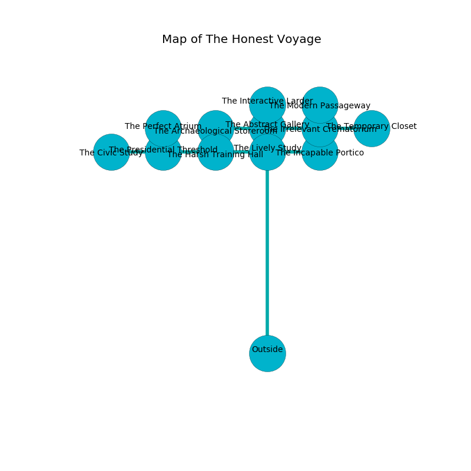

%Ruin Dogs

##The Honest Voyage
###Overview
The Honest Voyage is located on a haunted city. Some rooms of it are inaccessible. A lunar eclipse is happening outside. It is occupied by Thri-Kreens. Liberty Fine The Impulsive, a Hobgoblin Captain is here. The Thri-Kreens have been charmed by Liberty Fine The Impulsive. She  is founding a new religion. 

###Artifact
####The Restricted Torch

The Restricted Torch looks like a hard prism. It is a medium gray color. Cacophony flows near it. When worn it becomes a deadly projectile. 

###Locations

####the lively study
The stone walls are bloodstained. There is a trap here. When activated, a magical sound detector will extend a spring loaded spear. The air smells like roasted barley here. 

There is an engraving on the wall written in common. 

> I can not find [The Restricted Torch](#The-Restricted-Torch).
>
> Leave at once.
>

* To the south is the entrance.
* To the east a windy cavern opens to [the incapable portico](#the-incapable-portico).
* To the north a narrow hallway opens to [the abstract gallery](#the-abstract-gallery).
* To the west a flooded cavern opens to [the harsh training hall](#the-harsh-training-hall).

####the abstract gallery
There are an Incubus and an Old Faerie Dragon here. The air tastes like ripe banana here. The mirrored walls are covered in mold. There is a trap here. When activated, a pressure plate will ring a bell. 

* There is a bee here.
* To the south a narrow hallway opens to [the lively study](#the-lively-study).
* To the east a dark hall connects to [the irrelevant crematorium](#the-irrelevant-crematorium).
* To the north a windy corridor opens to [the interactive larder](#the-interactive-larder).
* To the west a small cavern opens to [the archaeological storeroom](#the-archaeological-storeroom).

####the irrelevant crematorium
There are four Thri-Kreens here. The floor is cluttered with debris. The concrete walls are pristine. The Thri-Kreens are willing to negotiate. 

* To the east a hazy threshold connects to [the temporary closet](#the-temporary-closet).
* To the north a narrow cave connects to [the modern passageway](#the-modern-passageway).
* To the west a dark hall opens to [the abstract gallery](#the-abstract-gallery).

####the incapable portico
The floor is cluttered with bones. 

* To the west a windy cavern opens to [the lively study](#the-lively-study).

####the archaeological storeroom
The air tastes like spruce here. The floor is smooth. The concrete walls are ruined. Yellow razorgrass is swaying in a patch on the floor. 

* To the east a small cavern leads to [the abstract gallery](#the-abstract-gallery).

####the harsh training hall
The air smells like walnut here. There are an Octopus and a Lizard King here. 

* There is an imp here.
* [Liberty Fine The Impulsive](#Liberty-Fine-The-Impulsive) is here.
* To the east a flooded cavern opens to [the lively study](#the-lively-study).
* To the west a hazy opening leads to [the presidential threshold](#the-presidential-threshold).

####the interactive larder
The air smells like spinach here. The crystal walls are ruined. There are four Thri-Kreens here. The floor is sticky. The Thri-Kreens are meditating. 

* To the south a windy corridor leads to [the abstract gallery](#the-abstract-gallery).

####the presidential threshold
There are a Gnoll, a Scarecrow, a Dire Wolf, a Kuo-Toa, a Magmin, and a Quaggoth Spore Servant here. The mirrored walls are pristine. 

* [The Restricted Torch](#The-Restricted-Torch) is here.
* To the east a hazy opening connects to [the harsh training hall](#the-harsh-training-hall).
* To the north a torchlit walkway connects to [the perfect atrium](#the-perfect-atrium).
* To the west a twisted path connects to [the civic study](#the-civic-study).

####the perfect atrium
The metallic walls are bloodstained. 

* To the south a torchlit walkway opens to [the presidential threshold](#the-presidential-threshold).

####the modern passageway
The air smells like bouillon here. The floor is flooded with three inch deep cold water. The concrete walls are pristine. 

* To the south a narrow cave opens to [the irrelevant crematorium](#the-irrelevant-crematorium).

####the temporary closet
Red mushrooms are swaying from the walls. There is a trap here. When activated, a tripwire will fire a scything blade. There are a Bugbear Chief and a Druid here. The metallic walls are unsettled. The floor is glossy. 

* To the west a hazy threshold connects to [the irrelevant crematorium](#the-irrelevant-crematorium).

####the civic study
Blue ferns are swaying in a patch on the floor. The obsidion walls are unsettled. There are a Ghast, a Berserker, and a Raven here. 

There is an engraving on the wall written in Thri-Kreens Script. 

> I am lost in The Honest Voyage.
>

* To the east a twisted path connects to [the presidential threshold](#the-presidential-threshold).

