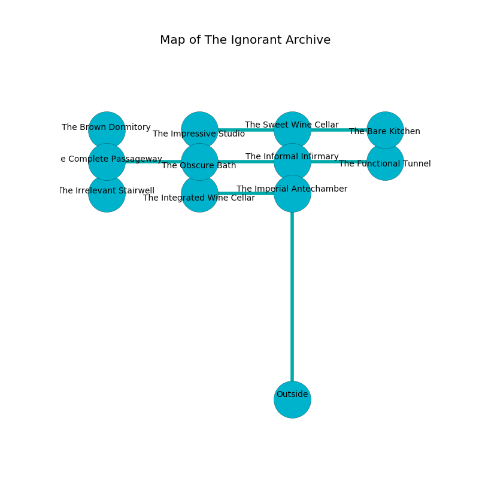

%Ruin Dogs

##The Ignorant Archive
###Overview
The Ignorant Archive is located in a cursed plain. Regions of The Ignorant Archive are flooded. The ruin is burning. It is occupied by Deep Gnomes. Jules Greco The Deceitful, a Cloud Giant is here. The Deep Gnomes are ruled by Jules Greco The Deceitful. He  is founding a new religion. 

###Artifact
####The Toxic Contempt

The Toxic Contempt has the form of a wet prism. When cradled it destroys itself. 

###Locations

####the informal infirmary
The stone walls are unsettled. 

* To the south is the entrance.
* To the east a long walkway connects to [the functional tunnel](#the-functional-tunnel).
* To the north a dripping corridor connects to [the sweet wine cellar](#the-sweet-wine-cellar).
* To the west a dripping hall leads to [the obscure bath](#the-obscure-bath).

####the obscure bath
There is a trap here. When activated, a magical proximity detector will launch a rolling boulder. The air tastes like tobacco here. The brick walls are covered in mold. 

* To the south a torchlit cave leads to [the integrated wine cellar](#the-integrated-wine-cellar).
* To the east a dripping hall connects to [the informal infirmary](#the-informal-infirmary).
* To the west a twisted gap connects to [the complete passageway](#the-complete-passageway).

####the functional tunnel
The floor is bloodstained. The metallic walls are ruined. The air smells like sausage here. There are twenty Deep Gnomes here. The Deep Gnomes are meditating. 

* There is a book here.
* [Jules Greco The Deceitful](#Jules-Greco-The-Deceitful) is here.
* To the west a long walkway opens to [the informal infirmary](#the-informal-infirmary).

####the complete passageway
Green razorgrass is decaying in a patch on the floor. The air tastes like coconut here. The floor is bloodstained. 

* To the south a flooded pathway opens to [the irrelevant stairwell](#the-irrelevant-stairwell).
* To the east a twisted gap connects to [the obscure bath](#the-obscure-bath).
* To the north a small pathway opens to [the brown dormitory](#the-brown-dormitory).

####the integrated wine cellar
The air tastes like cypress here. Blue lichens are sprouting from the walls. The obsidion walls are caving in. The floor is sticky. 

There is an engraving on the wall written in Deep Gnomes Script. 

> I discovered this place.
>
> Maybe try giving up.
>

* To the east a flooded hall connects to [the imperial antechamber](#the-imperial-antechamber).
* To the north a torchlit cave opens to [the obscure bath](#the-obscure-bath).

####the sweet wine cellar
There are a Giant Badger, a Goblin, and a Young Gold Dragon here. 

* [The Toxic Contempt](#The-Toxic-Contempt) is here.
* To the south a dripping corridor connects to [the informal infirmary](#the-informal-infirmary).
* To the east a windy hall leads to [the bare kitchen](#the-bare-kitchen).
* To the west a narrow cavern opens to [the impressive studio](#the-impressive-studio).

####the bare kitchen
The floor is bloodstained. There are twenty Deep Gnomes here. The concrete walls are unsettled. The Deep Gnomes are caring for babies. 

* There is a cart here.
* To the west a windy hall opens to [the sweet wine cellar](#the-sweet-wine-cellar).

####the brown dormitory
The air smells like taco here. Yellow lichens are growing from the ceiling. There are a Cambion, a Shambling Mound, a Commoner, two Gricks, a Troglodyte, an Ice Mephit, a Poisonous Snake, and  here. The floor is cluttered with shells. 

* To the south a small pathway connects to [the complete passageway](#the-complete-passageway).

####the irrelevant stairwell
The floor is cluttered with ashes. 

* To the north a flooded pathway connects to [the complete passageway](#the-complete-passageway).

####the imperial antechamber
The air tastes like smoked sausage here. The concrete walls are caving in. Yellow ferns are sprouting from the ceiling. 

* To the west a flooded hall connects to [the integrated wine cellar](#the-integrated-wine-cellar).

####the impressive studio
The air smells like melon here. 

* To the east a narrow cavern connects to [the sweet wine cellar](#the-sweet-wine-cellar).

