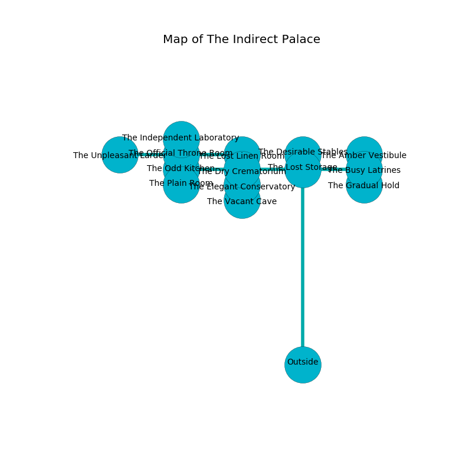

%Ruin Dogs

##The Indirect Palace
###Overview
The Indirect Palace is constructed on a broken plain. Some areas of The Indirect Palace are flooded. A windstorm is happening outside. It is occupied by Orc. Debbi Spivey The Dishonest, a Myconid Sovereign is here. The Orc are the minions of Debbi Spivey The Dishonest. She  is trying to destroy [Caelmawi Laeebadaf](#Caelmawi-Laeebadaf). 

###Artifact
####Caelmawi Laeebadaf

Caelmawi Laeebadaf is a powerful artifact in the shape of a hard orb. Magic bends around it. When rubbed it dissappears. 

###Locations

####the lost storage
The crystal walls are caving in. The floor is flooded with five inch deep lukewarm water. 

* To the south is the entrance.
* To the east a torchlit path opens to [the busy latrines](#the-busy-latrines).
* To the north a windy pathway leads to [the desirable stables](#the-desirable-stables).
* To the west a hazy passageway leads to [the dry crematorium](#the-dry-crematorium).

####the dry crematorium
There are a Myconid Adult and a Giant Elk here. Gray moss is swaying from the walls. 

There is an engraving on the wall written in common. 

> Poor me! the world is woe
>
> thin, able, slow
>
> ignorant, easy, narrow
>
> all is low
>

* To the south a narrow hall connects to [the elegant conservatory](#the-elegant-conservatory).
* To the east a hazy passageway leads to [the lost storage](#the-lost-storage).
* To the west a small threshold opens to [the odd kitchen](#the-odd-kitchen).

####the odd kitchen
The floor is sticky. The concrete walls are pristine. Gray razorgrass is decaying in a patch on the floor. 

There is an engraving on a tablet written in Orc Script. 

> [Caelmawi Laeebadaf](#Caelmawi-Laeebadaf)
>
> complete, financial, unanimous
>
> large, serious, valuable
>

* To the south a dark threshold leads to [the plain room](#the-plain-room).
* To the east a small threshold connects to [the dry crematorium](#the-dry-crematorium).
* To the north a dripping cave leads to [the official throne room](#the-official-throne-room).

####the plain room
The brick walls are scratched. The air smells like spruce here. 

* To the north a dark threshold opens to [the odd kitchen](#the-odd-kitchen).

####the desirable stables
The glass walls are pristine. Blue ferns are growing from the walls. There are a Giant Boar and a Flying Sword here. 

* To the south a windy pathway leads to [the lost storage](#the-lost-storage).

####the official throne room
White razorgrass is growing in broken urns. The floor is bloodstained. 

* To the south a dripping cave connects to [the odd kitchen](#the-odd-kitchen).
* To the east a windy opening leads to [the lost linen room](#the-lost-linen-room).
* To the north a torchlit walkway connects to [the independent laboratory](#the-independent-laboratory).
* To the west a narrow artery leads to [the unpleasant larder](#the-unpleasant-larder).

####the busy latrines
The metallic walls are caving in. 

* [Caelmawi Laeebadaf](#Caelmawi-Laeebadaf) is here.
* [Debbi Spivey The Dishonest](#Debbi-Spivey-The-Dishonest) is here.
* To the south a windy corridor leads to [the gradual hold](#the-gradual-hold).
* To the north a twisted pathway opens to [the amber vestibule](#the-amber-vestibule).
* To the west a torchlit path connects to [the lost storage](#the-lost-storage).

####the elegant conservatory
There are four Orcs here. The floor is glossy. The Orc are crazy with bloodlust. 

* To the south a windy opening connects to [the vacant cave](#the-vacant-cave).
* To the north a narrow hall connects to [the dry crematorium](#the-dry-crematorium).

####the independent laboratory
The floor is flooded with seven inch deep cool water. The crystal walls are pristine. 

* To the south a torchlit walkway leads to [the official throne room](#the-official-throne-room).

####the vacant cave
The floor is bloodstained. The obsidion walls are pristine. Green razorgrass is sprouting in a patch on the floor. 

* To the north a windy opening connects to [the elegant conservatory](#the-elegant-conservatory).

####the lost linen room
The glass walls are ruined. The floor is bloodstained. The air smells like hay here. 

There is an engraving on a monolith written in common. 

> Run away.
>

* There is a trophy here.
* There is a skull here.
* To the west a windy opening leads to [the official throne room](#the-official-throne-room).

####the amber vestibule
The air smells like magnolia here. There are four Orcs here. The obsidion walls are caving in. The floor is glossy. Red ferns are swaying from the ceiling. If the Orc notice the Ruin Dogs, one of them will retreat and alert the others. 

* To the south a twisted pathway connects to [the busy latrines](#the-busy-latrines).

####the unpleasant larder
The wooden walls are bloodstained. Gray mushrooms are decaying in cracks in the floor. The air tastes like huckleberry here. 

* To the east a narrow artery connects to [the official throne room](#the-official-throne-room).

####the gradual hold
Green ferns are decaying in broken urns. 

There is an engraving on a monolith written in common. 

> A cheese is a fibre
>
> satisfactory and accurate
>
> yet cheap
>
> unlawful and political
>
> frank and mutual
>
> meaningful, dominant, specified
>
> digital, awake, awful
>
> implicit, dull, medieval
>
> [Caelmawi Laeebadaf](#Caelmawi-Laeebadaf)
>
> ever shallow
>
> opposed and absolute
>
> bald, excited, tropical
>
> You are lost
>
> but never light
>
> organic, cold, portable
>
> municipal, successful, abundant
>
> but never surprised
>
> flat and functional
>
> A cheese is a fibre
>

* To the north a windy corridor connects to [the busy latrines](#the-busy-latrines).

