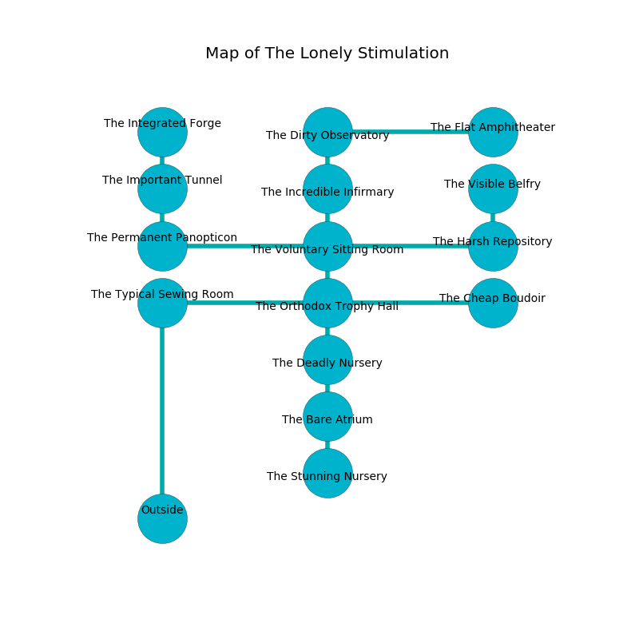

%Ruin Dogs

##The Lonely Stimulation
###Overview
The Lonely Stimulation is located in a cursed mountain. Some areas of The Lonely Stimulation are corrupted. The ruin is flooding. It is occupied by Kenku. Jackie Baumgardner The Impatient, a Fire Giant is here. The Kenku are the minions of Jackie Baumgardner The Impatient. He  is founding a new religion. 

###Artifact
####Imefamuhlaf Chewi

Imefamuhlaf Chewi is a powerful artifact in the shape of a sharp figurine. It is a bright yellow color. When rubbed it burns the mind. 

###Locations

####the typical sewing room
There are a Plesiosaurus, a Young Remorhaz, and a Chuul here. White ferns are sprouting in broken urns. The metallic walls are unsettled. The air smells like caraway here. 

There is an engraving on a monolith written in common. 

> Dear me! life is woe
>
> flexible and slow
>
> always formal
>
> the world is abnormal
>

* To the south is the entrance.
* To the east a dripping artery connects to [the orthodox trophy hall](#the-orthodox-trophy-hall).

####the orthodox trophy hall
The air smells like shrimp here. The floor is glossy. 

* There is a finger here.
* To the south a dark artery connects to [the deadly nursery](#the-deadly-nursery).
* To the east a narrow walkway connects to [the cheap boudoir](#the-cheap-boudoir).
* To the north a long cavern leads to [the voluntary sitting Room](#the-voluntary-sitting-Room).
* To the west a dripping artery leads to [the typical sewing room](#the-typical-sewing-room).

####the voluntary sitting Room
The floor is cluttered with rocks. The air tastes like cinnamon here. There are a Gelatinous Cube and a Tyrannosaurus Rex here. 

* There is a scissors here.
* To the south a long cavern leads to [the orthodox trophy hall](#the-orthodox-trophy-hall).
* To the east a small passageway opens to [the harsh repository](#the-harsh-repository).
* To the north a dark walkway opens to [the incredible infirmary](#the-incredible-infirmary).
* To the west a long pathway opens to [the permanent panopticon](#the-permanent-panopticon).

####the cheap boudoir
The wooden walls are scratched. The air smells like mandarin here. 

* There is a nail here.
* To the west a narrow walkway connects to [the orthodox trophy hall](#the-orthodox-trophy-hall).

####the permanent panopticon
Gray lichens are sprouting from the walls. The air smells like gasoline here. The crystal walls are bloodstained. 

* To the east a long pathway opens to [the voluntary sitting Room](#the-voluntary-sitting-Room).
* To the north a windy path leads to [the important tunnel](#the-important-tunnel).

####the incredible infirmary
The glass walls are pristine. The floor is smooth. There are forty Kenkus here. One of the Kenku is working a mechanism that can lock the exits. 

* There is a snake here.
* To the south a dark walkway connects to [the voluntary sitting Room](#the-voluntary-sitting-Room).
* To the north a small walkway opens to [the dirty observatory](#the-dirty-observatory).

####the deadly nursery
The floor is bloodstained. There are forty Kenkus here. One of the Kenku is on watch, the rest are meditating. 

There is an engraving on the floor written in common. 

> Oh my life is inhumane
>
> it is always main
>
> but real
>
> fate is main
>

* To the south a twisted cavern leads to [the bare atrium](#the-bare-atrium).
* To the north a dark artery leads to [the orthodox trophy hall](#the-orthodox-trophy-hall).

####the harsh repository
The air smells like fudge here. Yellow razorgrass is sprouting in broken urns. The glass walls are bloodstained. 

* To the north a small artery opens to [the visible belfry](#the-visible-belfry).
* To the west a small passageway connects to [the voluntary sitting Room](#the-voluntary-sitting-Room).

####the visible belfry
The air smells like toasted grain here. The floor is cluttered with debris. Red mushrooms are swaying in broken urns. 

There is an engraving on the wall written in common. 

> [Imefamuhlaf Chewi](#Imefamuhlaf-Chewi)
>
> ever standard
>
> A cup is a siege
>
> always intense
>
> A chain is a freshman
>
> yet bald
>
> [Imefamuhlaf Chewi](#Imefamuhlaf-Chewi)
>
> amber and monstrous
>

* To the south a small artery opens to [the harsh repository](#the-harsh-repository).

####the bare atrium
Gray razorgrass is swaying from the ceiling. 

* To the south a twisted gap leads to [the stunning nursery](#the-stunning-nursery).
* To the north a twisted cavern connects to [the deadly nursery](#the-deadly-nursery).

####the important tunnel
Yellow mushrooms are growing from the walls. The floor is smooth. The air smells like urine here. 

* To the south a windy path leads to [the permanent panopticon](#the-permanent-panopticon).
* To the north a twisted gap leads to [the integrated forge](#the-integrated-forge).

####the dirty observatory
The obsidion walls are caving in. Red lichens are swaying from the walls. The air smells like spruce here. 

* [Imefamuhlaf Chewi](#Imefamuhlaf-Chewi) is here.
* [Jackie Baumgardner The Impatient](#Jackie-Baumgardner-The-Impatient) is here.
* To the south a small walkway leads to [the incredible infirmary](#the-incredible-infirmary).
* To the east a dripping hall leads to [the flat amphitheater](#the-flat-amphitheater).

####the integrated forge
There are forty Kenkus here. The floor is smooth. The Kenku are performing a ritual. If not interrupted, a powerful monster will be summoned. 

* To the south a twisted gap opens to [the important tunnel](#the-important-tunnel).

####the stunning nursery
There are forty Kenkus here. If the Kenku notice the Ruin Dogs, one of them will retreat and alert [Jackie Baumgardner](#Jackie-Baumgardner). 

* To the north a twisted gap opens to [the bare atrium](#the-bare-atrium).

####the flat amphitheater
Red ferns are sprouting in cracks in the floor. The air smells like balsam	petal here. The floor is flooded with nine inch deep scalding water. 

* To the west a dripping hall leads to [the dirty observatory](#the-dirty-observatory).

