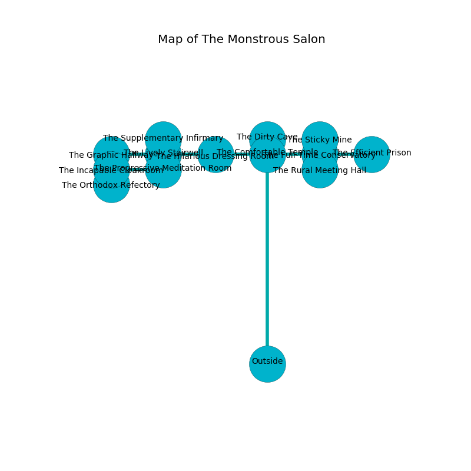

%Ruin Dogs

##The Monstrous Salon
###Overview
The Monstrous Salon is located in a haunted plain. Some areas of it are inaccessible. A solar eclipse is happening outside. It is occupied by Kobolds. Hai Ziegler The Boastful, a Quaggoth Thonot is here. The Kobolds are the slaves of Hai Ziegler The Boastful. He  is founding a new religion. 

###Artifact
####Aeid Iaaemmaf

Aeid Iaaemmaf looks like a transparent gem. It is a shifting blue color. Water incinerates near it. When eaten it frightens children. 

###Locations

####the comfortable temple
There are a Hobgoblin Captain and a Spined Devil here. The floor is bloodstained. The concrete walls are scratched. 

There is an engraving on a stone written in Kobolds Script. 

> Oh my! weak fate
>
> ever late
>
> assertive, minor, small
>
> everything is tall
>

* There is a nail here.
* [Aeid Iaaemmaf](#Aeid-Iaaemmaf) is here.
* To the south is the entrance.
* To the east a torchlit cavern leads to [the full-time conservatory](#the-full-time-conservatory).
* To the north a dripping gap leads to [the dirty cave](#the-dirty-cave).
* To the west a flooded corridor connects to [the hilarious dressing room](#the-hilarious-dressing-room).

####the hilarious dressing room
The air tastes like sesame here. The wooden walls are caving in. The floor is sticky. There is a trap here. When activated, a magical sound detector will launch a blade. 

* There is a chainmail here.
* To the east a flooded corridor connects to [the comfortable temple](#the-comfortable-temple).
* To the west a windy artery leads to [the lively stairwell](#the-lively-stairwell).

####the lively stairwell
The brick walls are unsettled. The floor is bloodstained. Gray mushrooms are decaying in cracks in the floor. 

* There is a girl here.
* To the east a windy artery leads to [the hilarious dressing room](#the-hilarious-dressing-room).
* To the north a dripping hallway leads to [the supplementary infirmary](#the-supplementary-infirmary).
* To the west a dark path opens to [the graphic hallway](#the-graphic-hallway).

####the graphic hallway
The air smells like cedar here. There is a trap here. When activated, a magical sound detector will launch a rolling boulder. The stone walls are pristine. The floor is flooded with one inch deep lukewarm water. 

* There is a box here.
* There is a hammer here.
* To the south a small opening connects to [the incapable cloakroom](#the-incapable-cloakroom).
* To the east a dark path opens to [the lively stairwell](#the-lively-stairwell).

####the supplementary infirmary
Gray lichens are decaying from the walls. 

* There is a girl here.
* To the south a dripping hallway leads to [the lively stairwell](#the-lively-stairwell).

####the full-time conservatory
The floor is smooth. Green ferns are sprouting from the walls. 

There is an engraving on a stone written in Kobolds Script. 

> Leave now.
>

* To the south a long cavern opens to [the rural meeting hall](#the-rural-meeting-hall).
* To the east a flooded passageway opens to [the efficient prison](#the-efficient-prison).
* To the north a hazy gap connects to [the sticky mine](#the-sticky-mine).
* To the west a torchlit cavern opens to [the comfortable temple](#the-comfortable-temple).

####the rural meeting hall
The air tastes like marjoram here. White mushrooms are swaying from the walls. There is a trap here. When activated, a pressure plate will open a trapdoor in the floor. 

There is an engraving on a stone written in Kobolds Script. 

> Try jumping.
>

* To the north a long cavern opens to [the full-time conservatory](#the-full-time-conservatory).

####the incapable cloakroom
There is a trap here. When activated, a magical sound detector will launch a javelin. The brick walls are bloodstained. The floor is smooth. Red razorgrass is decaying in broken urns. 

* To the south a narrow artery connects to [the orthodox refectory](#the-orthodox-refectory).
* To the east a small corridor opens to [the progressive meditation room](#the-progressive-meditation-room).
* To the north a small opening leads to [the graphic hallway](#the-graphic-hallway).

####the efficient prison
The metallic walls are caving in. The air smells like spinach here. There are six Kobolds and thirteen Winged Kobolds here. The Kobolds are sleeping. 

* To the west a flooded passageway leads to [the full-time conservatory](#the-full-time-conservatory).

####the orthodox refectory
There are thirteen Kobolds and ten Winged Kobolds here. Gray ferns are decaying in broken urns. If the Kobolds notice the Ruin Dogs, one of them will retreat and alert [Hai Ziegler](#Hai-Ziegler). 

There is an engraving on a tablet written in Kobolds Script. 

> A screw is a precision
>
> patient, charismatic, realistic
>
> left, sophisticated, internal
>
> ever dirty
>

* There is a chain here.
* To the north a narrow artery connects to [the incapable cloakroom](#the-incapable-cloakroom).

####the sticky mine
The air tastes like fig here. 

* To the south a hazy gap opens to [the full-time conservatory](#the-full-time-conservatory).

####the progressive meditation room
The obsidion walls are caving in. The floor is cluttered with broken glass. Yellow razorgrass is sprouting in cracks in the floor. 

* There is a spade here.
* [Hai Ziegler The Boastful](#Hai-Ziegler-The-Boastful) is here.
* To the west a small corridor connects to [the incapable cloakroom](#the-incapable-cloakroom).

####the dirty cave
There are thirteen Kobolds and ten Winged Kobolds here. The crystal walls are caving in. The Kobolds are performing a ritual. If not interrupted, [Hai Ziegler](#Hai-Ziegler) will be magically alarmed. 

* To the south a dripping gap leads to [the comfortable temple](#the-comfortable-temple).

