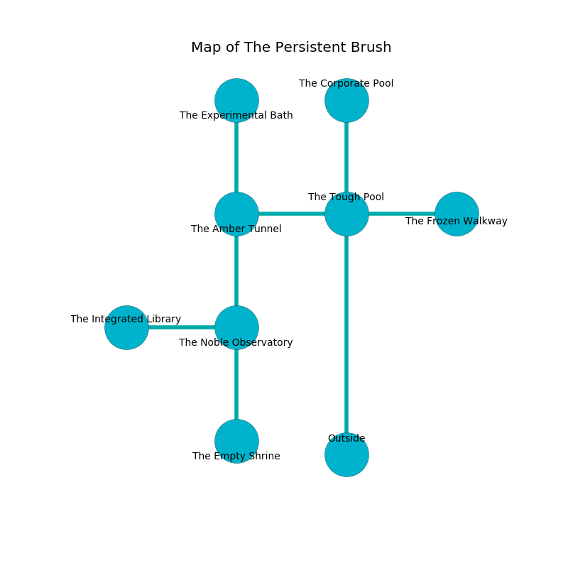

%Ruin Dogs

##The Persistent Brush
###Overview
The Persistent Brush is located on a ruined plain. Some areas of it are inaccessible. A solar eclipse is happening outside. It is occupied by Duergars. Sunny Troutman The Materialistic, a Drow Mage is here. The Duergars have been charmed by Sunny Troutman The Materialistic. She  is founding a new religion. 

###Artifact
####Ceia Effuia

Ceia Effuia has the form of a soft orb. Water pours away from it. It is a sickly purple color. It smells like cinnamon. When thrown it becomes hot. 

###Locations

####the tough pool

* To the south is the entrance.
* To the east a dripping threshold connects to [the frozen walkway](#the-frozen-walkway).
* To the north a long hallway opens to [the corporate pool](#the-corporate-pool).
* To the west a dripping pathway leads to [the amber tunnel](#the-amber-tunnel).

####the amber tunnel

* To the south a twisted corridor connects to [the noble observatory](#the-noble-observatory).
* To the east a dripping pathway connects to [the tough pool](#the-tough-pool).
* To the north a dripping cavern connects to [the experimental bath](#the-experimental-bath).

####the corporate pool
The air tastes like laundered cloth here. Gray razorgrass is decaying from the walls. 

* To the south a long hallway connects to [the tough pool](#the-tough-pool).

####the frozen walkway
There are eight Duergars here. The Duergars are berserk with rage. 

There is an engraving on a stone written in Duergars Script. 

> I am cruel.
>

* There is a casket here.
* To the west a dripping threshold opens to [the tough pool](#the-tough-pool).

####the noble observatory
There are an Earth Elemental, a Giant fire beetle, a Kenku, a Cockatrice, and a Succubus here. The floor is bloodstained. The air tastes like ammonia here. There is a trap here. When activated, a magical proximity detector will open a large pit in the floor. 

* [Ceia Effuia](#Ceia-Effuia) is here.
* To the south a dark threshold connects to [the empty shrine](#the-empty-shrine).
* To the north a twisted corridor leads to [the amber tunnel](#the-amber-tunnel).
* To the west a dripping opening leads to [the integrated library](#the-integrated-library).

####the empty shrine
The floor is sticky. The glass walls are pristine. The air smells like lovage here. 

* [Sunny Troutman The Materialistic](#Sunny-Troutman-The-Materialistic) is here.
* To the north a dark threshold opens to [the noble observatory](#the-noble-observatory).

####the experimental bath
The crystal walls are caving in. There are a Young Bronze Dragon and a Medusa here. 

There is an engraving on the floor written in common. 

> I could not try cowering.
>

* There is a blade here.
* There is a chest here.
* To the south a dripping cavern opens to [the amber tunnel](#the-amber-tunnel).

####the integrated library
The floor is flooded with three inch deep hot water. Green razorgrass is decaying from the ceiling. 

* To the east a dripping opening opens to [the noble observatory](#the-noble-observatory).

