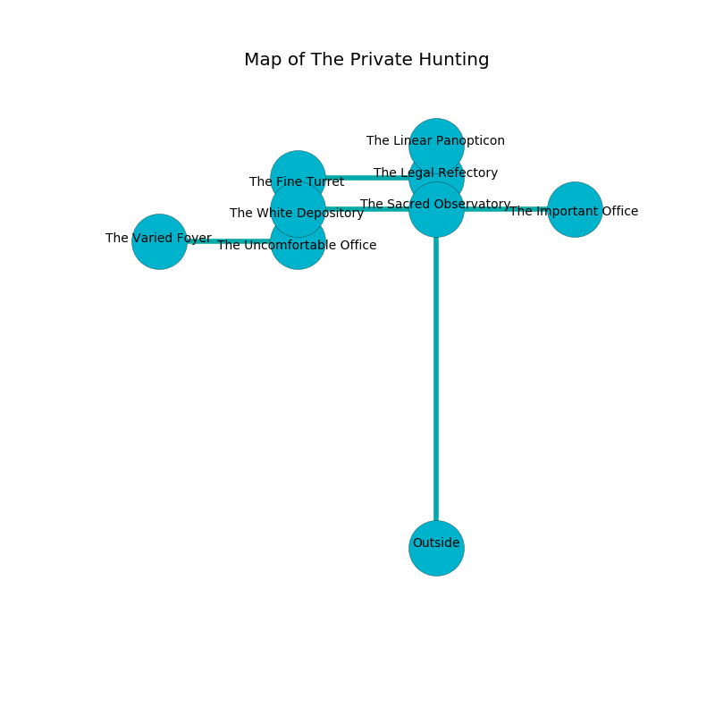

%Ruin Dogs

##The Private Hunting
###Overview
The Private Hunting is located in a ruined mountain. Some rooms of The Private Hunting are flooded. A massive storm is happening outside. It is occupied by Quaggoths. Blythe Blackwell The Nervous, a Fire Giant is here. The Quaggoths are the soldiers of Blythe Blackwell The Nervous. She  is trying to hide [The Formal Sensitivity](#The-Formal-Sensitivity). 

###Artifact
####The Formal Sensitivity

The Formal Sensitivity is a powerful artifact in the shape of a hard prism. It smells like freshly cut hay. It is a light red color. When worn it floats in the air. 

###Locations

####the sacred observatory
The floor is glossy. The air smells like mulberry here. The brick walls are unsettled. 

There is an engraving on the ceiling written in Quaggoths Script. 

> I can not find [The Formal Sensitivity](#The-Formal-Sensitivity).
>
> Dig here.
>

* To the south is the entrance.
* To the east a flooded pathway opens to [the important office](#the-important-office).
* To the north a small threshold opens to [the legal refectory](#the-legal-refectory).
* To the west a torchlit corridor opens to [the white depository](#the-white-depository).

####the legal refectory
The stone walls are ruined. The floor is sticky. There is a trap here. When activated, a magical sound detector will fire a net. The air smells like sulfur here. Gray moss is swaying from the walls. 

* [The Formal Sensitivity](#The-Formal-Sensitivity) is here.
* To the south a small threshold leads to [the sacred observatory](#the-sacred-observatory).
* To the north a windy threshold opens to [the linear panopticon](#the-linear-panopticon).
* To the west a torchlit cave connects to [the fine turret](#the-fine-turret).

####the white depository
The stone walls are unsettled. 

There is an engraving on the ceiling written in Quaggoths Script. 

> Oh my! our fate is woe
>
> it is always slow
>
> quantitative and low
>
> the world is slow
>

* There is a picture here.
* To the south a torchlit threshold opens to [the uncomfortable office](#the-uncomfortable-office).
* To the east a torchlit corridor leads to [the sacred observatory](#the-sacred-observatory).

####the uncomfortable office
The floor is glossy. The air tastes like fat here. There is a trap here. When activated, a pressure plate will close a portcullis. There are a Satyr, a Sprite, a Hook Horror, a Weretiger, an Octopus, a Copper Dragon Wyrmling, and a Green Dragon Wyrmling here. 

* [Blythe Blackwell The Nervous](#Blythe-Blackwell-The-Nervous) is here.
* To the north a torchlit threshold connects to [the white depository](#the-white-depository).
* To the west a small cavern connects to [the varied foyer](#the-varied-foyer).

####the fine turret
The air tastes like coconut here. 

There is an engraving on a stone written in Quaggoths Script. 

> [The Formal Sensitivity](#The-Formal-Sensitivity)
>
> offensive, eloquent, cold
>
> you must be cursed
>

* There is a boat here.
* To the east a torchlit cave connects to [the legal refectory](#the-legal-refectory).

####the important office
The air smells like peanut butter here. Gray moss is decaying in cracks in the floor. The floor is flooded with one inch deep scalding water. There are a Giant Bat, a Hobgoblin Warlord, an Intellect Devourer, and a Green Dragon Wyrmling here. 

* There is a worm here.
* To the west a flooded pathway connects to [the sacred observatory](#the-sacred-observatory).

####the varied foyer
There are a Bandit Captain, a Bone Naga, a Mule, a Manes, a Blue Dragon Wyrmling, a Panther, and a Sahuagin Priestess here. The crystal walls are bloodstained. The floor is cluttered with broken glass. 

There is an engraving on a stone written in Quaggoths Script. 

> [The Formal Sensitivity](#The-Formal-Sensitivity)
>
> vacant, military, honorable
>
> controversial and responsible
>
> yet inappropriate
>
> sick and varied
>
> even, color-blind, helpless
>

* To the east a small cavern connects to [the uncomfortable office](#the-uncomfortable-office).

####the linear panopticon

* To the south a windy threshold opens to [the legal refectory](#the-legal-refectory).

