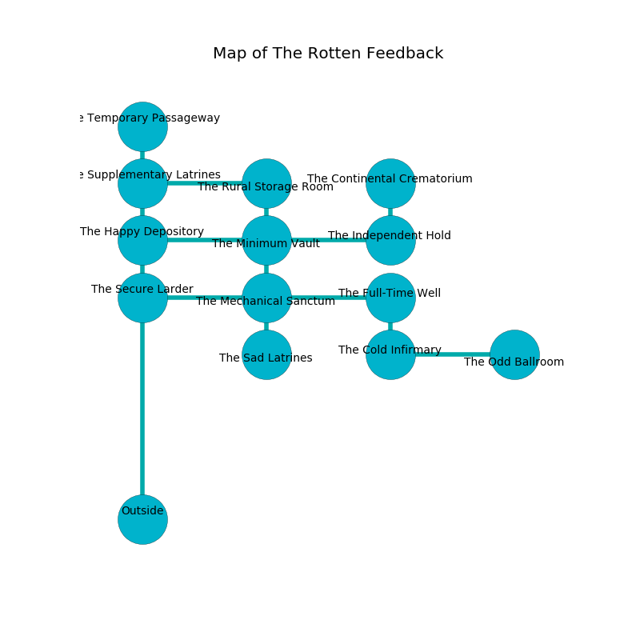

%Ruin Dogs

##The Rotten Feedback
###Overview
The Rotten Feedback is located in a haunted rift. Regions of The Rotten Feedback are inaccessible. The ruin is sinking into the earth. It is occupied by Centaurs. Hyacinth Heller The Quick-Tempered, a Mind Flayer Arcanist is here. The Centaurs are ruled by Hyacinth Heller The Quick-Tempered. She  is trying to recover [Gefbaf](#Gefbaf). 

###Artifact
####Gefbaf

Gefbaf is a powerful artifact in the shape of a mushy rock. It is a shifting gray color. Magic flows near it. It smells like eggs. When thrown it aids memory. 

###Locations

####the supplementary latrines
The air tastes like geranium here. Green razorgrass is swaying in a patch on the floor. There are five Centaurs here. One of the Centaurs is on watch, the rest are celebrating. 

There is an engraving on a stone written in Centaurs Script. 

> [Gefbaf](#Gefbaf)
>
> wrong, miserable, still
>
> [Gefbaf](#Gefbaf)
>

* To the south is the entrance.
* To the east a small threshold connects to [the rural storage room](#the-rural-storage-room).
* To the north a flooded gap opens to [the temporary passageway](#the-temporary-passageway).

####the rural storage room
There are five Centaurs here. The metallic walls are scratched. Red mushrooms are growing in a patch on the floor. The Centaurs are sleeping. 

* To the south a torchlit pathway leads to [the minimum vault](#the-minimum-vault).
* To the west a small threshold leads to [the supplementary latrines](#the-supplementary-latrines).

####the minimum vault
The glass walls are scratched. There are an Incubus, a Gray Ooze, a Monodrone, an Ogre Zombie, a Saber-Toothed Tiger, a Raven, and a Green Dragon Wyrmling here. The floor is glossy. Green lichens are sprouting in broken urns. The air tastes like cashew here. 

* To the south a dark passageway connects to [the mechanical sanctum](#the-mechanical-sanctum).
* To the east a narrow walkway leads to [the independent hold](#the-independent-hold).
* To the north a torchlit pathway opens to [the rural storage room](#the-rural-storage-room).
* To the west a hazy opening opens to [the happy depository](#the-happy-depository).

####the mechanical sanctum
Green ferns are swaying in cracks in the floor. The air smells like horhound here. There are an Orc War Chief, a Bronze Dragon Wyrmling, a Giant Octopus, a Yuan-Ti Pureblood, a Giant Eagle, and an Axe Beak here. 

* There is a skull here.
* To the south a flooded artery connects to [the sad latrines](#the-sad-latrines).
* To the east a torchlit hallway connects to [the full-time well](#the-full-time-well).
* To the north a dark passageway opens to [the minimum vault](#the-minimum-vault).
* To the west a long artery connects to [the secure larder](#the-secure-larder).

####the full-time well
Green mushrooms are swaying from the walls. The air tastes like oatmeal here. There are a Young Copper Dragon, a Githzerai Monk, and a Quipper here. 

There is an engraving on a monolith written in common. 

> Dig here.
>

* [Hyacinth Heller The Quick-Tempered](#Hyacinth-Heller-The-Quick-Tempered) is here.
* To the south a dripping cave opens to [the cold infirmary](#the-cold-infirmary).
* To the west a torchlit hallway connects to [the mechanical sanctum](#the-mechanical-sanctum).

####the independent hold
The floor is sticky. 

* To the north a narrow gap opens to [the continental crematorium](#the-continental-crematorium).
* To the west a narrow walkway opens to [the minimum vault](#the-minimum-vault).

####the continental crematorium
The stone walls are covered in mold. Red razorgrass is sprouting in broken urns. The air tastes like mint here. 

There is an engraving on the ceiling written in common. 

> We are lost
>
> federal, ugly, due
>
> We are lost
>

* To the south a narrow gap connects to [the independent hold](#the-independent-hold).

####the secure larder
The air tastes like bacon here. The mirrored walls are bloodstained. 

* There is a spear here.
* To the east a long artery opens to [the mechanical sanctum](#the-mechanical-sanctum).

####the temporary passageway
There are a Grick Alpha and a Galeb Duhr here. Blue lichens are growing from the ceiling. 

* To the south a flooded gap opens to [the supplementary latrines](#the-supplementary-latrines).

####the happy depository

* To the east a hazy opening leads to [the minimum vault](#the-minimum-vault).

####the cold infirmary
There are five Centaurs here. The stone walls are unsettled. Red moss is swaying in broken urns. The Centaurs are willing to negotiate. 

* [Gefbaf](#Gefbaf) is here.
* To the east a dark path opens to [the odd ballroom](#the-odd-ballroom).
* To the north a dripping cave opens to [the full-time well](#the-full-time-well).

####the sad latrines
There are a Mage, an Octopus, a Githzerai Monk, and a Fire Snake here. 

* To the north a flooded artery connects to [the mechanical sanctum](#the-mechanical-sanctum).

####the odd ballroom
There are a Sea Hag, a Vulture, a Shambling Mound, a Goblin, a Drider, and a Raven here. Red razorgrass is sprouting from the ceiling. The floor is glossy. 

* To the west a dark path leads to [the cold infirmary](#the-cold-infirmary).

