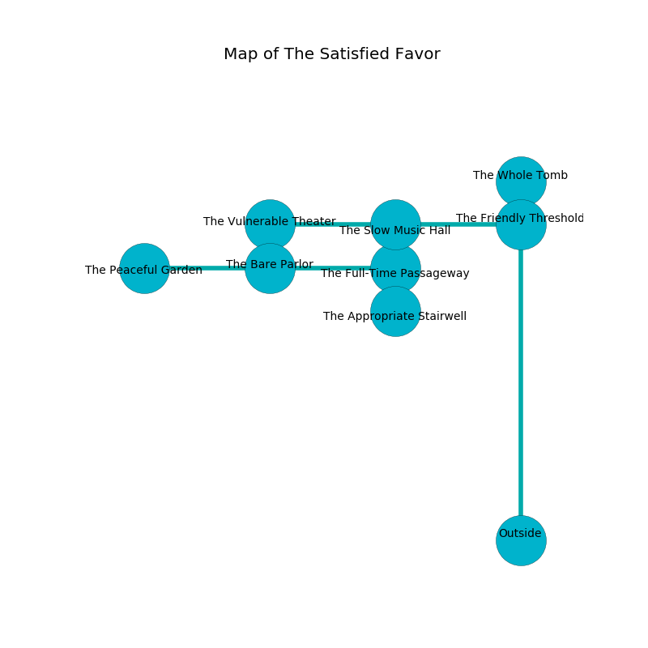

%Ruin Dogs

##The Satisfied Favor
###Overview
The Satisfied Favor is located on a cursed rift. Some areas of it are foggy. A solar eclipse is happening outside. It is occupied by Githyanki. Jackie Gamble The Lazy, a Cloud Giant is here. The Githyanki are the soldiers of Jackie Gamble The Lazy. She  is trying to recover [The Urban Flu](#The-Urban-Flu). 

###Artifact
####The Urban Flu

The Urban Flu looks like a smooth doll. It is a medium gray color. When smelled it becomes a force of destiny. 

###Locations

####the friendly threshold
The air smells like ylang here. There is a trap here. When activated, a pressure plate will launch a hail of needles. There are a Tiger, a Drow, a Displacer Beast, a Quaggoth, a Giant Weasel, a Panther, and an Owlbear here. The floor is flooded with one inch deep hot water. Red moss is growing in cracks in the floor. 

* [Jackie Gamble The Lazy](#Jackie-Gamble-The-Lazy) is here.
* To the south is the entrance.
* To the north a hazy artery opens to [the whole tomb](#the-whole-tomb).
* To the west a long threshold connects to [the slow music hall](#the-slow-music-hall).

####the slow music hall
The air smells like cereal here. The stone walls are scratched. 

There is an engraving on a monolith written in Githyanki Script. 

> I want to find [The Urban Flu](#The-Urban-Flu).
>
> Try dying.
>

* To the south a long opening connects to [the full-time passageway](#the-full-time-passageway).
* To the east a long threshold connects to [the friendly threshold](#the-friendly-threshold).
* To the west a windy walkway connects to [the vulnerable theater](#the-vulnerable-theater).

####the vulnerable theater
The obsidion walls are caving in. There are three Githyanki Warriors here. The air smells like starfruit here. The Githyanki are performing a ritual. If not interrupted, the ruin dogs will be weakened. 

* To the east a windy walkway opens to [the slow music hall](#the-slow-music-hall).

####the full-time passageway
There are an Air Elemental, a Cat, and a Chain Devil here. The obsidion walls are bloodstained. 

There is an engraving on a tablet written in Githyanki Script. 

> Leave at once.
>

* There is a wheel here.
* There is a boat here.
* To the south a torchlit gap connects to [the appropriate stairwell](#the-appropriate-stairwell).
* To the north a long opening opens to [the slow music hall](#the-slow-music-hall).
* To the west a torchlit path connects to [the bare parlor](#the-bare-parlor).

####the bare parlor
Red ferns are growing from the walls. The air tastes like tomato leaf here. There are a Half-Ogre and a Giant Ape here. The wooden walls are pristine. The floor is smooth. 

* [The Urban Flu](#The-Urban-Flu) is here.
* To the east a torchlit path connects to [the full-time passageway](#the-full-time-passageway).
* To the west a flooded hall opens to [the peaceful garden](#the-peaceful-garden).

####the whole tomb
The crystal walls are caving in. The air tastes like smoked sausage here. 

* To the south a hazy artery opens to [the friendly threshold](#the-friendly-threshold).

####the appropriate stairwell
The floor is smooth. Red razorgrass is growing in a patch on the floor. 

There is an engraving on the ceiling written in Githyanki Script. 

> I found [The Urban Flu](#The-Urban-Flu).
>
> A trap ahead.
>

* To the north a torchlit gap leads to [the full-time passageway](#the-full-time-passageway).

####the peaceful garden
Green ferns are sprouting from the ceiling. There are a Giant Goat, a Poltergeist, an Ettercap, a Shadow, and a Weretiger here. The floor is flooded with five inch deep scalding water. 

* To the east a flooded hall opens to [the bare parlor](#the-bare-parlor).

