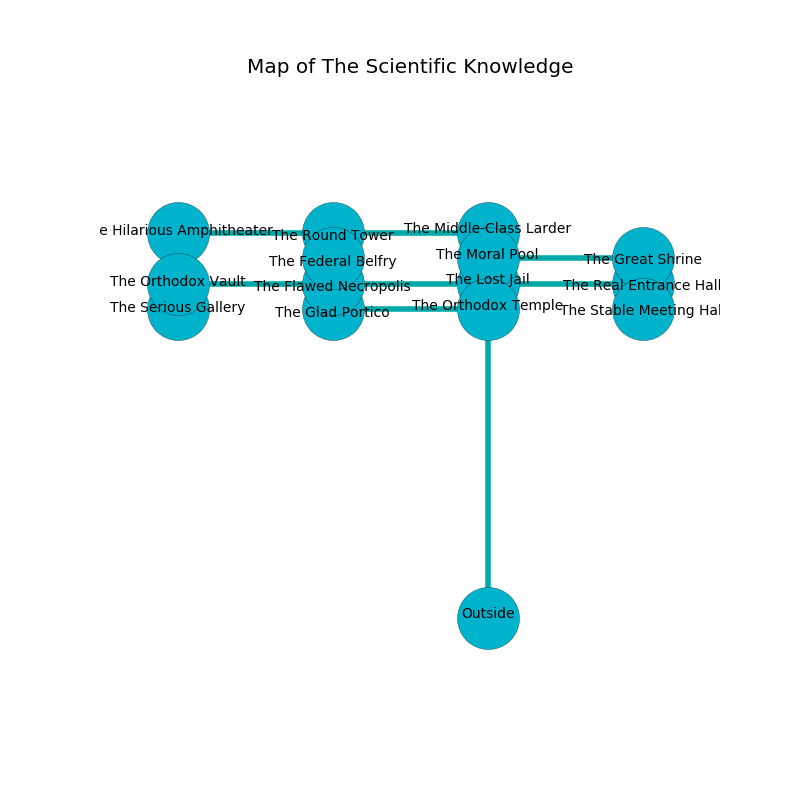

%Ruin Dogs

##The Scientific Knowledge
###Overview
The Scientific Knowledge is located under a flooded city. Some areas of it are flooded. A battle between raiders is happening outside. It is occupied by Dryads. Lowell Chamberlin The Untidy, a Gnoll Pack Lord is here. The Dryads are battling Lowell Chamberlin The Untidy. He  is founding a new religion. 

###Artifact
####The Toxic Person

The Toxic Person looks like a transparent figurine. It smells like paint. Water slides around it. When worn it illuminates its surroundings. 

###Locations

####the lost jail
The floor is smooth. 

* There is a key here.
* To the south is the entrance.
* To the east a hazy corridor opens to [the real entrance hall](#the-real-entrance-hall).
* To the north a torchlit cave opens to [the moral pool](#the-moral-pool).
* To the west a dripping cave leads to [the flawed necropolis](#the-flawed-necropolis).

####the flawed necropolis
The wooden walls are bloodstained. The air smells like cloth here. The floor is sticky. Blue mushrooms are sprouting in a patch on the floor. 

* To the south a hazy corridor leads to [the glad portico](#the-glad-portico).
* To the east a dripping cave leads to [the lost jail](#the-lost-jail).
* To the north a flooded passageway leads to [the federal belfry](#the-federal-belfry).
* To the west a torchlit artery opens to [the orthodox vault](#the-orthodox-vault).

####the real entrance hall
The floor is flooded with five inch deep lukewarm water. The air smells like valerian root here. There are two Dryads here. If the Dryads notice the Ruin Dogs, one of them will retreat and alert [Lowell Chamberlin](#Lowell-Chamberlin). 

* There is a femur here.
* To the south a long passageway connects to [the stable meeting hall](#the-stable-meeting-hall).
* To the west a hazy corridor connects to [the lost jail](#the-lost-jail).

####the moral pool
There is a trap here. When activated, a pressure plate will launch a swinging block. Yellow moss is decaying from the walls. The floor is smooth. There are a Giant Badger, a Tridrone, a Myconid Sovereign, and a Cockatrice here. 

* There is a chest here.
* To the south a torchlit cave connects to [the lost jail](#the-lost-jail).
* To the east a torchlit gap connects to [the great shrine](#the-great-shrine).
* To the north a flooded opening connects to [the middle-class larder](#the-middle-class-larder).

####the federal belfry
The air smells like radish here. There is a trap here. When activated, a magical sound detector will flood the room with water. The obsidion walls are ruined. 

* [Lowell Chamberlin The Untidy](#Lowell-Chamberlin-The-Untidy) is here.
* To the south a flooded passageway leads to [the flawed necropolis](#the-flawed-necropolis).

####the great shrine
The air tastes like gardenia here. There are two Dryads here. Gray lichens are growing from the walls. If the Dryads notice the Ruin Dogs, one of them will retreat and alert the others. 

* To the west a torchlit gap opens to [the moral pool](#the-moral-pool).

####the orthodox vault
The floor is bloodstained. White mushrooms are sprouting from the ceiling. The air tastes like rose here. 

There is an engraving on the ceiling written in Dryads Script. 

> O dire fate
>
> cheerful and independent
>
> native and straight
>
> death is dependent
>

* To the south a windy corridor leads to [the serious gallery](#the-serious-gallery).
* To the east a torchlit artery opens to [the flawed necropolis](#the-flawed-necropolis).

####the serious gallery
The floor is flooded with seven inch deep lukewarm water. The crystal walls are caving in. Gray moss is swaying in cracks in the floor. 

* There is a shield here.
* There is a hook here.
* To the north a windy corridor opens to [the orthodox vault](#the-orthodox-vault).

####the glad portico
Blue mushrooms are swaying in broken urns. There are two Dryads here. The floor is flooded with four inch deep lukewarm water. The air tastes like toast here. There is a trap here. When activated, a magical proximity detector will launch an arrow. The metallic walls are scratched. The Dryads are willing to negotiate. 

There is an engraving on the floor written in Dryads Script. 

> Poor me! the world is woe
>
> steep, active, bureaucratic
>
> ever slow
>
> everything is charismatic
>

* There is a cart here.
* [The Toxic Person](#The-Toxic-Person) is here.
* To the east a long hallway opens to [the orthodox temple](#the-orthodox-temple).
* To the north a hazy corridor connects to [the flawed necropolis](#the-flawed-necropolis).

####the stable meeting hall
There are two Dryads here. The Dryads are willing to negotiate. 

* There is a face here.
* To the north a long passageway opens to [the real entrance hall](#the-real-entrance-hall).

####the middle-class larder
There are two Dryads here. The concrete walls are ruined. The air smells like blackberry here. One of the Dryads is pointing a ballista at the entrance. 

* To the south a flooded opening opens to [the moral pool](#the-moral-pool).
* To the west a windy cavern leads to [the round tower](#the-round-tower).

####the round tower
The concrete walls are covered in mold. Gray moss is sprouting in cracks in the floor. 

* To the east a windy cavern connects to [the middle-class larder](#the-middle-class-larder).
* To the west a twisted corridor leads to [the hilarious amphitheater](#the-hilarious-amphitheater).

####the hilarious amphitheater
The air tastes like caraway here. The stone walls are unsettled. The floor is sticky. 

* To the east a twisted corridor connects to [the round tower](#the-round-tower).

####the orthodox temple
There is a Polar Bear here. 

* To the west a long hallway opens to [the glad portico](#the-glad-portico).

