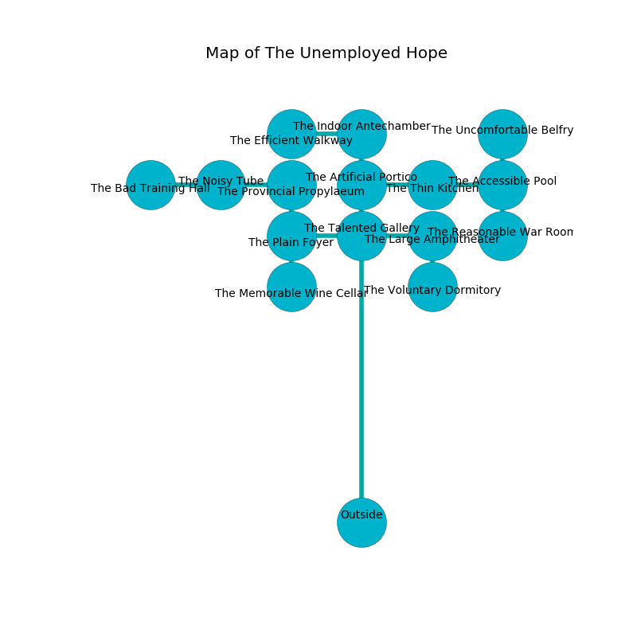

%Ruin Dogs

##The Unemployed Hope
###Overview
The Unemployed Hope is located in a poisoned tree. Some areas of it are foggy. A massive flood is happening outside. It is occupied by Sahuagin. Jess Watkins The Arrogant, an Orc Eye of Gruumsh is here. The Sahuagin worship Jess Watkins The Arrogant. He  is trying to recover [Uddumamd Luuf](#Uddumamd-Luuf). 

###Artifact
####Uddumamd Luuf

Uddumamd Luuf has the form of a smooth cube. Fire slides from it. It smells like grape. When cradled it frightens children. 

###Locations

####the talented gallery
The obsidion walls are scratched. The air smells like lily of the valley here. Red razorgrass is sprouting from the walls. 

* To the south is the entrance.
* To the east a hazy gap connects to [the large amphitheater](#the-large-amphitheater).
* To the north a dripping cave leads to [the artificial portico](#the-artificial-portico).
* To the west a twisted cave opens to [the plain foyer](#the-plain-foyer).

####the large amphitheater
The concrete walls are unsettled. There are a Warhorse and a Bugbear Chief here. The air tastes like onion here. Gray mushrooms are growing in cracks in the floor. 

* To the south a hazy cavern connects to [the voluntary dormitory](#the-voluntary-dormitory).
* To the west a hazy gap leads to [the talented gallery](#the-talented-gallery).

####the voluntary dormitory
The obsidion walls are pristine. 

* To the north a hazy cavern opens to [the large amphitheater](#the-large-amphitheater).

####the plain foyer
The air tastes like dairy here. There are six Sahuagin here. The floor is glossy. If the Sahuagin notice the Ruin Dogs, one of them will retreat and alert the others. 

* To the south a torchlit opening connects to [the memorable wine cellar](#the-memorable-wine-cellar).
* To the east a twisted cave connects to [the talented gallery](#the-talented-gallery).
* To the north a small path leads to [the provincial propylaeum](#the-provincial-propylaeum).

####the provincial propylaeum
There is a trap here. When activated, a pressure plate will open a large pit in the floor. Gray lichens are swaying from the walls. There are a Phase Spider and a Worg here. 

* There is a skirt here.
* To the south a small path opens to [the plain foyer](#the-plain-foyer).
* To the west a flooded artery leads to [the noisy tube](#the-noisy-tube).

####the artificial portico
There are a Violet Fungus, an Orog, a Kenku, a Thug, a Giant Frog, a Giant Octopus, and an Eagle here. The floor is flooded with two inch deep hot water. 

There is an engraving on the wall written in Sahuagin Script. 

> Maybe try fighting.
>

* There is a spoon here.
* To the south a dripping cave connects to [the talented gallery](#the-talented-gallery).
* To the east a flooded cave opens to [the thin kitchen](#the-thin-kitchen).
* To the north a hazy hallway leads to [the indoor antechamber](#the-indoor-antechamber).

####the memorable wine cellar
The brick walls are ruined. Yellow razorgrass is decaying from the walls. The floor is cluttered with shells. 

* To the north a torchlit opening leads to [the plain foyer](#the-plain-foyer).

####the indoor antechamber
Yellow moss is growing from the ceiling. The floor is smooth. 

* To the south a hazy hallway connects to [the artificial portico](#the-artificial-portico).
* To the west a flooded cave leads to [the efficient walkway](#the-efficient-walkway).

####the noisy tube
There are six Sahuagin here. The floor is bloodstained. One of the Sahuagin is pointing a ballista at the entrance. 

* There is a dress here.
* There is a skull here.
* To the east a flooded artery leads to [the provincial propylaeum](#the-provincial-propylaeum).
* To the west a torchlit path connects to [the bad training hall](#the-bad-training-hall).

####the efficient walkway
There are six Sahuagin here. The brick walls are unsettled. The floor is cluttered with broken glass. If the Sahuagin notice the Ruin Dogs, one of them will retreat and alert [Jess Watkins](#Jess-Watkins). 

* To the east a flooded cave leads to [the indoor antechamber](#the-indoor-antechamber).

####the thin kitchen
The obsidion walls are bloodstained. Green lichens are sprouting from the ceiling. 

There is an engraving on a stone written in Sahuagin Script. 

> Poor me! pitiful you
>
> enthusiastic, bald, new
>
> it is never chronic
>
> fate is electronic
>

* To the east a twisted threshold leads to [the accessible pool](#the-accessible-pool).
* To the west a flooded cave connects to [the artificial portico](#the-artificial-portico).

####the accessible pool
The floor is smooth. The crystal walls are scratched. Red ferns are swaying from the walls. There is a trap here. When activated, a magical sound detector will make the walls close in. 

There is an engraving on the ceiling written in common. 

> Go away.
>

* [Uddumamd Luuf](#Uddumamd-Luuf) is here.
* To the south a twisted passageway leads to [the reasonable war Room](#the-reasonable-war-Room).
* To the north a windy pathway leads to [the uncomfortable belfry](#the-uncomfortable-belfry).
* To the west a twisted threshold connects to [the thin kitchen](#the-thin-kitchen).

####the bad training hall
The floor is sticky. The air smells like the fresh outdoors here. The glass walls are unsettled. 

* There is a chainmail here.
* To the east a torchlit path leads to [the noisy tube](#the-noisy-tube).

####the uncomfortable belfry
The air tastes like sausage here. 

* To the south a windy pathway leads to [the accessible pool](#the-accessible-pool).

####the reasonable war Room
There are a Myconid Adult, a Riding Horse, a Giant Elk, and an Aarakocra here. The brick walls are unsettled. 

There is an engraving on a monolith written in common. 

> O! cruel we
>
> civilian and late
>
> fragrant, continuous, free
>
> all is great
>

* There is a fowl here.
* There is a whip here.
* [Jess Watkins The Arrogant](#Jess-Watkins-The-Arrogant) is here.
* To the north a twisted passageway leads to [the accessible pool](#the-accessible-pool).

