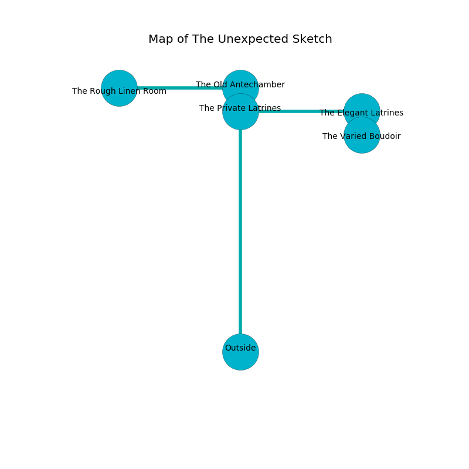

%Ruin Dogs

##The Unexpected Sketch
###Overview
The Unexpected Sketch is located in a flooded rift. Regions of it are unbearably cold. A solar eclipse is happening outside. It is occupied by Duergars. Addie Fortenberry The Unkind, a Mind Flayer Arcanist is here. The Duergars are ruled by Addie Fortenberry The Unkind. She  is founding a new religion. 

###Artifact
####Ieml Faiuofca

Ieml Faiuofca is a powerful artifact in the shape of a mushy cube. It smells like musk. When smelled it makes its owner invisible. 

###Locations

####the private latrines
There are a Nycaloth, a Xorn, and a Kuo-Toa here. The air tastes like popcorn here. The obsidion walls are unsettled. The floor is bloodstained. 

* To the south is the entrance.
* To the east a torchlit hall connects to [the elegant latrines](#the-elegant-latrines).
* To the north a dark walkway opens to [the old antechamber](#the-old-antechamber).

####the old antechamber
The air tastes like sawdust here. The floor is sticky. There are a Sahuagin, a Bat, a Grick Alpha, a Duergar, and a Vine Blight here. 

* [Ieml Faiuofca](#Ieml-Faiuofca) is here.
* To the south a dark walkway connects to [the private latrines](#the-private-latrines).
* To the west a long threshold connects to [the rough linen room](#the-rough-linen-room).

####the elegant latrines
There are a Panther, a Hezrou, and a Bugbear here. Blue mushrooms are swaying from the ceiling. 

* [Addie Fortenberry The Unkind](#Addie-Fortenberry-The-Unkind) is here.
* To the south a twisted cavern connects to [the varied boudoir](#the-varied-boudoir).
* To the west a torchlit hall opens to [the private latrines](#the-private-latrines).

####the varied boudoir
The air smells like solvent here. The floor is flooded with five inch deep cool water. There are nine Duergars here. The brick walls are covered in mold. One of the Duergars is pointing a ballista at the entrance. 

There is an engraving on a monolith written in common. 

> I am lost in The Unexpected Sketch.
>

* There is a button here.
* To the north a twisted cavern leads to [the elegant latrines](#the-elegant-latrines).

####the rough linen room
There are nine Duergars here. The air tastes like oatmeal here. The stone walls are covered in mold. White ferns are decaying in a patch on the floor. The floor is bloodstained. The Duergars are willing to negotiate. 

* To the east a long threshold connects to [the old antechamber](#the-old-antechamber).

