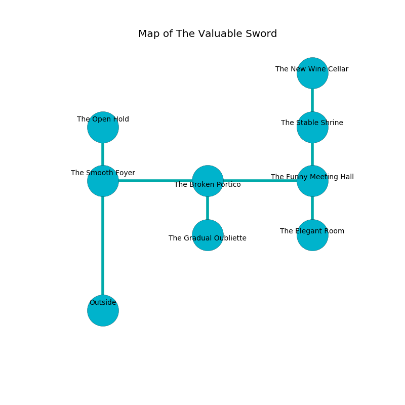

%Ruin Dogs

##The Valuable Sword
###Overview
The Valuable Sword is located in a ruined city. Some areas of The Valuable Sword are corrupted. A blizzard is happening outside. It is occupied by Sahuagin. Herb Marcotte The Compulsive, a Hobgoblin Captain is here. The Sahuagin are battling Herb Marcotte The Compulsive. He  is trying to discover [The Official Government](#The-Official-Government). 

###Artifact
####The Official Government

The Official Government looks like a smooth spear. Gravity slips around it. It is a sickly orange color. When worshipped it shows an image of the future. 

###Locations

####the smooth foyer
There are a Rust Monster, a Black Bear, an Aarakocra, an Orc, a Saber-Toothed Tiger, a Poisonous Snake, a Black Dragon Wyrmling, and a Vulture here. The floor is bloodstained. 

* To the south is the entrance.
* To the east a flooded passageway connects to [the broken portico](#the-broken-portico).
* To the north a dark opening connects to [the open hold](#the-open-hold).

####the broken portico
There are a Ghast and a Chuul here. 

* To the south a windy pathway opens to [the gradual oubliette](#the-gradual-oubliette).
* To the east a long corridor opens to [the funny meeting hall](#the-funny-meeting-hall).
* To the west a flooded passageway connects to [the smooth foyer](#the-smooth-foyer).

####the funny meeting hall
The air tastes like cucumber skin here. There are eight Sahuagin here. Blue ferns are decaying in broken urns. The floor is glossy. If the Sahuagin notice the Ruin Dogs, one of them will retreat and alert the others. 

There is an engraving on the floor written in common. 

> I found [The Official Government](#The-Official-Government).
>

* There is a nail here.
* [Herb Marcotte The Compulsive](#Herb-Marcotte-The-Compulsive) is here.
* To the south a small artery leads to [the elegant room](#the-elegant-room).
* To the north a narrow walkway connects to [the stable shrine](#the-stable-shrine).
* To the west a long corridor leads to [the broken portico](#the-broken-portico).

####the open hold
The floor is flooded with nine inch deep cold water. Red lichens are growing in broken urns. 

* There is a cart here.
* There is a horn here.
* There is a drake here.
* To the south a dark opening connects to [the smooth foyer](#the-smooth-foyer).

####the stable shrine
The air smells like acerola here. The floor is flooded with three inch deep scalding water. The obsidion walls are unsettled. 

There is an engraving on a stone written in Sahuagin Script. 

> Do not try digging.
>

* [The Official Government](#The-Official-Government) is here.
* To the south a narrow walkway opens to [the funny meeting hall](#the-funny-meeting-hall).
* To the north a long corridor leads to [the new wine cellar](#the-new-wine-cellar).

####the elegant room
The air tastes like mastic here. The floor is bloodstained. The wooden walls are ruined. There are eight Sahuagin here. The Sahuagin are willing to fight to the death. 

* To the north a small artery opens to [the funny meeting hall](#the-funny-meeting-hall).

####the gradual oubliette
There are eight Sahuagin here. The air smells like geranium here. The floor is smooth. The Sahuagin are performing a ritual. If not interrupted, [Herb Marcotte](#Herb-Marcotte) will be magically alarmed. 

* To the north a windy pathway connects to [the broken portico](#the-broken-portico).

####the new wine cellar
There are a Darkmantle, a Cat, a Doppelganger, and a Cult Fanatic here. The floor is bloodstained. Blue razorgrass is decaying from the ceiling. The air tastes like wax here. 

* To the south a long corridor connects to [the stable shrine](#the-stable-shrine).

