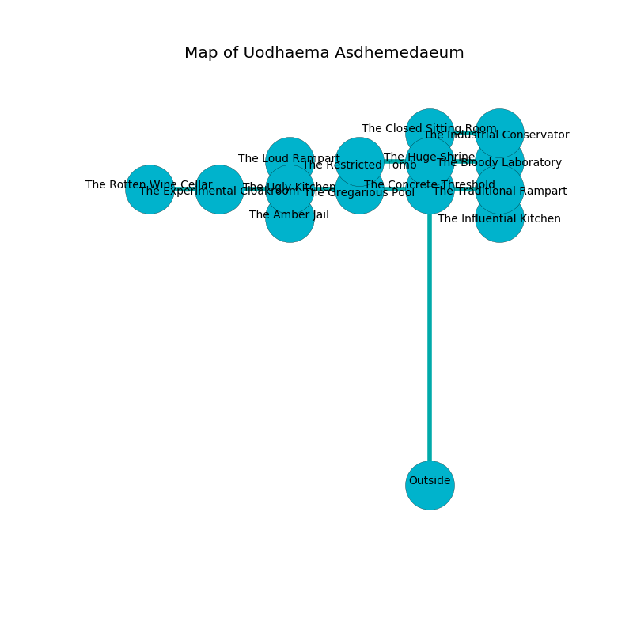

%Ruin Dogs

##Uodhaema Asdhemedaeum
###Overview
Uodhaema Asdhemedaeum is located in a haunted city. Regions of it are flooded. A blizzard is happening outside. It is occupied by Lizardfolk. Katherine Swan The Dishonest, a Succubus is here. The Lizardfolk are the soldiers of Katherine Swan The Dishonest. She  is trying to steal [The Broken Arena](#The-Broken-Arena). 

###Artifact
####The Broken Arena

The Broken Arena has the form of a smooth crystal. Psychic energy glows away from it. It is a pale orange color. When touched it illuminates its surroundings. 

###Locations

####the concrete threshold
There are a Lizardfolk and two Lizardfolk Shamans here. Green moss is sprouting in a patch on the floor. The Lizardfolk are willing to negotiate. 

* To the south is the entrance.
* To the east a twisted corridor opens to [the traditional rampart](#the-traditional-rampart).
* To the north a narrow pathway connects to [the huge shrine](#the-huge-shrine).
* To the west a dark corridor opens to [the gregarious pool](#the-gregarious-pool).

####the huge shrine
There is a trap here. When activated, a magical proximity detector will make the walls close in. There are two Lizardfolk and a Lizardfolk Shaman here. Blue lichens are decaying in a patch on the floor. The floor is bloodstained. The Lizardfolk are performing a ritual. If not interrupted, [Katherine Swan](#Katherine-Swan) will be magically alarmed. 

There is an engraving on the floor written in common. 

> Hide here.
>

* To the south a narrow pathway leads to [the concrete threshold](#the-concrete-threshold).
* To the east a dripping hall opens to [the bloody laboratory](#the-bloody-laboratory).
* To the north a dark threshold leads to [the closed sitting Room](#the-closed-sitting-Room).
* To the west a flooded opening connects to [the restricted tomb](#the-restricted-tomb).

####the traditional rampart
The floor is flooded with six inch deep cool water. The air smells like citronella here. Gray ferns are decaying in cracks in the floor. 

* To the south a torchlit hallway leads to [the influential kitchen](#the-influential-kitchen).
* To the west a twisted corridor opens to [the concrete threshold](#the-concrete-threshold).

####the restricted tomb
There is a Giant Scorpion here. The brick walls are covered in mold. Blue ferns are growing from the walls. The air smells like parsley here. The floor is cluttered with broken glass. 

* To the east a flooded opening leads to [the huge shrine](#the-huge-shrine).

####the closed sitting Room
The stone walls are caving in. The air tastes like narcissus here. 

There is an engraving on a tablet written in common. 

> Do not try jumping.
>

* There is a trophy here.
* To the south a dark threshold opens to [the huge shrine](#the-huge-shrine).
* To the east a long walkway connects to [the industrial conservatory](#the-industrial-conservatory).

####the gregarious pool
The air tastes like flesh here. There is a trap here. When activated, a magical proximity detector will blast flames. 

* To the east a dark corridor opens to [the concrete threshold](#the-concrete-threshold).
* To the west a narrow cavern leads to [the ugly kitchen](#the-ugly-kitchen).

####the bloody laboratory

* To the west a dripping hall opens to [the huge shrine](#the-huge-shrine).

####the ugly kitchen
The floor is sticky. White moss is sprouting in cracks in the floor. 

* There is a pot here.
* To the south a flooded opening opens to [the amber jail](#the-amber-jail).
* To the east a narrow cavern connects to [the gregarious pool](#the-gregarious-pool).
* To the north a twisted opening opens to [the loud rampart](#the-loud-rampart).
* To the west a hazy artery connects to [the experimental cloakroom](#the-experimental-cloakroom).

####the influential kitchen
Red mushrooms are growing in cracks in the floor. The metallic walls are bloodstained. The air smells like sand here. There are a Werewolf and a Giant Vulture here. 

* There is a stamp here.
* To the north a torchlit hallway connects to [the traditional rampart](#the-traditional-rampart).

####the amber jail
The crystal walls are unsettled. The air tastes like plastic here. 

* There is a bell here.
* To the north a flooded opening connects to [the ugly kitchen](#the-ugly-kitchen).

####the industrial conservatory
The floor is glossy. There is a trap here. When activated, a pressure plate will make the ceiling slowly lower. Green lichens are swaying from the ceiling. 

* There is a girl here.
* [Katherine Swan The Dishonest](#Katherine-Swan-The-Dishonest) is here.
* To the west a long walkway opens to [the closed sitting Room](#the-closed-sitting-Room).

####the experimental cloakroom
There are two Lizardfolk and a Lizardfolk Shaman here. The floor is smooth. The air smells like petitgrain here. The Lizardfolk are willing to fight to the death. 

* [The Broken Arena](#The-Broken-Arena) is here.
* To the east a hazy artery leads to [the ugly kitchen](#the-ugly-kitchen).
* To the west a twisted corridor connects to [the rotten wine cellar](#the-rotten-wine-cellar).

####the loud rampart
The air tastes like tea here. There is a trap here. When activated, a magical sound detector will swing a tripping chain. There are a Sea Horse, a Mule, a Will-O’-Wisp, a Ghoul, a Riding Horse, and a Crab here. 

There is an engraving on the ceiling written in Lizardfolk Script. 

> Treasure here.
>

* To the south a twisted opening connects to [the ugly kitchen](#the-ugly-kitchen).

####the rotten wine cellar
The air smells like lime here. 

* To the east a twisted corridor connects to [the experimental cloakroom](#the-experimental-cloakroom).

