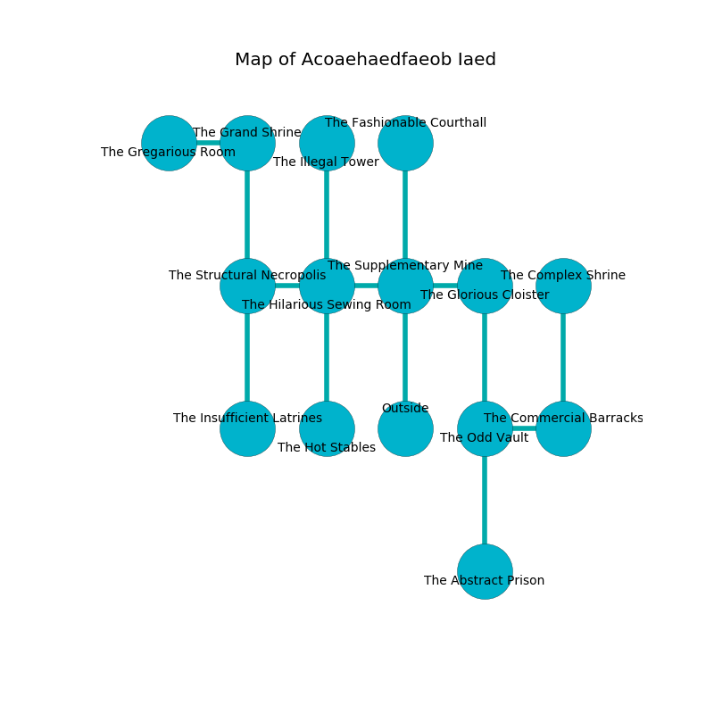

%Ruin Dogs

##Acoaehaedfaeob Iaed
###Overview
Acoaehaedfaeob Iaed is located under a haunted city. Parts of Acoaehaedfaeob Iaed are flooded. The ruin is burning. It is occupied by Gnolls. Gregory Snowden The Resentful, a Quaggoth Thonot is here. The Gnolls are the minions of Gregory Snowden The Resentful. She  is trying to find [The Premature Reverse](#The-Premature-Reverse). 

###Artifact
####The Premature Reverse

The Premature Reverse is a powerful artifact in the shape of a warm monument. Cacophony shifts near it. It is a sickly yellow color. When carried it ignites its surrroundings. 

###Locations

####the supplementary mine
There is a Bearded Devil here. The concrete walls are unsettled. The floor is cluttered with bones. 

* To the west a long walkway connects to [the hilarious sewing room](#the-hilarious-sewing-room).
* To the east a twisted corridor leads to [the glorious cloister](#the-glorious-cloister).
* To the north a torchlit hall opens to [the fashionable courthall](#the-fashionable-courthall).
* To the south is the entrance.

####the glorious cloister
The brick walls are caving in. Yellow razorgrass is decaying in broken urns. The floor is smooth. 

* To the west a twisted corridor connects to [the supplementary mine](#the-supplementary-mine).
* To the south a torchlit gap connects to [the odd vault](#the-odd-vault).

####the fashionable courthall
The wooden walls are scratched. Yellow lichens are sprouting from the ceiling. The floor is bloodstained. There are an Eagle, a Brass Dragon Wyrmling, a Merfolk, a Druid, and an Owl here. 

There is an engraving on a tablet written in common. 

> A hospital is a ceiling
>
> main and competent
>
> temporary and revolutionary
>
> A leaf is a ban
>
> welcome, insufficient, sexual
>
> They are corrupted
>
> exclusive and sympathetic
>

* To the south a torchlit hall leads to [the supplementary mine](#the-supplementary-mine).

####the hilarious sewing room
The air smells like anise here. The floor is sticky. 

* To the west a dark opening opens to [the structural necropolis](#the-structural-necropolis).
* To the east a long walkway connects to [the supplementary mine](#the-supplementary-mine).
* To the north a long cave opens to [the illegal tower](#the-illegal-tower).
* To the south a hazy hallway connects to [the hot stables](#the-hot-stables).

####the illegal tower
The floor is cluttered with debris. There are two Gnolls and a Gnoll Pack Lord here. If the Gnolls notice the Ruin Dogs, one of them will retreat and alert the others. 

* To the south a long cave opens to [the hilarious sewing room](#the-hilarious-sewing-room).

####the odd vault
The brick walls are pristine. The air smells like clover here. Red ferns are sprouting in a patch on the floor. 

There is an engraving on a monolith written in common. 

> O our fate is sadistic
>
> corporate, classical, artistic
>
> ever reasonable
>
> the world is realistic
>

* [Gregory Snowden The Resentful](#Gregory-Snowden-The-Resentful) is here.
* To the east a hazy cave opens to [the commercial barracks](#the-commercial-barracks).
* To the north a torchlit gap opens to [the glorious cloister](#the-glorious-cloister).
* To the south a small gap connects to [the abstract prison](#the-abstract-prison).

####the abstract prison
The air tastes like sweat here. The floor is cluttered with bones. The stone walls are scratched. Red moss is decaying from the ceiling. 

There is an engraving on the ceiling written in common. 

> [The Premature Reverse](#The-Premature-Reverse)
>
> invisible, accessible, agile
>
> yet popular
>
> you must be loved
>

* To the north a small gap opens to [the odd vault](#the-odd-vault).

####the structural necropolis
The floor is smooth. White razorgrass is decaying from the walls. The stone walls are covered in mold. 

There is an engraving on the floor written in Gnolls Script. 

> Poor me! sad god
>
> but odd
>
> it is never generous
>
> fate is odd
>

* To the east a dark opening leads to [the hilarious sewing room](#the-hilarious-sewing-room).
* To the north a small passageway opens to [the grand shrine](#the-grand-shrine).
* To the south a hazy threshold leads to [the insufficient latrines](#the-insufficient-latrines).

####the commercial barracks
There are a White Dragon Wyrmling and a Yuan-Ti Pureblood here. 

* There is a whistle here.
* [The Premature Reverse](#The-Premature-Reverse) is here.
* To the west a hazy cave leads to [the odd vault](#the-odd-vault).
* To the north a dark cavern connects to [the complex shrine](#the-complex-shrine).

####the grand shrine
The air smells like marshmallow here. The glass walls are scratched. The floor is glossy. 

* There is a brain here.
* There is a key here.
* To the west a long opening connects to [the gregarious room](#the-gregarious-room).
* To the south a small passageway opens to [the structural necropolis](#the-structural-necropolis).

####the gregarious room
Red lichens are growing in a patch on the floor. 

* There is a picture here.
* There is a collar here.
* To the east a long opening leads to [the grand shrine](#the-grand-shrine).

####the insufficient latrines
The floor is glossy. 

* To the north a hazy threshold leads to [the structural necropolis](#the-structural-necropolis).

####the hot stables
The floor is sticky. Blue moss is swaying in broken urns. The obsidion walls are ruined. There are a Lion, a Flumph, a Flying Sword, an Ogre Zombie, and a Vulture here. The air tastes like roasted chicken here. 

* To the north a hazy hallway leads to [the hilarious sewing room](#the-hilarious-sewing-room).

####the complex shrine
The crystal walls are ruined. The floor is cluttered with debris. 

* There is a ring here.
* To the south a dark cavern opens to [the commercial barracks](#the-commercial-barracks).

