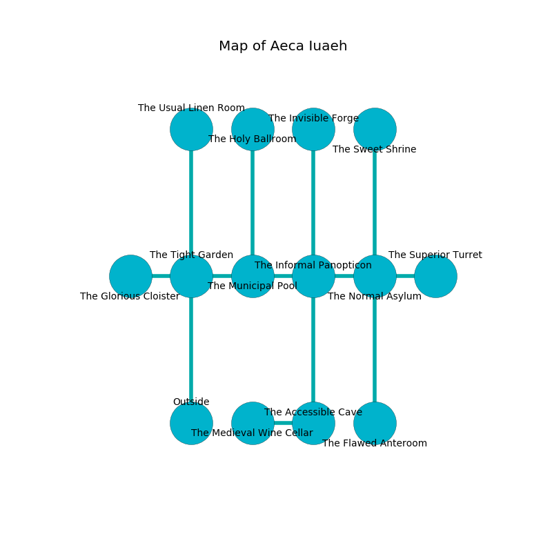

%Ruin Dogs

##Aeca Iuaeh
###Overview
Aeca Iuaeh is constructed on an obsidion plain. Some areas of Aeca Iuaeh are flooded. The ruin is coming to life. It is occupied by Sahuagin. Reed Gable The Miserly, a Cambion is here. The Sahuagin are ruled by Reed Gable The Miserly. He  is founding a new religion. 

###Artifact
####Bedmabedaeci

Bedmabedaeci is a powerful artifact in the shape of a soft sphere. It smells like hay. It is a light black color. Cacophony glows away from it. When carried it levitates surrounding objects. 

###Locations

####the tight garden
The floor is bloodstained. 

* To the west a hazy pathway opens to [the glorious cloister](#the-glorious-cloister).
* To the east a torchlit hallway opens to [the municipal pool](#the-municipal-pool).
* To the north a torchlit threshold opens to [the usual linen room](#the-usual-linen-room).
* To the south is the entrance.

####the municipal pool

* There is a dagger here.
* To the west a torchlit hallway opens to [the tight garden](#the-tight-garden).
* To the east a small passageway leads to [the informal panopticon](#the-informal-panopticon).
* To the north a narrow opening opens to [the holy ballroom](#the-holy-ballroom).

####the usual linen room
The air tastes like passion fruit here. The floor is bloodstained. 

There is an engraving on a stone written in common. 

> Try dying.
>

* To the south a torchlit threshold leads to [the tight garden](#the-tight-garden).

####the informal panopticon
The air smells like acerola here. There are two Sahuagin and a Sahuagin Baron here. The Sahuagin are willing to fight to the death. 

* To the west a small passageway leads to [the municipal pool](#the-municipal-pool).
* To the east a twisted threshold opens to [the normal asylum](#the-normal-asylum).
* To the north a dark walkway leads to [the invisible forge](#the-invisible-forge).
* To the south a flooded threshold leads to [the accessible cave](#the-accessible-cave).

####the accessible cave
There are a Zombie, a Swarm of Bats, a Draft Horse, a Magmin, a Gorgon, and a Spined Devil here. The air tastes like green apple here. The floor is flooded with six inch deep hot water. 

* There is a plate here.
* There is an icon here.
* To the west a small cave opens to [the medieval wine cellar](#the-medieval-wine-cellar).
* To the north a flooded threshold leads to [the informal panopticon](#the-informal-panopticon).

####the normal asylum
The concrete walls are covered in mold. There is a Half-Red Dragon Veteran here. The floor is bloodstained. 

There is an engraving on a tablet written in Sahuagin Script. 

> Do not try cowering.
>

* There is a shoe here.
* [Bedmabedaeci](#Bedmabedaeci) is here.
* To the west a twisted threshold opens to [the informal panopticon](#the-informal-panopticon).
* To the east a long hallway opens to [the superior turret](#the-superior-turret).
* To the north a torchlit hall leads to [the sweet shrine](#the-sweet-shrine).
* To the south a torchlit corridor leads to [the flawed anteroom](#the-flawed-anteroom).

####the glorious cloister
The air smells like clary sage here. There are a Sahuagin and a Sahuagin Baron here. If the Sahuagin notice the Ruin Dogs, one of them will retreat and alert the others. 

* There is a ring here.
* There is a sponge here.
* To the east a hazy pathway connects to [the tight garden](#the-tight-garden).

####the holy ballroom
The obsidion walls are ruined. The air smells like burnt butter here. White ferns are sprouting in broken urns. 

There is an engraving on a monolith written in common. 

> Dig here.
>

* To the south a narrow opening connects to [the municipal pool](#the-municipal-pool).

####the invisible forge
The brick walls are bloodstained. 

* To the south a dark walkway connects to [the informal panopticon](#the-informal-panopticon).

####the superior turret
There are a Thug, a Mud Mephit, a Swarm of Ravens, and a Banshee here. The air smells like juice here. The mirrored walls are scratched. The floor is sticky. 

* To the west a long hallway leads to [the normal asylum](#the-normal-asylum).

####the sweet shrine
The crystal walls are ruined. The floor is cluttered with rocks. The air smells like nut here. There are four Sahuagin and a Sahuagin Baron here. One of the Sahuagin is on watch, the rest are caring for babies. 

* To the south a torchlit hall connects to [the normal asylum](#the-normal-asylum).

####the medieval wine cellar
Red lichens are growing from the ceiling. The floor is sticky. The air smells like celery here. 

* [Reed Gable The Miserly](#Reed-Gable-The-Miserly) is here.
* To the east a small cave leads to [the accessible cave](#the-accessible-cave).

####the flawed anteroom
The floor is bloodstained. There is a trap here. When activated, a magical rune will launch a poison needle. The air tastes like hyacinth here. There are a Young Remorhaz, an Allosaurus, and a Griffon here. 

There is an engraving on a stone written in common. 

> Poor me! terrible soul
>
> frank, constant, whole
>
> dominant and familiar
>
> cruelty is whole
>

* There is a baby here.
* To the north a torchlit corridor connects to [the normal asylum](#the-normal-asylum).

