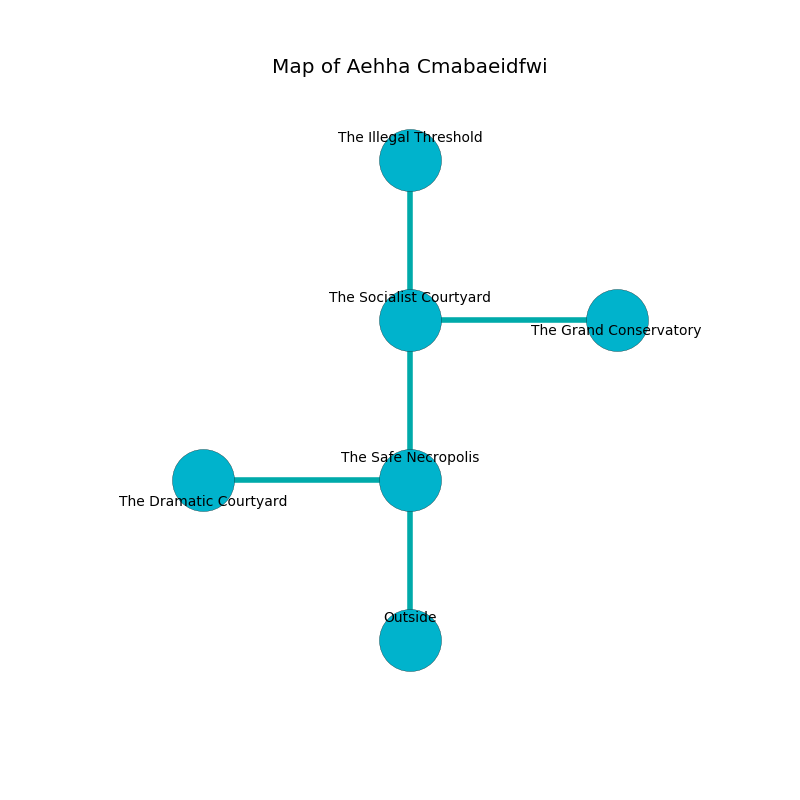

%Ruin Dogs

##Aehha Cmabaeidfwi
###Overview
Aehha Cmabaeidfwi is located on a haunted rift. Some areas of Aehha Cmabaeidfwi are cursed. The ruin is coming to life. It is occupied by Pixies. Reynaldo Barber The Belligerent, a Barbed Devil is here. The Pixies are the soldiers of Reynaldo Barber The Belligerent. He  is founding a new religion. 

###Artifact
####The Cool Stand

The Cool Stand is a powerful artifact in the shape of an opaque amulet. When rubbed it destroys others. 

###Locations

####the safe necropolis
The brick walls are caving in. 

* To the west a long opening leads to [the dramatic courtyard](#the-dramatic-courtyard).
* To the north a dripping corridor opens to [the socialist courtyard](#the-socialist-courtyard).
* To the south is the entrance.

####the socialist courtyard
The floor is flooded with eight inch deep cool water. Blue ferns are sprouting in cracks in the floor. 

* [The Cool Stand](#The-Cool-Stand) is here.
* [Reynaldo Barber The Belligerent](#Reynaldo-Barber-The-Belligerent) is here.
* To the east a windy artery opens to [the grand conservatory](#the-grand-conservatory).
* To the north a hazy hall leads to [the illegal threshold](#the-illegal-threshold).
* To the south a dripping corridor connects to [the safe necropolis](#the-safe-necropolis).

####the dramatic courtyard
Red mushrooms are growing from the ceiling. The air smells like lemon here. 

* To the east a long opening opens to [the safe necropolis](#the-safe-necropolis).

####the illegal threshold
There is a trap here. When activated, a pressure plate will collapse a column. The air smells like petitgrain here. 

* To the south a hazy hall opens to [the socialist courtyard](#the-socialist-courtyard).

####the grand conservatory
The floor is cluttered with bones. There are two Guards, a Riding Horse, a Vine Blight, a Basilisk, a Giant Rat, and  here. 

There is an engraving on the floor written in common. 

> Poor me! pitiful fate
>
> deep, visual, late
>
> white, negative, unlikely
>
> life is likely
>

* There is a gold coin here.
* To the west a windy artery leads to [the socialist courtyard](#the-socialist-courtyard).

