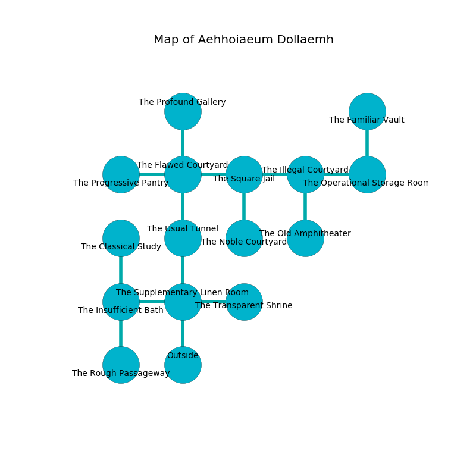

%Ruin Dogs

##Aehhoiaeum Dollaemh
###Overview
Aehhoiaeum Dollaemh is constructed on an obsidion plain. Some areas of Aehhoiaeum Dollaemh are flooded. A blizzard is happening outside. It is occupied by Myconids. Yuette Milburn The Patronizing, a Mind Flayer Arcanist is here. The Myconids have been charmed by Yuette Milburn The Patronizing. She  is trying to hide [Uaefoi Faeddum](#Uaefoi-Faeddum). 

###Artifact
####Uaefoi Faeddum

Uaefoi Faeddum has the form of a warm monument. When worshipped it destroys others. 

###Locations

####the supplementary linen room
The floor is glossy. The stone walls are ruined. There are three Myconid Sovereigns and six Myconid Adults here. The Myconids are willing to negotiate. 

* There is a horse here.
* To the west a flooded artery connects to [the insufficient bath](#the-insufficient-bath).
* To the east a torchlit path connects to [the transparent shrine](#the-transparent-shrine).
* To the north a flooded threshold connects to [the usual tunnel](#the-usual-tunnel).
* To the south is the entrance.

####the usual tunnel
There is a trap here. When activated, a magical rune will launch a poison dart. The floor is bloodstained. Green moss is growing from the walls. 

* There is a drake here.
* To the north a small path connects to [the flawed courtyard](#the-flawed-courtyard).
* To the south a flooded threshold leads to [the supplementary linen room](#the-supplementary-linen-room).

####the flawed courtyard
There are four Myconid Sovereigns and four Myconid Adults here. The air tastes like musk here. The mirrored walls are pristine. If the Myconids notice the Ruin Dogs, one of them will retreat and alert [Yuette Milburn](#Yuette-Milburn). 

* To the west a flooded threshold connects to [the progressive pantry](#the-progressive-pantry).
* To the east a small corridor leads to [the square jail](#the-square-jail).
* To the north a narrow cave leads to [the profound gallery](#the-profound-gallery).
* To the south a small path connects to [the usual tunnel](#the-usual-tunnel).

####the square jail
The floor is flooded with five inch deep cold water. Green mushrooms are sprouting in a patch on the floor. The stone walls are bloodstained. 

* To the west a small corridor leads to [the flawed courtyard](#the-flawed-courtyard).
* To the east a narrow threshold connects to [the illegal courtyard](#the-illegal-courtyard).
* To the south a torchlit pathway opens to [the noble courtyard](#the-noble-courtyard).

####the insufficient bath
The floor is smooth. White lichens are growing in a patch on the floor. 

There is an engraving on the ceiling written in common. 

> Maybe try digging.
>

* [Uaefoi Faeddum](#Uaefoi-Faeddum) is here.
* [Yuette Milburn The Patronizing](#Yuette-Milburn-The-Patronizing) is here.
* To the east a flooded artery leads to [the supplementary linen room](#the-supplementary-linen-room).
* To the north a narrow gap opens to [the classical study](#the-classical-study).
* To the south a small threshold leads to [the rough passageway](#the-rough-passageway).

####the transparent shrine
The air smells like cooked onion here. Gray razorgrass is swaying in a patch on the floor. 

* To the west a torchlit path opens to [the supplementary linen room](#the-supplementary-linen-room).

####the illegal courtyard
Red mushrooms are swaying from the ceiling. The air tastes like tallow here. There are a Hunter Shark, a Rug of Smothering, a Giant Crab, a Mimic, and a Basilisk here. 

* There is a breastplate here.
* To the west a narrow threshold opens to [the square jail](#the-square-jail).
* To the east a twisted hallway leads to [the operational storage room](#the-operational-storage-room).
* To the south a dripping hall opens to [the old amphitheater](#the-old-amphitheater).

####the progressive pantry
The air smells like lemongrass here. The concrete walls are ruined. Blue razorgrass is decaying in a patch on the floor. There is a trap here. When activated, a magical rune will close a portcullis. 

There is an engraving on the floor written in Myconids Script. 

> [Uaefoi Faeddum](#Uaefoi-Faeddum)
>
> economic and desirable
>
> [Uaefoi Faeddum](#Uaefoi-Faeddum)
>
> but never conscious
>

* There is a mug here.
* To the east a flooded threshold leads to [the flawed courtyard](#the-flawed-courtyard).

####the noble courtyard
There are a Stone Giant, a Rat, a Thug, a Cat, a Brown Bear, and a Treant here. The floor is flooded with six inch deep scalding water. The metallic walls are unsettled. 

* To the north a torchlit pathway leads to [the square jail](#the-square-jail).

####the profound gallery
The mirrored walls are scratched. Yellow moss is sprouting from the ceiling. The air smells like agarwood here. The floor is bloodstained. There is a trap here. When activated, a magical rune will cast a curse. 

There is an engraving on the floor written in Myconids Script. 

> I can not find [Uaefoi Faeddum](#Uaefoi-Faeddum).
>
> Try hiding.
>

* To the south a narrow cave opens to [the flawed courtyard](#the-flawed-courtyard).

####the old amphitheater
White moss is sprouting from the walls. 

There is an engraving on the ceiling written in Myconids Script. 

> I worship [Uaefoi Faeddum](#Uaefoi-Faeddum).
>

* To the north a dripping hall leads to [the illegal courtyard](#the-illegal-courtyard).

####the classical study
There is a trap here. When activated, a pressure plate will make the ceiling slowly lower. The floor is bloodstained. 

* There is an ant here.
* To the south a narrow gap opens to [the insufficient bath](#the-insufficient-bath).

####the operational storage room
The air tastes like cauliflower here. The mirrored walls are pristine. 

* There is a picture here.
* There is a basket here.
* To the west a twisted hallway opens to [the illegal courtyard](#the-illegal-courtyard).
* To the north a dripping artery connects to [the familiar vault](#the-familiar-vault).

####the familiar vault
The floor is glossy. Gray lichens are growing from the ceiling. The air tastes like grape skin here. There are four Myconid Sovereigns and three Myconid Adults here. One of the Myconids is on watch, the rest are meditating. 

* There is a whip here.
* To the south a dripping artery opens to [the operational storage room](#the-operational-storage-room).

####the rough passageway
There are a Darkmantle, a Duergar, a Young Green Dragon, an Ankheg, a Basilisk, and a Bat here. The floor is smooth. The air smells like bitter orange here. 

* To the north a small threshold connects to [the insufficient bath](#the-insufficient-bath).

