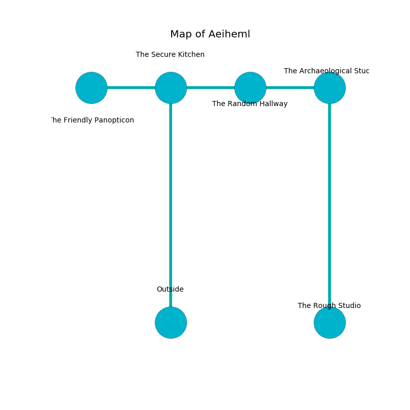

%Ruin Dogs

##Aeiheml
###Overview
Aeiheml is located on a cursed plain. Parts of it are foggy. The ruin is burning. It is occupied by Duergars. Myron Blanton The Overemotional, a Drow Priestess of Lolth is here. The Duergars are battling Myron Blanton The Overemotional. He  is trying to recover [Asdfaiiaeum](#Asdfaiiaeum). 

###Artifact
####Asdfaiiaeum

Asdfaiiaeum has the form of a cold meteorite. Power pours around it. It is a light green color. When eaten it floats in the air. 

###Locations

####the secure kitchen
There are eight Duergars here. Green moss is swaying from the ceiling. The floor is cluttered with ashes. The Duergars are performing a ritual. If not interrupted, [Myron Blanton](#Myron-Blanton) will be magically alarmed. 

* There is a stocking here.
* [Asdfaiiaeum](#Asdfaiiaeum) is here.
* [Myron Blanton The Overemotional](#Myron-Blanton-The-Overemotional) is here.
* To the west a twisted pathway connects to [the friendly panopticon](#the-friendly-panopticon).
* To the east a hazy hall connects to [the random hallway](#the-random-hallway).
* To the south is the entrance.

####the random hallway
The air smells like citrus peel here. The mirrored walls are bloodstained. Green moss is swaying in a patch on the floor. There are eight Duergars here. The Duergars are performing a ritual. If not interrupted, a powerful monster will be summoned. 

* There is a hoard here.
* To the west a hazy hall leads to [the secure kitchen](#the-secure-kitchen).
* To the east a dark hall connects to [the archaeological study](#the-archaeological-study).

####the archaeological study
The air smells like mandarin here. The floor is flooded with one inch deep cool water. Green razorgrass is growing from the ceiling. 

* To the west a dark hall connects to [the random hallway](#the-random-hallway).
* To the south a twisted corridor leads to [the rough studio](#the-rough-studio).

####the rough studio
The wooden walls are caving in. 

* To the north a twisted corridor opens to [the archaeological study](#the-archaeological-study).

####the friendly panopticon
Blue razorgrass is growing in broken urns. 

* To the east a twisted pathway leads to [the secure kitchen](#the-secure-kitchen).

