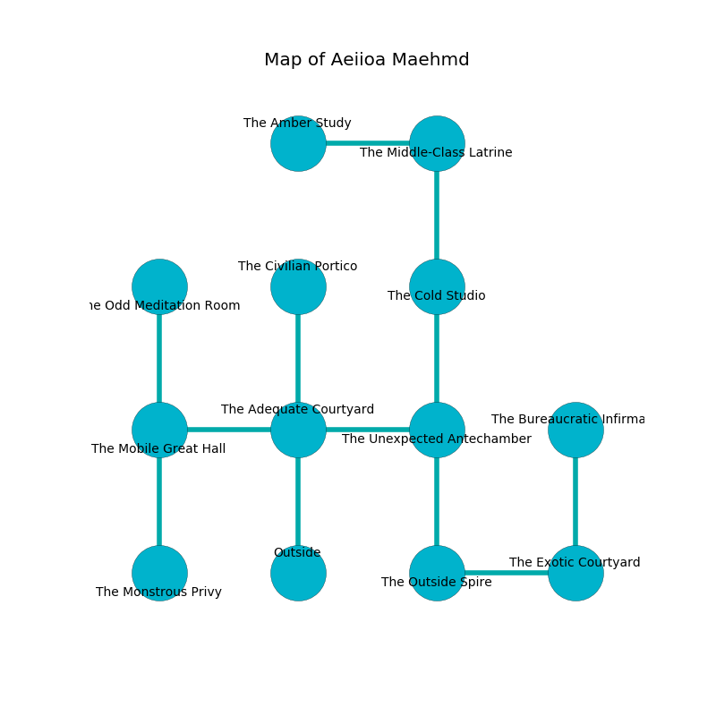

%Ruin Dogs

##Aeiioa Maehmd
###Overview
Aeiioa Maehmd is located on a haunted city. Parts of Aeiioa Maehmd are foggy. The ruin is coming to life. It is occupied by Lizardfolk. Archie Whalen The Sarcastic, a Succubus is here. The Lizardfolk are the slaves of Archie Whalen The Sarcastic. He  is trying to research [Iaela](#Iaela). 

###Artifact
####Iaela

Iaela is a powerful artifact in the shape of a glassy doll. When picked up it turns surrounding objects to ashes. 

###Locations

####the adequate courtyard
There are a Githyanki Warrior, an Aarakocra, a Giant Bat, and a Gelatinous Cube here. The mirrored walls are caving in. Yellow ferns are swaying in cracks in the floor. 

* There is a blade here.
* There is a cart here.
* To the west a dark walkway leads to [the mobile great hall](#the-mobile-great-hall).
* To the east a windy hall leads to [the unexpected antechamber](#the-unexpected-antechamber).
* To the north a dripping gap connects to [the civilian portico](#the-civilian-portico).
* To the south is the entrance.

####the civilian portico
The glass walls are ruined. The air tastes like tobacco here. The floor is sticky. 

* [Archie Whalen The Sarcastic](#Archie-Whalen-The-Sarcastic) is here.
* To the south a dripping gap opens to [the adequate courtyard](#the-adequate-courtyard).

####the unexpected antechamber

* To the west a windy hall leads to [the adequate courtyard](#the-adequate-courtyard).
* To the north a dark threshold opens to [the cold studio](#the-cold-studio).
* To the south a twisted hall connects to [the outside spire](#the-outside-spire).

####the mobile great hall
There are a Lion, a Smoke Mephit, and a Wererat here. The floor is bloodstained. 

* There is a boot here.
* There is a drawer here.
* To the east a dark walkway leads to [the adequate courtyard](#the-adequate-courtyard).
* To the north a dripping path connects to [the odd meditation room](#the-odd-meditation-room).
* To the south a torchlit cavern opens to [the monstrous privy](#the-monstrous-privy).

####the outside spire
Yellow moss is swaying in broken urns. The mirrored walls are ruined. 

There is an engraving on the ceiling written in common. 

> Dear me! pitiful you
>
> yet internal
>
> lively, decorative, new
>
> nothing is eternal
>

* To the east a twisted passageway opens to [the exotic courtyard](#the-exotic-courtyard).
* To the north a twisted hall opens to [the unexpected antechamber](#the-unexpected-antechamber).

####the exotic courtyard
The air smells like rye bread here. There are a Lizardfolk Shaman and two Lizardfolk here. The crystal walls are caving in. The Lizardfolk are willing to fight to the death. 

* To the west a twisted passageway connects to [the outside spire](#the-outside-spire).
* To the north a twisted pathway opens to [the bureaucratic infirmary](#the-bureaucratic-infirmary).

####the bureaucratic infirmary
The floor is glossy. There are two Lizardfolk Shamans here. The Lizardfolk are performing a ritual. If not interrupted, the ruin dogs will be weakened. 

* To the south a twisted pathway connects to [the exotic courtyard](#the-exotic-courtyard).

####the cold studio
The wooden walls are pristine. The floor is flooded with two inch deep cold water. There are an Azer, a Swarm of Rats, a Myconid Sovereign, and a Draft Horse here. 

* To the north a long walkway leads to [the middle-class latrine](#the-middle-class-latrine).
* To the south a dark threshold connects to [the unexpected antechamber](#the-unexpected-antechamber).

####the middle-class latrine
Yellow lichens are decaying in cracks in the floor. The air smells like popcorn here. 

* There is a goat here.
* There is a dog here.
* [Iaela](#Iaela) is here.
* To the west a dark cave connects to [the amber study](#the-amber-study).
* To the south a long walkway leads to [the cold studio](#the-cold-studio).

####the odd meditation room
The brick walls are pristine. 

There is an engraving on a tablet written in common. 

> Try running.
>

* There is a key here.
* To the south a dripping path connects to [the mobile great hall](#the-mobile-great-hall).

####the monstrous privy

* To the north a torchlit cavern connects to [the mobile great hall](#the-mobile-great-hall).

####the amber study
There are a Lizardfolk Shaman, a Pentadrone, a Jackalwere, and a Scorpion here. The wooden walls are covered in mold. 

* To the east a dark cave connects to [the middle-class latrine](#the-middle-class-latrine).

