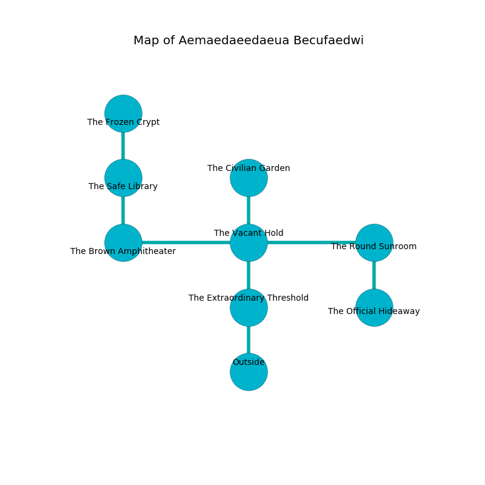

%Ruin Dogs

##Aemaedaeedaeua Becufaedwi
###Overview
Aemaedaeedaeua Becufaedwi is constructed on a poisoned rift. Some rooms of Aemaedaeedaeua Becufaedwi are cursed. The ruin is sinking into the earth. It is occupied by Humans. Reynaldo See The Intolerant, a Mage is here. The Humans are the soldiers of Reynaldo See The Intolerant. He  is trying to hide [The Cruel Auditor](#The-Cruel-Auditor). 

###Artifact
####The Cruel Auditor

The Cruel Auditor has the form of a sharp monument. It is a bright brown color. It smells like neroli. Cacophony pours from it. When smelled it emits dust. 

###Locations

####the extraordinary threshold
The air tastes like eggs here. The floor is glossy. The wooden walls are ruined. 

* To the north a hazy cave connects to [the vacant hold](#the-vacant-hold).
* To the south is the entrance.

####the vacant hold
The air smells like dry	durian here. There are a Giant Crocodile, a Boar, and a White Dragon Wyrmling here. 

* To the west a dripping opening connects to [the brown amphitheater](#the-brown-amphitheater).
* To the east a torchlit path leads to [the round sunroom](#the-round-sunroom).
* To the north a flooded corridor connects to [the civilian garden](#the-civilian-garden).
* To the south a hazy cave leads to [the extraordinary threshold](#the-extraordinary-threshold).

####the round sunroom
The obsidion walls are bloodstained. The air tastes like immortelle here. The floor is cluttered with rocks. There is a trap here. When activated, a magical proximity detector will ring a bell. There are a Thug, a Gladiator, a Commoner, two Priests, and  here. Blue mushrooms are growing in broken urns. One of the Humans is on watch, the rest are meditating. 

* [Reynaldo See The Intolerant](#Reynaldo-See-The-Intolerant) is here.
* To the west a torchlit path opens to [the vacant hold](#the-vacant-hold).
* To the south a flooded corridor opens to [the official hideaway](#the-official-hideaway).

####the official hideaway
The air tastes like root here. The floor is cluttered with ashes. 

* To the north a flooded corridor connects to [the round sunroom](#the-round-sunroom).

####the civilian garden
The floor is glossy. Blue lichens are sprouting from the walls. There is a trap here. When activated, a magical proximity detector will launch a fireball. 

* To the south a flooded corridor leads to [the vacant hold](#the-vacant-hold).

####the brown amphitheater
Green lichens are swaying from the walls. The stone walls are bloodstained. 

* To the east a dripping opening leads to [the vacant hold](#the-vacant-hold).
* To the north a dripping walkway connects to [the safe library](#the-safe-library).

####the safe library
There are a Veteran, a Berserker, a Cultist, and a Scout here. The floor is cluttered with shells. The Humans are feasting. 

* [The Cruel Auditor](#The-Cruel-Auditor) is here.
* To the north a small cavern leads to [the frozen crypt](#the-frozen-crypt).
* To the south a dripping walkway opens to [the brown amphitheater](#the-brown-amphitheater).

####the frozen crypt
The wooden walls are ruined. There is a trap here. When activated, a magical proximity detector will fire an acid arrow. The air tastes like sulfur here. 

* There is a sheep here.
* To the south a small cavern connects to [the safe library](#the-safe-library).

