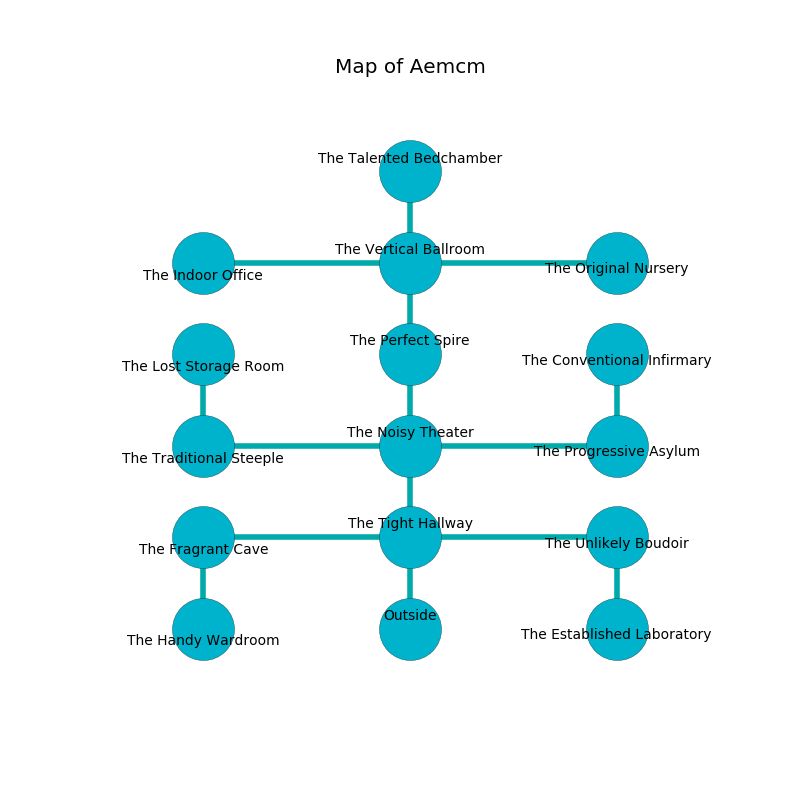

%Ruin Dogs

##Aemcm
###Overview
Aemcm is located in an obsidion city. Regions of it are frozen. A blizzard is happening outside. It is occupied by Sahuagins. Lashawnda Amato The Quarrelsome, a Cloud Giant is here. The Sahuagins worship Lashawnda Amato The Quarrelsome. She  is founding a new religion. 

###Artifact
####The Likely Ruin

The Likely Ruin has the form of a soft gem. It is a dark blue color. When worshipped it destroys others. 

###Locations

####the tight hallway
The mirrored walls are unsettled. There are four Sahuagin Priestesses here. One of the Sahuagins is pointing a ballista at the entrance. 

* To the west a narrow opening connects to [the fragrant cave](#the-fragrant-cave).
* To the east a narrow artery leads to [the unlikely boudoir](#the-unlikely-boudoir).
* To the north a flooded hallway connects to [the noisy theater](#the-noisy-theater).
* To the south is the entrance.

####the noisy theater
The air tastes like prune here. The stone walls are caving in. The floor is sticky. 

* To the west a dark path connects to [the traditional steeple](#the-traditional-steeple).
* To the east a small hall connects to [the progressive asylum](#the-progressive-asylum).
* To the north a dripping gap leads to [the perfect spire](#the-perfect-spire).
* To the south a flooded hallway opens to [the tight hallway](#the-tight-hallway).

####the unlikely boudoir
There are four Sahuagin Priestesses here. The floor is flooded with two inch deep cold water. One of the Sahuagins is working a mechanism that can open a trapodoor in the floor. 

* To the west a narrow artery leads to [the tight hallway](#the-tight-hallway).
* To the south a twisted cave leads to [the established laboratory](#the-established-laboratory).

####the traditional steeple
The obsidion walls are unsettled. The floor is glossy. 

There is an engraving on a stone written in Sahuagins Script. 

> O terrible god
>
> it is always odd
>
> honorable, profound, happy
>
> fate is odd
>

* There is a ring here.
* There is a leaf here.
* To the east a dark path opens to [the noisy theater](#the-noisy-theater).
* To the north a narrow path connects to [the lost storage room](#the-lost-storage-room).

####the established laboratory
There are a Merfolk, a Young Green Dragon, and an Owl here. The floor is flooded with two inch deep cool water. 

* To the north a twisted cave opens to [the unlikely boudoir](#the-unlikely-boudoir).

####the progressive asylum
The wooden walls are caving in. There are four Sahuagin Priestesses here. The Sahuagins are willing to negotiate. 

* To the west a small hall opens to [the noisy theater](#the-noisy-theater).
* To the north a dripping hall opens to [the conventional infirmary](#the-conventional-infirmary).

####the perfect spire
The wooden walls are bloodstained. There are a Doppelganger, a Saber-Toothed Tiger, a Myconid Adult, a Gray Ooze, and a Berserker here. 

There is an engraving on the ceiling written in Sahuagins Script. 

> O! everything is inhumane
>
> mechanical, agricultural, plain
>
> it is never plain
>
> hope is vain
>

* To the north a flooded hall connects to [the vertical ballroom](#the-vertical-ballroom).
* To the south a dripping gap leads to [the noisy theater](#the-noisy-theater).

####the conventional infirmary
There is a trap here. When activated, a magical proximity detector will close a portcullis. 

* To the south a dripping hall connects to [the progressive asylum](#the-progressive-asylum).

####the vertical ballroom
The air smells like osmanthus here. White razorgrass is sprouting in a patch on the floor. 

* There is a diamond here.
* [The Likely Ruin](#The-Likely-Ruin) is here.
* To the west a narrow path opens to [the indoor office](#the-indoor-office).
* To the east a long corridor opens to [the original nursery](#the-original-nursery).
* To the north a narrow pathway opens to [the talented bedchamber](#the-talented-bedchamber).
* To the south a flooded hall leads to [the perfect spire](#the-perfect-spire).

####the fragrant cave
The brick walls are bloodstained. 

* There is a demon here.
* To the east a narrow opening leads to [the tight hallway](#the-tight-hallway).
* To the south a long artery connects to [the handy wardroom](#the-handy-wardroom).

####the handy wardroom
The wooden walls are ruined. 

* To the north a long artery connects to [the fragrant cave](#the-fragrant-cave).

####the indoor office
White mushrooms are growing in broken urns. The air tastes like clam here. The metallic walls are unsettled. 

There is an engraving on the ceiling written in common. 

> Leave now.
>

* To the east a narrow path connects to [the vertical ballroom](#the-vertical-ballroom).

####the lost storage room
The floor is bloodstained. 

* There is a key here.
* [Lashawnda Amato The Quarrelsome](#Lashawnda-Amato-The-Quarrelsome) is here.
* To the south a narrow path connects to [the traditional steeple](#the-traditional-steeple).

####the talented bedchamber
Gray ferns are sprouting in a patch on the floor. The air tastes like cornmeal here. 

* There is a leprechaun here.
* There is a brain here.
* To the south a narrow pathway connects to [the vertical ballroom](#the-vertical-ballroom).

####the original nursery
There are a Shield Guardian, a Blood Hawk, a Kuo-Toa, a Homunculus, a Twig Blight, a Constrictor Snake, and a Violet Fungus here. The floor is smooth. The concrete walls are ruined. 

There is an engraving on the wall written in common. 

> I am seeking [The Likely Ruin](#The-Likely-Ruin).
>

* To the west a long corridor connects to [the vertical ballroom](#the-vertical-ballroom).

