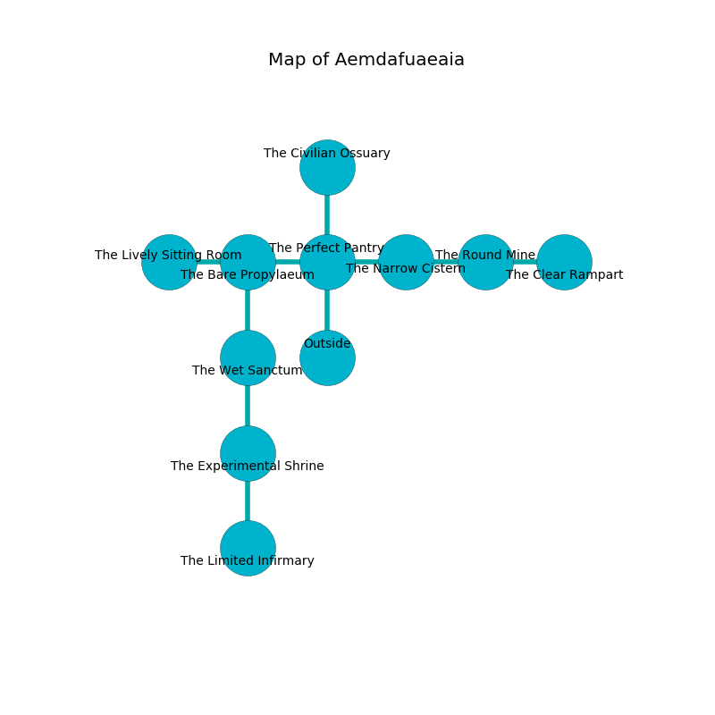

%Ruin Dogs

##Aemdafuaeaia
###Overview
Aemdafuaeaia is located on an obsidion tree. Regions of Aemdafuaeaia are flooded. A lunar eclipse is happening outside. It is occupied by Satyrs. Booker Hawthorne The Impulsive, a Frost Giant is here. The Satyrs are the minions of Booker Hawthorne The Impulsive. He  is trying to use [Idfocdofa](#Idfocdofa). 

###Artifact
####Idfocdofa

Idfocdofa has the form of a wet orb. It smells like grass. Power incinerates towards it. When rubbed it becomes a shielding force. 

###Locations

####the perfect pantry
The air tastes like orange here. The metallic walls are bloodstained. 

There is an engraving on a stone written in common. 

> Dig here.
>

* To the west a dark gap opens to [the bare propylaeum](#the-bare-propylaeum).
* To the east a dark cave connects to [the narrow cistern](#the-narrow-cistern).
* To the north a twisted pathway connects to [the civilian ossuary](#the-civilian-ossuary).
* To the south is the entrance.

####the bare propylaeum
White razorgrass is decaying from the walls. The air smells like pear here. 

* There is a wight here.
* [Booker Hawthorne The Impulsive](#Booker-Hawthorne-The-Impulsive) is here.
* To the west a long walkway leads to [the lively sitting Room](#the-lively-sitting-Room).
* To the east a dark gap opens to [the perfect pantry](#the-perfect-pantry).
* To the south a flooded artery leads to [the wet sanctum](#the-wet-sanctum).

####the narrow cistern
The wooden walls are covered in mold. Gray moss is sprouting from the ceiling. The floor is smooth. 

There is an engraving on a tablet written in common. 

> I am seeking [Idfocdofa](#Idfocdofa).
>
> I could not try leaving.
>

* To the west a dark cave leads to [the perfect pantry](#the-perfect-pantry).
* To the east a long cavern leads to [the round mine](#the-round-mine).

####the round mine
The floor is smooth. Gray moss is swaying in a patch on the floor. There are eighteen Satyrs here. If the Satyrs notice the Ruin Dogs, one of them will retreat and alert the others. 

There is an engraving on a tablet written in common. 

> Treasure here.
>

* To the west a long cavern leads to [the narrow cistern](#the-narrow-cistern).
* To the east a twisted cave leads to [the clear rampart](#the-clear-rampart).

####the clear rampart
The air smells like passion fruit here. The floor is bloodstained. The mirrored walls are covered in mold. 

* To the west a twisted cave leads to [the round mine](#the-round-mine).

####the civilian ossuary
The floor is sticky. The air tastes like avocado here. 

* To the south a twisted pathway connects to [the perfect pantry](#the-perfect-pantry).

####the wet sanctum
There are eighteen Satyrs here. The brick walls are scratched. Gray razorgrass is swaying from the walls. The Satyrs are willing to negotiate. 

* To the north a flooded artery connects to [the bare propylaeum](#the-bare-propylaeum).
* To the south a long artery leads to [the experimental shrine](#the-experimental-shrine).

####the lively sitting Room
The concrete walls are covered in mold. The floor is cluttered with broken glass. Yellow mushrooms are decaying in a patch on the floor. 

* To the east a long walkway connects to [the bare propylaeum](#the-bare-propylaeum).

####the experimental shrine
Blue mushrooms are swaying from the ceiling. The floor is cluttered with ashes. There are eighteen Satyrs here. The air smells like pear here. The Satyrs are crazy with bloodlust. 

There is an engraving on a stone written in common. 

> I am defending Aemdafuaeaia.
>
> Do not try fighting.
>

* [Idfocdofa](#Idfocdofa) is here.
* To the north a long artery opens to [the wet sanctum](#the-wet-sanctum).
* To the south a windy threshold leads to [the limited infirmary](#the-limited-infirmary).

####the limited infirmary
The floor is flooded with five inch deep cool water. The concrete walls are covered in mold. There are a Galeb Duhr and a Xorn here. 

* There is a wight here.
* To the north a windy threshold leads to [the experimental shrine](#the-experimental-shrine).

