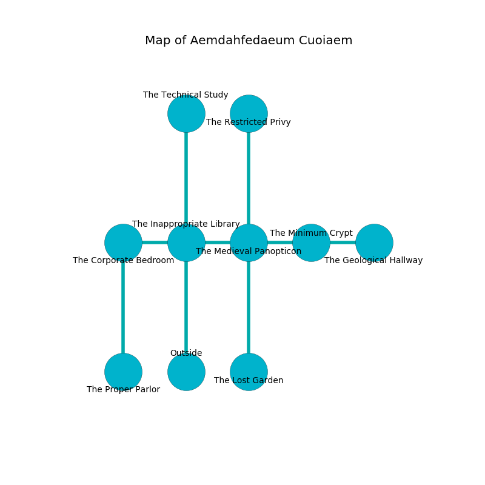

%Ruin Dogs

##Aemdahfedaeum Cuoiaem
###Overview
Aemdahfedaeum Cuoiaem is constructed on a crystal plain. Some areas of it are inaccessible. A massive flood is happening outside. It is occupied by Kuo-Toa. Krysten Willingham The Resentful, a Cult Fanatic is here. The Kuo-Toa have been charmed by Krysten Willingham The Resentful. She  is trying to use [Cummacdaeum Muideha](#Cummacdaeum-Muideha). 

###Artifact
####Cummacdaeum Muideha

Cummacdaeum Muideha has the form of a soft crystal. Power pours from it. It smells like green bean. When worn it liquifies. 

###Locations

####the inappropriate library
The floor is sticky. The air smells like paint here. White razorgrass is swaying from the walls. 

* To the west a windy threshold connects to [the corporate bedroom](#the-corporate-bedroom).
* To the east a torchlit hall opens to [the medieval panopticon](#the-medieval-panopticon).
* To the north a small pathway opens to [the technical study](#the-technical-study).
* To the south is the entrance.

####the medieval panopticon
The air tastes like spearmint here. The floor is bloodstained. The mirrored walls are covered in mold. 

* [Cummacdaeum Muideha](#Cummacdaeum-Muideha) is here.
* To the west a torchlit hall connects to [the inappropriate library](#the-inappropriate-library).
* To the east a windy hallway leads to [the minimum crypt](#the-minimum-crypt).
* To the north a flooded cave leads to [the restricted privy](#the-restricted-privy).
* To the south a twisted gap connects to [the lost garden](#the-lost-garden).

####the corporate bedroom
The floor is smooth. White razorgrass is swaying in a patch on the floor. The crystal walls are pristine. 

There is an engraving on a stone written in Kuo-Toa Script. 

> I could not try praying.
>

* To the east a windy threshold leads to [the inappropriate library](#the-inappropriate-library).
* To the south a torchlit pathway connects to [the proper parlor](#the-proper-parlor).

####the technical study
There is a Rug of Smothering here. The air tastes like elderberry here. 

There is an engraving on the wall written in common. 

> Oh my! pitiful we
>
> yet never free
>
> ambiguous and mature
>
> the world is obscure
>

* To the south a small pathway leads to [the inappropriate library](#the-inappropriate-library).

####the minimum crypt
There are a Kuo-Toa Whip and four Kuo-Toa here. If the Kuo-Toa notice the Ruin Dogs, one of them will retreat and alert [Krysten Willingham](#Krysten-Willingham). 

* To the west a windy hallway leads to [the medieval panopticon](#the-medieval-panopticon).
* To the east a torchlit opening leads to [the geological hallway](#the-geological-hallway).

####the lost garden
Gray moss is sprouting from the ceiling. There are a Troglodyte, a Black Bear, an Allosaurus, and a Steam Mephit here. The crystal walls are unsettled. 

* To the north a twisted gap opens to [the medieval panopticon](#the-medieval-panopticon).

####the proper parlor
The floor is sticky. There are two Kuo-Toa Whips and a Kuo-Toa here. The crystal walls are scratched. The Kuo-Toa are willing to negotiate. 

* To the north a torchlit pathway opens to [the corporate bedroom](#the-corporate-bedroom).

####the geological hallway
The brick walls are ruined. Blue moss is decaying from the ceiling. The air tastes like pear here. 

* To the west a torchlit opening opens to [the minimum crypt](#the-minimum-crypt).

####the restricted privy
The crystal walls are scratched. The floor is glossy. 

* There is a specter here.
* There is a comb here.
* [Krysten Willingham The Resentful](#Krysten-Willingham-The-Resentful) is here.
* To the south a flooded cave leads to [the medieval panopticon](#the-medieval-panopticon).

