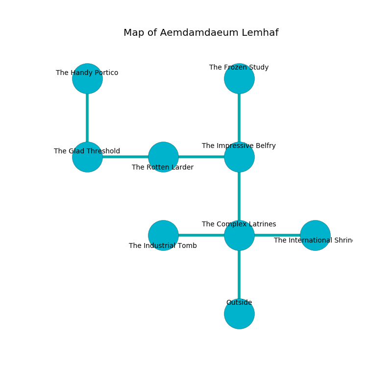

%Ruin Dogs

##Aemdamdaeum Lemhaf
###Overview
Aemdamdaeum Lemhaf is located on a broken plain. Regions of it are foggy. The ruin is burning. It is occupied by Dryads. Milda Hilton The Grumpy, an Orc War Chief is here. The Dryads are battling Milda Hilton The Grumpy. She  is trying to use [Muom Aemlaeuaeloeh](#Muom-Aemlaeuaeloeh). 

###Artifact
####Muom Aemlaeuaeloeh

Muom Aemlaeuaeloeh has the form of an opaque cube. It is a medium orange color. It smells like seashore. When gazed upon it liquifies. 

###Locations

####the complex latrines
The metallic walls are pristine. Yellow moss is swaying from the walls. 

* To the west a torchlit path opens to [the industrial tomb](#the-industrial-tomb).
* To the east a dripping cave opens to [the international shrine](#the-international-shrine).
* To the north a windy corridor opens to [the impressive belfry](#the-impressive-belfry).
* To the south is the entrance.

####the impressive belfry
The air tastes like walnut here. The floor is flooded with six inch deep lukewarm water. The wooden walls are scratched. 

There is an engraving on the floor written in common. 

> [Muom Aemlaeuaeloeh](#Muom-Aemlaeuaeloeh)
>
> scientific, sophisticated, fast
>
> you are punished
>

* To the west a torchlit hall leads to [the rotten larder](#the-rotten-larder).
* To the north a narrow cave opens to [the frozen study](#the-frozen-study).
* To the south a windy corridor leads to [the complex latrines](#the-complex-latrines).

####the international shrine
The mirrored walls are unsettled. The air smells like potato chip here. 

* There is a bee here.
* To the west a dripping cave leads to [the complex latrines](#the-complex-latrines).

####the frozen study
There are three Dryads here. The stone walls are bloodstained. The Dryads are performing a ritual. If not interrupted, the ruin dogs will be weakened. 

* To the south a narrow cave opens to [the impressive belfry](#the-impressive-belfry).

####the industrial tomb
There is an Owlbear here. The concrete walls are scratched. Gray mushrooms are swaying in cracks in the floor. 

There is an engraving on the ceiling written in common. 

> I worship [Muom Aemlaeuaeloeh](#Muom-Aemlaeuaeloeh).
>

* To the east a torchlit path connects to [the complex latrines](#the-complex-latrines).

####the rotten larder
The air smells like grape here. There is a Hook Horror here. 

* There is a rod here.
* [Milda Hilton The Grumpy](#Milda-Hilton-The-Grumpy) is here.
* To the west a twisted pathway opens to [the glad threshold](#the-glad-threshold).
* To the east a torchlit hall leads to [the impressive belfry](#the-impressive-belfry).

####the glad threshold
The air smells like tuberose here. The wooden walls are caving in. 

There is an engraving on the ceiling written in common. 

> I worship [Muom Aemlaeuaeloeh](#Muom-Aemlaeuaeloeh).
>
> Run away.
>

* [Muom Aemlaeuaeloeh](#Muom-Aemlaeuaeloeh) is here.
* To the east a twisted pathway opens to [the rotten larder](#the-rotten-larder).
* To the north a dark cave opens to [the handy portico](#the-handy-portico).

####the handy portico
The metallic walls are ruined. The floor is glossy. 

* There is a roof here.
* To the south a dark cave leads to [the glad threshold](#the-glad-threshold).

