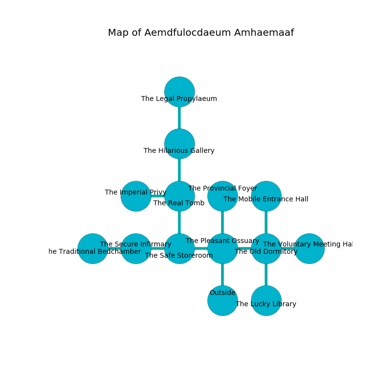

%Ruin Dogs

##Aemdfulocdaeum Amhaemaaf
###Overview
Aemdfulocdaeum Amhaemaaf is located under a poisoned tree. Parts of it are foggy. The ruin is collapsing slowly. It is occupied by Sahuagin. Grant Isbell The Mean, an Ogre is here. The Sahuagin are the minions of Grant Isbell The Mean. He  is founding a new religion. 

###Artifact
####Aebeha Cuddaf

Aebeha Cuddaf looks like a soft rock. It smells like blackberry. When thrown it destroys itself. 

###Locations

####the pleasant ossuary
The air tastes like violet leaf here. There are a Giant Toad, a Ghoul, and a Deer here. Red razorgrass is swaying in cracks in the floor. 

* To the west a hazy cavern opens to [the safe storeroom](#the-safe-storeroom).
* To the east a twisted threshold connects to [the old dormitory](#the-old-dormitory).
* To the north a narrow artery opens to [the provincial foyer](#the-provincial-foyer).
* To the south is the entrance.

####the provincial foyer
The air tastes like cornmint here. 

* There is a wall here.
* There is a bird here.
* To the south a narrow artery opens to [the pleasant ossuary](#the-pleasant-ossuary).

####the old dormitory
The mirrored walls are caving in. There are four Sahuagin here. White lichens are sprouting in cracks in the floor. The Sahuagin are willing to negotiate. 

* [Aebeha Cuddaf](#Aebeha-Cuddaf) is here.
* [Grant Isbell The Mean](#Grant-Isbell-The-Mean) is here.
* To the west a twisted threshold opens to [the pleasant ossuary](#the-pleasant-ossuary).
* To the east a small threshold leads to [the voluntary meeting hall](#the-voluntary-meeting-hall).
* To the north a flooded hallway opens to [the mobile entrance hall](#the-mobile-entrance-hall).
* To the south a small passageway connects to [the lucky library](#the-lucky-library).

####the safe storeroom
Blue lichens are growing in a patch on the floor. The air smells like cereal here. 

* There is a horn here.
* To the west a long pathway connects to [the secure infirmary](#the-secure-infirmary).
* To the east a hazy cavern connects to [the pleasant ossuary](#the-pleasant-ossuary).
* To the north a flooded threshold leads to [the real tomb](#the-real-tomb).

####the secure infirmary
The stone walls are bloodstained. 

* There is a sponge here.
* To the west a windy path opens to [the traditional bedchamber](#the-traditional-bedchamber).
* To the east a long pathway connects to [the safe storeroom](#the-safe-storeroom).

####the real tomb
The metallic walls are unsettled. There are a Quadrone and an Ogre here. 

* To the west a windy path connects to [the imperial privy](#the-imperial-privy).
* To the north a dark cavern connects to [the hilarious gallery](#the-hilarious-gallery).
* To the south a flooded threshold leads to [the safe storeroom](#the-safe-storeroom).

####the traditional bedchamber
There is a Will-O’-Wisp here. The wooden walls are bloodstained. The floor is glossy. 

There is an engraving on the wall written in Sahuagin Script. 

> They are lost
>
> representative and ethnic
>
> They are lost
>

* To the east a windy path opens to [the secure infirmary](#the-secure-infirmary).

####the lucky library
There are a Noble and a Black Dragon Wyrmling here. Red razorgrass is swaying in a patch on the floor. The floor is smooth. 

* To the north a small passageway leads to [the old dormitory](#the-old-dormitory).

####the mobile entrance hall
The brick walls are pristine. There is a trap here. When activated, a tripwire will make the walls close in. There are an Axe Beak, an Awakened Tree, and a Giant Goat here. The floor is glossy. 

* To the south a flooded hallway leads to [the old dormitory](#the-old-dormitory).

####the hilarious gallery
There are four Sahuagin here. The air tastes like lily of the valley here. The floor is glossy. The Sahuagin are caring for babies. 

There is an engraving on the floor written in Sahuagin Script. 

> Oh my! the memory of you is woe
>
> feminine, afraid, slow
>
> generous and public
>
> fate is slow
>

* To the north a twisted opening connects to [the legal propylaeum](#the-legal-propylaeum).
* To the south a dark cavern connects to [the real tomb](#the-real-tomb).

####the imperial privy
The crystal walls are bloodstained. The air smells like toast here. There are four Sahuagin here. The floor is sticky. Blue moss is decaying from the ceiling. If the Sahuagin notice the Ruin Dogs, one of them will retreat and alert [Grant Isbell](#Grant-Isbell). 

There is an engraving on a monolith written in common. 

> I am lost in Aemdfulocdaeum Amhaemaaf.
>

* There is a head here.
* To the east a windy path connects to [the real tomb](#the-real-tomb).

####the legal propylaeum
There are four Sahuagin here. The glass walls are bloodstained. The Sahuagin are meditating. 

* To the south a twisted opening opens to [the hilarious gallery](#the-hilarious-gallery).

####the voluntary meeting hall
Green lichens are decaying from the ceiling. There are a Sahuagin, an Azer, a Goat, a Needle Blight, and a Scout here. The metallic walls are ruined. 

There is an engraving on the ceiling written in common. 

> [Aebeha Cuddaf](#Aebeha-Cuddaf)
>
> but never personal
>
> yet never objective
>
> large and obscure
>
> tidy and lonely
>
> regular, efficient, graphic
>
> old, loud, confident
>
> close and original
>
> [Aebeha Cuddaf](#Aebeha-Cuddaf)
>
> always shallow
>
> but tall
>
> left and logical
>
> but never original
>
> adequate and sick
>
> helpless, provincial, exotic
>
> ever sudden
>

* To the west a small threshold leads to [the old dormitory](#the-old-dormitory).

