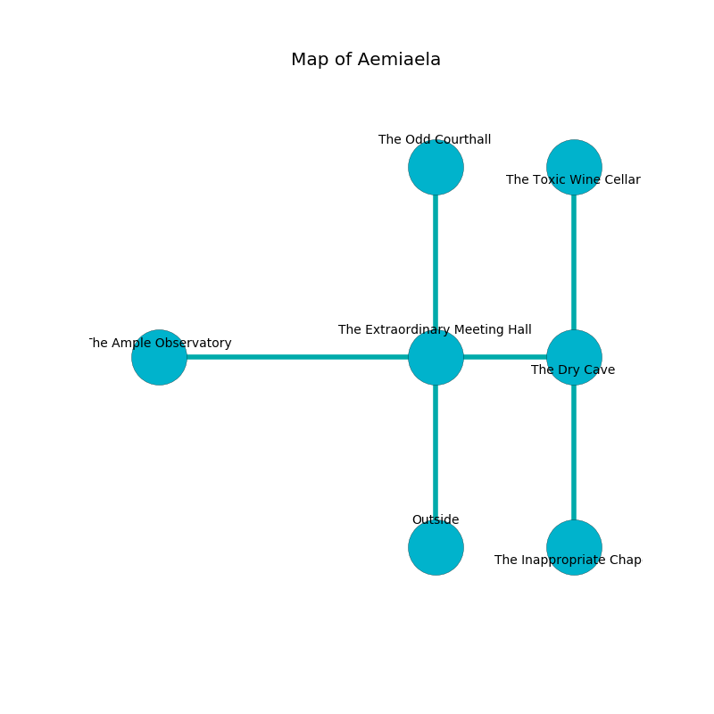

%Ruin Dogs

##Aemiaela
###Overview
Aemiaela is located under a giant city. Some areas of it are inaccessible. A massive flood is happening outside. It is occupied by Sahuagin. Ezekiel Sacco The Flirtatious, a Cloud Giant is here. The Sahuagin are battling Ezekiel Sacco The Flirtatious. He  is founding a new religion. 

###Artifact
####Geimaeum Cfuial

Geimaeum Cfuial has the form of a cold meteorite. When carried it destroys itself. 

###Locations

####the extraordinary meeting hall
The floor is glossy. The metallic walls are ruined. 

* To the west a small opening opens to [the ample observatory](#the-ample-observatory).
* To the east a long hallway leads to [the dry cave](#the-dry-cave).
* To the north a torchlit passageway leads to [the odd courthall](#the-odd-courthall).
* To the south is the entrance.

####the odd courthall
The air smells like white chocolate here. Blue mushrooms are sprouting in a patch on the floor. The floor is cluttered with broken glass. 

* There is a carriage here.
* There is a sheep here.
* There is a bell here.
* To the south a torchlit passageway connects to [the extraordinary meeting hall](#the-extraordinary-meeting-hall).

####the dry cave
The glass walls are bloodstained. There are a Sahuagin and two Sahuagin Barons here. The Sahuagin are performing a ritual. If not interrupted, a powerful monster will be summoned. 

* There is a shield here.
* There is a bottle here.
* [Geimaeum Cfuial](#Geimaeum-Cfuial) is here.
* To the west a long hallway opens to [the extraordinary meeting hall](#the-extraordinary-meeting-hall).
* To the north a twisted threshold connects to [the toxic wine cellar](#the-toxic-wine-cellar).
* To the south a narrow threshold leads to [the inappropriate chapel](#the-inappropriate-chapel).

####the ample observatory
There are two Sahuagin Barons here. The air smells like buttery	cabbage here. If the Sahuagin notice the Ruin Dogs, one of them will retreat and alert the others. 

* To the west a long hall connects to [the ample observatory](#the-ample-observatory).
* To the east a small opening connects to [the extraordinary meeting hall](#the-extraordinary-meeting-hall).

####the ample observatory
The air smells like mimosa here. White moss is swaying from the ceiling. 

* [Ezekiel Sacco The Flirtatious](#Ezekiel-Sacco-The-Flirtatious) is here.
* To the east a long hall opens to [the ample observatory](#the-ample-observatory).

####the inappropriate chapel
There is a trap here. When activated, a tripwire will launch stone blocks from the ceiling. The mirrored walls are pristine. The floor is smooth. 

* There is a shield here.
* There is a trophy here.
* To the north a narrow threshold opens to [the dry cave](#the-dry-cave).

####the toxic wine cellar
There are a Sahuagin and two Sahuagin Barons here. One of the Sahuagin is on watch, the rest are fighting amongst themselves. 

* There is a worm here.
* To the south a twisted threshold opens to [the dry cave](#the-dry-cave).

