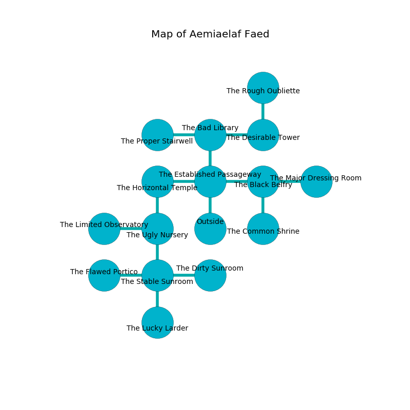

%Ruin Dogs

##Aemiaelaf Faed
###Overview
Aemiaelaf Faed is located on a poisoned plain. Regions of Aemiaelaf Faed are frozen. A lunar eclipse is happening outside. It is occupied by Troglodytes. Rick Leavitt The Nervous, an Assassin is here. The Troglodytes are battling Rick Leavitt The Nervous. He  is trying to use [The Colourful Bundle](#The-Colourful-Bundle). 

###Artifact
####The Colourful Bundle

The Colourful Bundle has the form of a mushy amulet. It is a dark gray color. When held it ignites its surrroundings. 

###Locations

####the established passageway
There are a Pony, a Spectator, a Green Hag, a Pegasus, a Cat, a Swarm of Quippers, and an Animated Armor here. The floor is smooth. The air tastes like jam here. Gray lichens are swaying in broken urns. 

* There is a cup here.
* To the west a torchlit gap connects to [the horizontal temple](#the-horizontal-temple).
* To the east a hazy gap opens to [the black belfry](#the-black-belfry).
* To the north a dark hallway opens to [the bad library](#the-bad-library).
* To the south is the entrance.

####the horizontal temple
The air smells like garlic here. The stone walls are covered in mold. 

There is an engraving on a tablet written in Troglodytes Script. 

> They are sorrowful
>
> liquid and systematic
>
> obscure and genuine
>
> proud and uneasy
>

* There is a sock here.
* To the east a torchlit gap leads to [the established passageway](#the-established-passageway).
* To the south a long pathway opens to [the ugly nursery](#the-ugly-nursery).

####the ugly nursery
The floor is glossy. There is a Young Silver Dragon here. 

* To the west a flooded path leads to [the limited observatory](#the-limited-observatory).
* To the north a long pathway leads to [the horizontal temple](#the-horizontal-temple).
* To the south a windy opening opens to [the stable sunroom](#the-stable-sunroom).

####the limited observatory
The floor is bloodstained. The air smells like lavender here. Blue lichens are sprouting in broken urns. The brick walls are pristine. 

* To the east a flooded path connects to [the ugly nursery](#the-ugly-nursery).

####the black belfry
The air tastes like carrot here. There are thirty six Troglodytes here. One of the Troglodytes is pointing a ballista at the entrance. 

There is an engraving on a monolith written in Troglodytes Script. 

> O! sorry we
>
> handy and interactive
>
> ever free
>
> sadness is attractive
>

* There is a tree here.
* To the west a hazy gap opens to [the established passageway](#the-established-passageway).
* To the east a dripping path opens to [the major dressing room](#the-major-dressing-room).
* To the south a long path opens to [the common shrine](#the-common-shrine).

####the stable sunroom
There are a Displacer Beast, an Ice Mephit, a Lemure, an Earth Elemental, and a Gnoll Pack Lord here. 

There is an engraving on a monolith written in Troglodytes Script. 

> O! everything is sadistic
>
> always characteristic
>
> infinite, different, complex
>
> death is characteristic
>

* [The Colourful Bundle](#The-Colourful-Bundle) is here.
* To the west a hazy corridor opens to [the flawed portico](#the-flawed-portico).
* To the east a narrow corridor leads to [the dirty sunroom](#the-dirty-sunroom).
* To the north a windy opening opens to [the ugly nursery](#the-ugly-nursery).
* To the south a narrow threshold leads to [the lucky larder](#the-lucky-larder).

####the bad library
The air smells like garlic here. The floor is glossy. There are thirty six Troglodytes here. The Troglodytes are performing a ritual. If not interrupted, the Troglodytes will become more powerful. 

* There is a salamander here.
* To the west a dark pathway connects to [the proper stairwell](#the-proper-stairwell).
* To the east a torchlit artery connects to [the desirable tower](#the-desirable-tower).
* To the south a dark hallway opens to [the established passageway](#the-established-passageway).

####the common shrine
The air tastes like leather here. 

* There is an ant here.
* There is an arch here.
* To the north a long path opens to [the black belfry](#the-black-belfry).

####the desirable tower
The air smells like phenolic here. Blue ferns are growing from the ceiling. The floor is sticky. 

There is an engraving on the wall written in common. 

> I am defending this place.
>

* To the west a torchlit artery opens to [the bad library](#the-bad-library).
* To the north a flooded threshold connects to [the rough oubliette](#the-rough-oubliette).

####the flawed portico
There are a Lamia, a Rug of Smothering, a Fire Snake, and a White Dragon Wyrmling here. The air tastes like peppermint here. 

There is an engraving on the wall written in Troglodytes Script. 

> Dig here.
>

* To the east a hazy corridor opens to [the stable sunroom](#the-stable-sunroom).

####the proper stairwell
Red mushrooms are swaying from the ceiling. The floor is smooth. 

* There is a worm here.
* To the east a dark pathway opens to [the bad library](#the-bad-library).

####the rough oubliette
The floor is cluttered with debris. There are a Winter Wolf, a Mezzoloth, a Kuo-Toa, and a Gargoyle here. White mushrooms are swaying in cracks in the floor. The air smells like mold here. 

* To the south a flooded threshold connects to [the desirable tower](#the-desirable-tower).

####the major dressing room
Yellow lichens are decaying in cracks in the floor. 

* To the west a dripping path leads to [the black belfry](#the-black-belfry).

####the dirty sunroom
The floor is bloodstained. The mirrored walls are scratched. There are thirty six Troglodytes here. One of the Troglodytes is pointing a ballista at the entrance. 

* [Rick Leavitt The Nervous](#Rick-Leavitt-The-Nervous) is here.
* To the west a narrow corridor leads to [the stable sunroom](#the-stable-sunroom).

####the lucky larder
The stone walls are ruined. The floor is bloodstained. There are a Troglodyte, a Blue Dragon Wyrmling, a Shadow, a Reef Shark, a Deer, a Cloud Giant, an Orog, and a Goblin Boss here. The air tastes like nasturtium here. Blue mushrooms are swaying in a patch on the floor. 

* To the north a narrow threshold leads to [the stable sunroom](#the-stable-sunroom).

