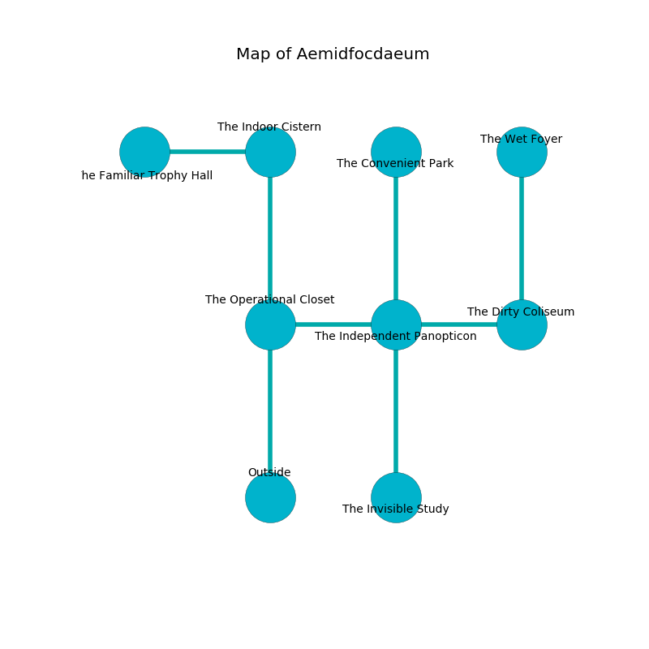

%Ruin Dogs

##Aemidfocdaeum
###Overview
Aemidfocdaeum is located under a cursed rift. Some areas of Aemidfocdaeum are inaccessible. A solar eclipse is happening outside. It is occupied by Cyclopses. Bianca Medeiros The Miserly, a Drow Priestess of Lolth is here. The Cyclopses are the slaves of Bianca Medeiros The Miserly. She  is trying to find [Iaddhabamd](#Iaddhabamd). 

###Artifact
####Iaddhabamd

Iaddhabamd looks like a glassy cube. It smells like gasoline. Magic flows away from it. When picked up it changes the past. 

###Locations

####the operational closet
The air smells like walnut here. Green razorgrass is swaying in a patch on the floor. 

There is an engraving on a stone written in Cyclopses Script. 

> I am sneaky.
>
> Maybe try hiding.
>

* To the east a small hallway leads to [the independent panopticon](#the-independent-panopticon).
* To the north a hazy pathway opens to [the indoor cistern](#the-indoor-cistern).
* To the south is the entrance.

####the independent panopticon
The crystal walls are pristine. There are a Medusa, a Kuo-Toa Monitor, and a Jackalwere here. 

* [Iaddhabamd](#Iaddhabamd) is here.
* To the west a small hallway opens to [the operational closet](#the-operational-closet).
* To the east a dark path opens to [the dirty coliseum](#the-dirty-coliseum).
* To the north a flooded hallway leads to [the convenient park](#the-convenient-park).
* To the south a twisted cavern leads to [the invisible study](#the-invisible-study).

####the dirty coliseum
Blue lichens are sprouting from the walls. The floor is glossy. The stone walls are bloodstained. There is a trap here. When activated, a magical proximity detector will shoot a lightning bolt. 

There is an engraving on a stone written in Cyclopses Script. 

> A lock is a return
>
> patient and ample
>
> but surprised
>
> A lock is a return
>

* There is a ring here.
* To the west a dark path leads to [the independent panopticon](#the-independent-panopticon).
* To the north a windy hallway leads to [the wet foyer](#the-wet-foyer).

####the wet foyer
The air tastes like green bean here. There are two Cyclopses here. The Cyclopses are drunk. 

* To the south a windy hallway leads to [the dirty coliseum](#the-dirty-coliseum).

####the indoor cistern
The air tastes like myrrh here. The obsidion walls are ruined. The floor is glossy. 

* [Bianca Medeiros The Miserly](#Bianca-Medeiros-The-Miserly) is here.
* To the west a small cave connects to [the familiar trophy hall](#the-familiar-trophy-hall).
* To the south a hazy pathway opens to [the operational closet](#the-operational-closet).

####the convenient park
There are a Salamander, a Pentadrone, and a Dust Mephit here. The metallic walls are caving in. 

There is an engraving on the floor written in Cyclopses Script. 

> Dig here.
>

* To the south a flooded hallway opens to [the independent panopticon](#the-independent-panopticon).

####the familiar trophy hall
The air tastes like rancid butter here. There are two Cyclopses here. Gray ferns are growing in a patch on the floor. The stone walls are unsettled. The floor is bloodstained. The Cyclopses are crazy with bloodlust. 

* To the east a small cave opens to [the indoor cistern](#the-indoor-cistern).

####the invisible study
The air tastes like osmanthus here. There are two Cyclopses here. The floor is bloodstained. If the Cyclopses notice the Ruin Dogs, one of them will retreat and alert the others. 

* To the north a twisted cavern opens to [the independent panopticon](#the-independent-panopticon).

