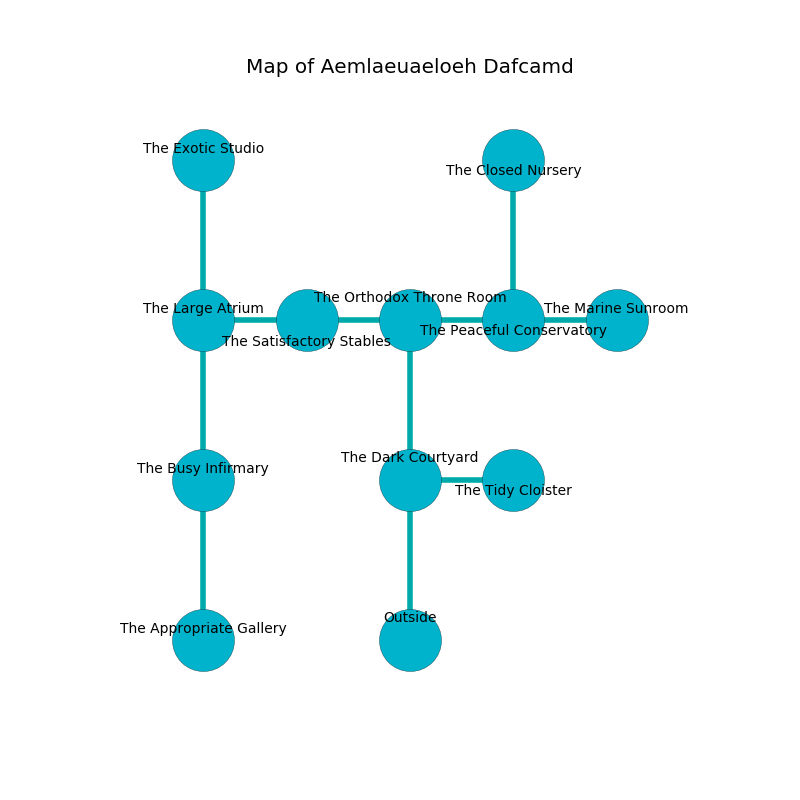

%Ruin Dogs

##Aemlaeuaeloeh Dafcamd
###Overview
Aemlaeuaeloeh Dafcamd is located on a crystal city. Some areas of it are frozen. The ruin is burning. It is occupied by Harpies. Pat Goss The Domineering, a Cambion is here. The Harpies worship Pat Goss The Domineering. He  is trying to hide [Dfucalofa](#Dfucalofa). 

###Artifact
####Dfucalofa

Dfucalofa has the form of a wet sphere. When held it changes the past. 

###Locations

####the dark courtyard
The concrete walls are ruined. White ferns are decaying from the walls. There are four Harpies here. The Harpies are fighting amongst themselves. 

* To the east a dark passageway opens to [the tidy cloister](#the-tidy-cloister).
* To the north a long hall opens to [the orthodox throne room](#the-orthodox-throne-room).
* To the south is the entrance.

####the orthodox throne room
The floor is flooded with eight inch deep cold water. White ferns are swaying in cracks in the floor. There are a Gnoll Fang of Yeenoghu, a Minotaur, a Warhorse Skeleton, and a Panther here. 

* To the west a flooded opening connects to [the satisfactory stables](#the-satisfactory-stables).
* To the east a dark artery connects to [the peaceful conservatory](#the-peaceful-conservatory).
* To the south a long hall connects to [the dark courtyard](#the-dark-courtyard).

####the peaceful conservatory
There are a Weretiger and an Ogre here. The floor is smooth. 

* To the west a dark artery opens to [the orthodox throne room](#the-orthodox-throne-room).
* To the east a small hallway opens to [the marine sunroom](#the-marine-sunroom).
* To the north a dripping artery leads to [the closed nursery](#the-closed-nursery).

####the satisfactory stables
There are four Harpies here. The Harpies are performing a ritual. If not interrupted, [Pat Goss](#Pat-Goss) will be magically alarmed. 

* To the west a narrow hallway opens to [the large atrium](#the-large-atrium).
* To the east a flooded opening leads to [the orthodox throne room](#the-orthodox-throne-room).

####the closed nursery

There is an engraving on a stone written in common. 

> Dear me! sorry we
>
> dramatic, afraid, vicious
>
> but never free
>
> sadness is ambitious
>

* To the south a dripping artery leads to [the peaceful conservatory](#the-peaceful-conservatory).

####the large atrium
The brick walls are bloodstained. The floor is sticky. The air smells like tallow here. 

There is an engraving on a monolith written in Harpies Script. 

> A pump is a brick
>
> yet historical
>
> happy, welcome, obvious
>
> A rail is a colleague
>
> liberal and proud
>
> careful, exact, tough
>
> you must never be frozen
>

* To the east a narrow hallway opens to [the satisfactory stables](#the-satisfactory-stables).
* To the north a hazy pathway leads to [the exotic studio](#the-exotic-studio).
* To the south a flooded gap connects to [the busy infirmary](#the-busy-infirmary).

####the busy infirmary
The stone walls are caving in. There are a Saber-Toothed Tiger and an Ogre Zombie here. The air smells like juniper here. The floor is sticky. 

* There is a boat here.
* [Dfucalofa](#Dfucalofa) is here.
* To the north a flooded gap connects to [the large atrium](#the-large-atrium).
* To the south a small path opens to [the appropriate gallery](#the-appropriate-gallery).

####the tidy cloister
There are four Harpies here. There is a trap here. When activated, a magical rune will flood the room with water. The metallic walls are ruined. The floor is smooth. The Harpies are performing a ritual. If not interrupted, a powerful monster will be summoned. 

There is an engraving on the ceiling written in common. 

> A tongue is a border
>
> always fair
>
> violent and sick
>
> close and financial
>
> but never distant
>
> but never traditional
>
> A tongue is a border
>

* To the west a dark passageway opens to [the dark courtyard](#the-dark-courtyard).

####the exotic studio
The air tastes like banana here. There are a Winter Wolf, an Octopus, a Slaad Tadpole, a Gnoll, a Poltergeist, a Scorpion, and a Piercer here. 

* To the south a hazy pathway opens to [the large atrium](#the-large-atrium).

####the marine sunroom
The floor is flooded with four inch deep cold water. The air smells like phenolic here. 

There is an engraving on the wall written in Harpies Script. 

> A square is an analogy
>
> express, frozen, cruel
>
> A square is an analogy
>

* There is a brake here.
* [Pat Goss The Domineering](#Pat-Goss-The-Domineering) is here.
* To the west a small hallway leads to [the peaceful conservatory](#the-peaceful-conservatory).

####the appropriate gallery
Gray razorgrass is swaying from the walls. The floor is smooth. There are four Harpies here. The wooden walls are scratched. The air smells like naphthyl here. The Harpies are performing a ritual. If not interrupted, a powerful monster will be summoned. 

* To the north a small path connects to [the busy infirmary](#the-busy-infirmary).

