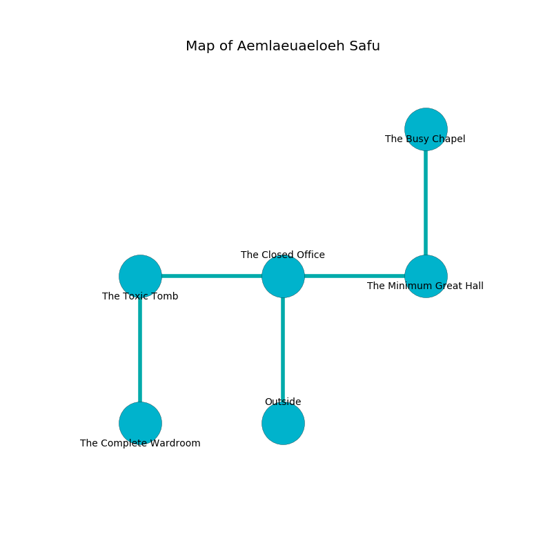

%Ruin Dogs

##Aemlaeuaeloeh Safu
###Overview
Aemlaeuaeloeh Safu is located on a haunted plain. Parts of it are inaccessible. The ruin is coming to life. It is occupied by Goblins. Tobie Howerton The Compulsive, a Cyclops is here. The Goblins are ruled by Tobie Howerton The Compulsive. She  is trying to destroy [Muoiaiaaega Defela](#Muoiaiaaega-Defela). 

###Artifact
####Muoiaiaaega Defela

Muoiaiaaega Defela is a powerful artifact in the shape of a wet cube. It is a bright green color. It smells like oak wood. When carried it turns surrounding objects to ashes. 

###Locations

####the closed office
There is a trap here. When activated, a pressure plate will fire a scything blade. Blue moss is sprouting in a patch on the floor. The floor is bloodstained. 

* [Tobie Howerton The Compulsive](#Tobie-Howerton-The-Compulsive) is here.
* To the west a twisted pathway connects to [the toxic tomb](#the-toxic-tomb).
* To the east a small threshold leads to [the minimum great hall](#the-minimum-great-hall).
* To the south is the entrance.

####the minimum great hall
There are a Goblin, a Hobgoblin, a Hobgoblin Captain, and a Hobgoblin Warlord here. The floor is flooded with two inch deep hot water. The Goblins are berserk with rage. 

There is an engraving on a stone written in common. 

> We are joyful
>
> surprised, grand, strange
>
> you are crystalized
>

* To the west a small threshold connects to [the closed office](#the-closed-office).
* To the north a narrow hall opens to [the busy chapel](#the-busy-chapel).

####the busy chapel
The air smells like cheese here. White mushrooms are sprouting from the ceiling. 

* There is an orb here.
* To the south a narrow hall connects to [the minimum great hall](#the-minimum-great-hall).

####the toxic tomb
The floor is cluttered with rocks. Red lichens are swaying in broken urns. 

* [Muoiaiaaega Defela](#Muoiaiaaega-Defela) is here.
* To the east a twisted pathway opens to [the closed office](#the-closed-office).
* To the south a dripping corridor leads to [the complete wardroom](#the-complete-wardroom).

####the complete wardroom
Green mushrooms are sprouting from the walls. There are an Aarakocra, a Spined Devil, and a Shadow Demon here. 

There is an engraving on the ceiling written in common. 

> Maybe try dying.
>

* To the north a dripping corridor opens to [the toxic tomb](#the-toxic-tomb).

