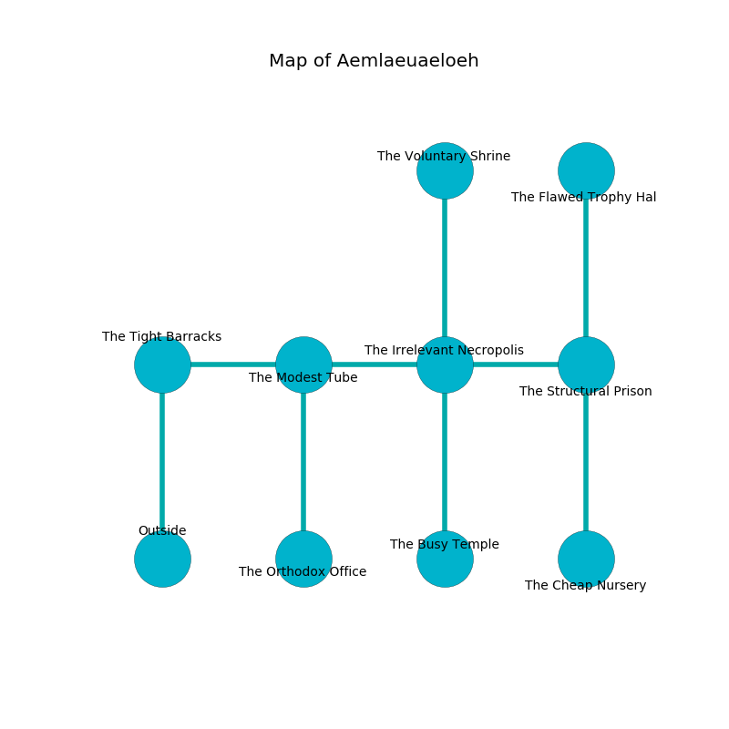

%Ruin Dogs

##Aemlaeuaeloeh
###Overview
Aemlaeuaeloeh is located on a haunted city. Some areas of it are frozen. A battle between raiders is happening outside. It is occupied by Orcs. Emile Finney The Gullible, a Gnoll Pack Lord is here. The Orcs are the soldiers of Emile Finney The Gullible. He  is trying to discover [The Enjoyable Multimedia](#The-Enjoyable-Multimedia). 

###Artifact
####The Enjoyable Multimedia

The Enjoyable Multimedia has the form of a sharp gem. It smells like sassafrass. Psychic energy incinerates away from it. When smelled it grants a wish. 

###Locations

####the tight barracks
The floor is bloodstained. The air tastes like elderberry here. 

* There is a bee here.
* [Emile Finney The Gullible](#Emile-Finney-The-Gullible) is here.
* To the east a dark gap connects to [the modest tube](#the-modest-tube).
* To the south is the entrance.

####the modest tube
There are two Orc Eyes of Gruumsh here. The floor is flooded with seven inch deep hot water. The Orcs are crazy with bloodlust. 

* To the west a dark gap leads to [the tight barracks](#the-tight-barracks).
* To the east a flooded hallway connects to [the irrelevant necropolis](#the-irrelevant-necropolis).
* To the south a small cavern opens to [the orthodox office](#the-orthodox-office).

####the irrelevant necropolis
Blue lichens are decaying in a patch on the floor. There are two Orc Eyes of Gruumsh here. The mirrored walls are bloodstained. The floor is sticky. The Orcs are feasting. 

* There is a pig here.
* There is a map here.
* There is a goblin here.
* To the west a flooded hallway leads to [the modest tube](#the-modest-tube).
* To the east a long hallway opens to [the structural prison](#the-structural-prison).
* To the north a narrow cave connects to [the voluntary shrine](#the-voluntary-shrine).
* To the south a twisted hallway connects to [the busy temple](#the-busy-temple).

####the voluntary shrine
The air tastes like the fresh outdoors here. 

* There is a horse here.
* To the south a narrow cave connects to [the irrelevant necropolis](#the-irrelevant-necropolis).

####the busy temple
There are two Orc Eyes of Gruumsh here. The floor is glossy. The Orcs are berserk with rage. 

* To the north a twisted hallway leads to [the irrelevant necropolis](#the-irrelevant-necropolis).

####the orthodox office
There are a Rug of Smothering and a Gargoyle here. The stone walls are covered in mold. 

* To the north a small cavern connects to [the modest tube](#the-modest-tube).

####the structural prison
The wooden walls are pristine. The floor is smooth. 

* [The Enjoyable Multimedia](#The-Enjoyable-Multimedia) is here.
* To the west a long hallway opens to [the irrelevant necropolis](#the-irrelevant-necropolis).
* To the north a small walkway leads to [the flawed trophy hall](#the-flawed-trophy-hall).
* To the south a torchlit hallway leads to [the cheap nursery](#the-cheap-nursery).

####the flawed trophy hall
The floor is bloodstained. The brick walls are ruined. There are two Orc Eyes of Gruumsh here. The Orcs are willing to negotiate. 

* To the south a small walkway leads to [the structural prison](#the-structural-prison).

####the cheap nursery
Red ferns are decaying from the walls. The metallic walls are covered in mold. There are two Orc Eyes of Gruumsh here. The Orcs are performing a ritual. If not interrupted, the ruin dogs will be weakened. 

* To the north a torchlit hallway connects to [the structural prison](#the-structural-prison).

