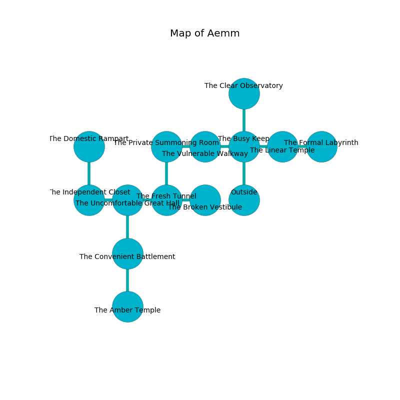

%Ruin Dogs

##Aemm
###Overview
Aemm is located in an alien rift. Regions of it are foggy. The ruin is coming to life. It is occupied by Ogres. Samatha Atkins The Rude, a Hobgoblin Warlord is here. The Ogres are battling Samatha Atkins The Rude. She  is trying to use [Cubdemwi Cmebdehma](#Cubdemwi-Cmebdehma). 

###Artifact
####Cubdemwi Cmebdehma

Cubdemwi Cmebdehma is a powerful artifact in the shape of a hard spear. It is a pale white color. Water glows towards it. When eaten it emits dust. 

###Locations

####the busy keep
The air tastes like praline here. 

* To the west a hazy pathway connects to [the vulnerable walkway](#the-vulnerable-walkway).
* To the east a windy pathway opens to [the linear temple](#the-linear-temple).
* To the north a dripping hallway opens to [the clear observatory](#the-clear-observatory).
* To the south is the entrance.

####the clear observatory
The wooden walls are scratched. There are three Ogres here. One of the Ogres is pointing a ballista at the entrance. 

* To the south a dripping hallway opens to [the busy keep](#the-busy-keep).

####the vulnerable walkway
The mirrored walls are ruined. The air tastes like spinach here. Red moss is growing in a patch on the floor. 

* To the west a flooded gap opens to [the private summoning room](#the-private-summoning-room).
* To the east a hazy pathway opens to [the busy keep](#the-busy-keep).

####the linear temple
There are a Lizard King, a Giant Weasel, and a Green Hag here. Red razorgrass is growing from the walls. The glass walls are pristine. 

There is an engraving on a monolith written in common. 

> Oh pitiful we
>
> historical and free
>
> always deep
>
> cruelty is cheap
>

* To the west a windy pathway opens to [the busy keep](#the-busy-keep).
* To the east a torchlit hall opens to [the formal labyrinth](#the-formal-labyrinth).

####the private summoning room
There are a Tribal Warrior, a Myconid Sovereign, and a Flesh Golem here. Yellow mushrooms are growing in a patch on the floor. The floor is bloodstained. 

* To the east a flooded gap opens to [the vulnerable walkway](#the-vulnerable-walkway).
* To the south a long walkway leads to [the fresh tunnel](#the-fresh-tunnel).

####the fresh tunnel
There are a Kuo-Toa Whip, a Stirge, a Draft Horse, a Giant Crab, a Panther, a Swarm of Insects, a Slaad Tadpole, a Dire Wolf, a Shrieker, a Giant Centipede, a Quaggoth Spore Servant, a Druid, and a Crocodile here. The floor is bloodstained. 

* To the west a dark pathway leads to [the uncomfortable great hall](#the-uncomfortable-great-hall).
* To the east a torchlit walkway leads to [the broken vestibule](#the-broken-vestibule).
* To the north a long walkway leads to [the private summoning room](#the-private-summoning-room).

####the uncomfortable great hall
Green ferns are decaying in broken urns. There are four Half-Ogres and an Ogre here. The wooden walls are pristine. One of the Ogres is on watch, the rest are meditating. 

* To the west a small cave connects to [the independent closet](#the-independent-closet).
* To the east a dark pathway opens to [the fresh tunnel](#the-fresh-tunnel).
* To the south a narrow hall connects to [the convenient battlement](#the-convenient-battlement).

####the broken vestibule
The air smells like camphoreous here. 

There is an engraving on a tablet written in common. 

> I am the best.
>

* [Samatha Atkins The Rude](#Samatha-Atkins-The-Rude) is here.
* To the west a torchlit walkway opens to [the fresh tunnel](#the-fresh-tunnel).

####the formal labyrinth
The air tastes like turmeric here. There is a trap here. When activated, a tripwire will flood the room with water. There are a Half-Ogre and three Ogres here. The Ogres are defending this room from intruders. 

* To the west a torchlit hall leads to [the linear temple](#the-linear-temple).

####the independent closet
There are two Sahuagin Barons here. The stone walls are ruined. Gray ferns are decaying in broken urns. The floor is bloodstained. 

* There is a casket here.
* [Cubdemwi Cmebdehma](#Cubdemwi-Cmebdehma) is here.
* To the east a small cave leads to [the uncomfortable great hall](#the-uncomfortable-great-hall).
* To the north a flooded gap opens to [the domestic rampart](#the-domestic-rampart).

####the convenient battlement
The floor is sticky. 

* There is a bowl here.
* To the north a narrow hall leads to [the uncomfortable great hall](#the-uncomfortable-great-hall).
* To the south a dripping artery leads to [the amber temple](#the-amber-temple).

####the amber temple
The obsidion walls are ruined. The floor is flooded with nine inch deep lukewarm water. 

There is an engraving on the floor written in common. 

> They are cursed
>
> balanced, mature, delicate
>

* To the north a dripping artery connects to [the convenient battlement](#the-convenient-battlement).

####the domestic rampart
The air smells like black currant here. The glass walls are ruined. Green ferns are decaying from the ceiling. There are two Half-Ogres and two Ogres here. The Ogres are willing to fight to the death. 

* To the south a flooded gap leads to [the independent closet](#the-independent-closet).

