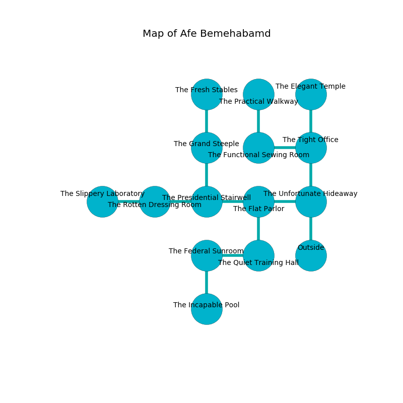

%Ruin Dogs

##Afe Bemehabamd
###Overview
Afe Bemehabamd is located in a poisoned rift. Some areas of it are flooded. A battle between raiders is happening outside. It is occupied by Duergars. Liane Mcvay The Secretive, a Fire Giant is here. The Duergars are battling Liane Mcvay The Secretive. She  is trying to destroy [Dfewiaf Dedaf](#Dfewiaf-Dedaf). 

###Artifact
####Dfewiaf Dedaf

Dfewiaf Dedaf looks like a cold monument. Water incinerates away from it. When worshipped it dissappears. 

###Locations

####the unfortunate hideaway
The obsidion walls are pristine. White ferns are decaying in cracks in the floor. There are ten Duergars here. The Duergars are defending this room from intruders. 

* [Liane Mcvay The Secretive](#Liane-Mcvay-The-Secretive) is here.
* To the west a narrow hallway connects to [the flat parlor](#the-flat-parlor).
* To the north a long corridor leads to [the tight office](#the-tight-office).
* To the south is the entrance.

####the tight office
The floor is cluttered with rocks. The air tastes like musk here. The mirrored walls are caving in. 

* To the west a dripping pathway opens to [the functional sewing room](#the-functional-sewing-room).
* To the north a flooded artery connects to [the elegant temple](#the-elegant-temple).
* To the south a long corridor opens to [the unfortunate hideaway](#the-unfortunate-hideaway).

####the flat parlor
The concrete walls are covered in mold. There are ten Duergars here. Green lichens are growing in a patch on the floor. The air smells like currant bud here. The floor is cluttered with shells. The Duergars are celebrating. 

There is an engraving on the wall written in Duergars Script. 

> Dig here.
>

* To the west a flooded opening leads to [the presidential stairwell](#the-presidential-stairwell).
* To the east a narrow hallway connects to [the unfortunate hideaway](#the-unfortunate-hideaway).
* To the south a dripping opening opens to [the quiet training hall](#the-quiet-training-hall).

####the presidential stairwell
The air tastes like banana here. There are a Quaggoth Spore Servant, a Gnoll Pack Lord, and a Githyanki Knight here. 

* To the west a torchlit gap connects to [the rotten dressing room](#the-rotten-dressing-room).
* To the east a flooded opening opens to [the flat parlor](#the-flat-parlor).
* To the north a windy path connects to [the grand steeple](#the-grand-steeple).

####the rotten dressing room
White razorgrass is swaying in cracks in the floor. There are ten Duergars here. If the Duergars notice the Ruin Dogs, one of them will retreat and alert the others. 

* [Dfewiaf Dedaf](#Dfewiaf-Dedaf) is here.
* To the west a torchlit pathway opens to [the slippery laboratory](#the-slippery-laboratory).
* To the east a torchlit gap leads to [the presidential stairwell](#the-presidential-stairwell).

####the quiet training hall
The air smells like unripe banana here. There are a Satyr, a Mezzoloth, a Giant Goat, a Grick Alpha, a Myconid Adult, a Fire Snake, and a Giant Elk here. 

There is an engraving on the ceiling written in Duergars Script. 

> Go away.
>

* To the west a twisted threshold leads to [the federal sunroom](#the-federal-sunroom).
* To the north a dripping opening connects to [the flat parlor](#the-flat-parlor).

####the functional sewing room
There are ten Duergars here. Yellow ferns are swaying from the walls. One of the Duergars is on watch, the rest are celebrating. 

* To the east a dripping pathway leads to [the tight office](#the-tight-office).
* To the north a flooded hall leads to [the practical walkway](#the-practical-walkway).

####the grand steeple
There are a Red Slaad, a Shadow, a Guardian Naga, and a Flying Snake here. Gray razorgrass is decaying from the ceiling. 

* There is a baby here.
* To the north a dark pathway connects to [the fresh stables](#the-fresh-stables).
* To the south a windy path leads to [the presidential stairwell](#the-presidential-stairwell).

####the federal sunroom
The air tastes like water here. The brick walls are bloodstained. 

* There is an amulet here.
* There is a collar here.
* To the east a twisted threshold leads to [the quiet training hall](#the-quiet-training-hall).
* To the south a windy passageway opens to [the incapable pool](#the-incapable-pool).

####the practical walkway
The floor is smooth. The air tastes like smoke here. The brick walls are ruined. 

* There is a crossbow here.
* To the south a flooded hall leads to [the functional sewing room](#the-functional-sewing-room).

####the fresh stables
The air tastes like kiwi here. The stone walls are bloodstained. 

* To the south a dark pathway connects to [the grand steeple](#the-grand-steeple).

####the incapable pool
The air tastes like clove here. 

* To the north a windy passageway leads to [the federal sunroom](#the-federal-sunroom).

####the elegant temple
Gray razorgrass is decaying from the ceiling. The brick walls are unsettled. The floor is glossy. 

* There is a leaf here.
* To the south a flooded artery leads to [the tight office](#the-tight-office).

####the slippery laboratory
The floor is cluttered with shells. 

There is an engraving on the ceiling written in common. 

> All of us are free
>
> commercial and talented
>
> left and maximum
>
> All of us are free
>

* There is a fork here.
* To the east a torchlit pathway leads to [the rotten dressing room](#the-rotten-dressing-room).

