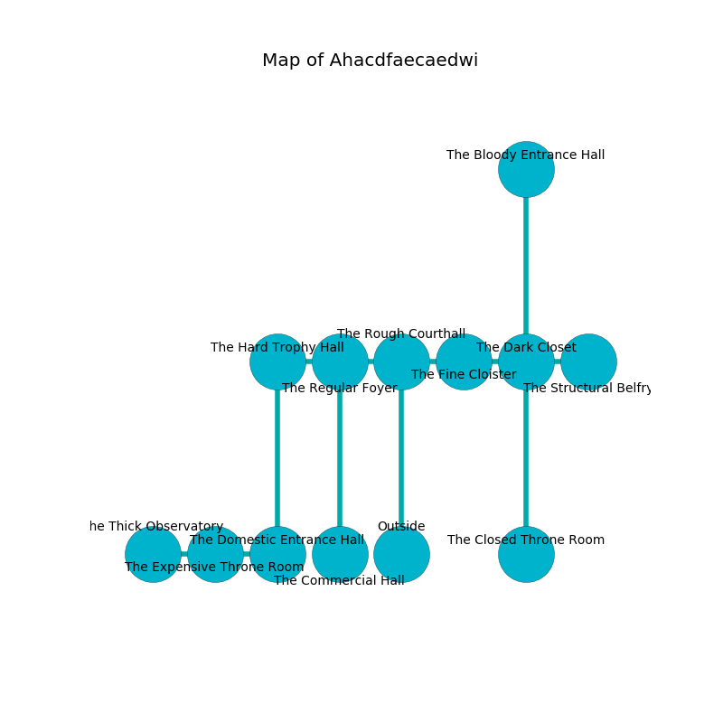

%Ruin Dogs

##Ahacdfaecaedwi
###Overview
Ahacdfaecaedwi is constructed on an alien mountain. Some areas of Ahacdfaecaedwi are flooded. A windstorm is happening outside. It is occupied by Githzerai. Odis Buck The Mean, a Vampire Spawn is here. The Githzerai are battling Odis Buck The Mean. He  is trying to discover [Lacela](#Lacela). 

###Artifact
####Lacela

Lacela looks like a hard figurine. Light shifts from it. When held it makes its owner invisible. 

###Locations

####the rough courthall
There are a Centaur, an Axe Beak, and a Grick here. Green razorgrass is decaying from the walls. 

* To the west a long cave connects to [the regular foyer](#the-regular-foyer).
* To the east a torchlit hall opens to [the fine cloister](#the-fine-cloister).
* To the south is the entrance.

####the regular foyer
The air smells like cornmeal here. White moss is swaying from the walls. The floor is cluttered with shells. The glass walls are scratched. There are two Githzerai Monks here. The Githzerai are feasting. 

* To the west a hazy corridor connects to [the hard trophy hall](#the-hard-trophy-hall).
* To the east a long cave connects to [the rough courthall](#the-rough-courthall).
* To the south a windy threshold leads to [the commercial hall](#the-commercial-hall).

####the fine cloister
The mirrored walls are caving in. The air tastes like praline here. There are two Githzerai Monks here. One of the Githzerai is pointing a ballista at the entrance. 

There is an engraving on the ceiling written in common. 

> A tongue is a disadvantage
>
> but vertical
>
> constant, mechanical, tasty
>
> you are loved
>

* To the west a torchlit hall opens to [the rough courthall](#the-rough-courthall).
* To the east a twisted walkway opens to [the dark closet](#the-dark-closet).

####the hard trophy hall
The air smells like rancid butter here. Red razorgrass is swaying from the ceiling. 

* There is a whistle here.
* To the east a hazy corridor leads to [the regular foyer](#the-regular-foyer).
* To the south a twisted cavern opens to [the domestic entrance hall](#the-domestic-entrance-hall).

####the commercial hall
The air smells like tomato here. White mushrooms are swaying in broken urns. 

* To the north a windy threshold opens to [the regular foyer](#the-regular-foyer).

####the dark closet
The glass walls are ruined. The air tastes like brandy here. 

* There is a comb here.
* There is an arch here.
* [Lacela](#Lacela) is here.
* To the west a twisted walkway connects to [the fine cloister](#the-fine-cloister).
* To the east a small walkway opens to [the structural belfry](#the-structural-belfry).
* To the north a narrow walkway connects to [the bloody entrance hall](#the-bloody-entrance-hall).
* To the south a torchlit gap leads to [the closed throne room](#the-closed-throne-room).

####the closed throne room
Green lichens are growing in cracks in the floor. The air smells like spice here. The floor is smooth. 

There is an engraving on a monolith written in Githzerai Script. 

> Oh my fate is sadistic
>
> it is never optimistic
>
> loose and live
>
> hope is alive
>

* To the north a torchlit gap leads to [the dark closet](#the-dark-closet).

####the structural belfry
There are a Hobgoblin, a Blue Dragon Wyrmling, and a Yeti here. 

* To the west a small walkway opens to [the dark closet](#the-dark-closet).

####the domestic entrance hall
There is a trap here. When activated, a pressure plate will launch an arrow. The air tastes like honey here. 

* [Odis Buck The Mean](#Odis-Buck-The-Mean) is here.
* To the west a windy opening connects to [the expensive throne room](#the-expensive-throne-room).
* To the north a twisted cavern leads to [the hard trophy hall](#the-hard-trophy-hall).

####the expensive throne room
The obsidion walls are scratched. The air tastes like plastic here. The floor is glossy. There are a Darkmantle, a Thri-Kreen, a White Dragon Wyrmling, and a Rust Monster here. 

There is an engraving on a tablet written in Githzerai Script. 

> Oh meak we
>
> yet never free
>
> yet molecular
>
> all is secular
>

* To the west a windy hallway connects to [the thick observatory](#the-thick-observatory).
* To the east a windy opening connects to [the domestic entrance hall](#the-domestic-entrance-hall).

####the thick observatory
The air smells like deertongue here. The floor is bloodstained. There is a trap here. When activated, a magical rune will fire a scything blade. The stone walls are caving in. Red moss is sprouting in cracks in the floor. 

* To the east a windy hallway opens to [the expensive throne room](#the-expensive-throne-room).

####the bloody entrance hall
There are two Githzerai Monks here. Blue razorgrass is growing in cracks in the floor. The Githzerai are caring for babies. 

* To the south a narrow walkway opens to [the dark closet](#the-dark-closet).

