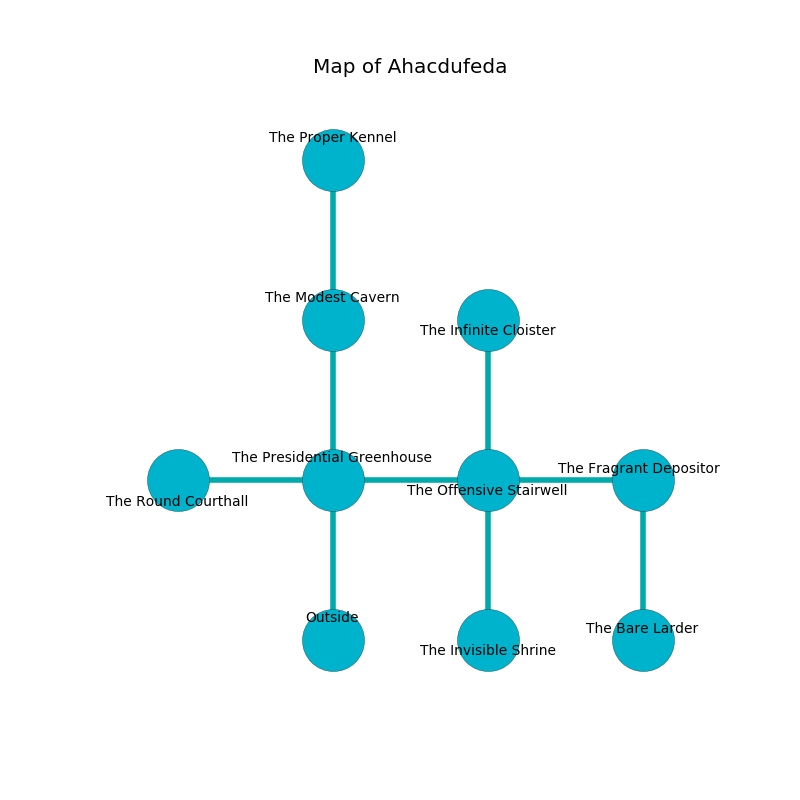

%Ruin Dogs

##Ahacdufeda
###Overview
Ahacdufeda is located in a broken mountain. Some rooms of it are flooded. The ruin is flooding. It is occupied by Pixies. Irving Toledo The Cynical, a Mage is here. The Pixies are battling Irving Toledo The Cynical. He  is founding a new religion. 

###Artifact
####The Romantic Collection

The Romantic Collection looks like a cold figurine. It smells like lily of the valley. When gazed upon it destroys others. 

###Locations

####the presidential greenhouse
There are twenty eight Pixies here. The air tastes like honey here. One of the Pixies is on watch, the rest are sleeping. 

* To the west a windy cave connects to [the round courthall](#the-round-courthall).
* To the east a long path opens to [the offensive stairwell](#the-offensive-stairwell).
* To the north a twisted cave connects to [the modest cavern](#the-modest-cavern).
* To the south is the entrance.

####the offensive stairwell
There is a trap here. When activated, a pressure plate will launch an arrow. Gray razorgrass is growing in a patch on the floor. 

* To the west a long path connects to [the presidential greenhouse](#the-presidential-greenhouse).
* To the east a hazy passageway leads to [the fragrant depository](#the-fragrant-depository).
* To the north a windy opening connects to [the infinite cloister](#the-infinite-cloister).
* To the south a dripping artery opens to [the invisible shrine](#the-invisible-shrine).

####the fragrant depository
The air smells like acai here. White moss is decaying in a patch on the floor. There are a Drow, a Beholder Zombie, a Bat, and an Awakened Tree here. The brick walls are caving in. 

There is an engraving on the ceiling written in common. 

> Maybe try digging.
>

* [The Romantic Collection](#The-Romantic-Collection) is here.
* [Irving Toledo The Cynical](#Irving-Toledo-The-Cynical) is here.
* To the west a hazy passageway opens to [the offensive stairwell](#the-offensive-stairwell).
* To the south a long corridor opens to [the bare larder](#the-bare-larder).

####the infinite cloister
The air smells like zedoary here. There are twenty eight Pixies here. The floor is sticky. If the Pixies notice the Ruin Dogs, one of them will retreat and alert the others. 

* To the south a windy opening connects to [the offensive stairwell](#the-offensive-stairwell).

####the invisible shrine
The metallic walls are bloodstained. Yellow lichens are sprouting from the ceiling. The air tastes like spinach here. 

* To the north a dripping artery opens to [the offensive stairwell](#the-offensive-stairwell).

####the modest cavern
The floor is flooded with six inch deep lukewarm water. The mirrored walls are unsettled. Blue moss is growing in broken urns. There are twenty eight Pixies here. The Pixies are defending this room from intruders. 

* To the north a dripping pathway leads to [the proper kennel](#the-proper-kennel).
* To the south a twisted cave leads to [the presidential greenhouse](#the-presidential-greenhouse).

####the round courthall
The floor is bloodstained. Blue razorgrass is swaying in cracks in the floor. 

There is an engraving on a stone written in common. 

> A gun is a rotation
>
> yet never thoughtful
>
> you will be returned
>

* To the east a windy cave leads to [the presidential greenhouse](#the-presidential-greenhouse).

####the proper kennel
There are twenty eight Pixies here. The floor is cluttered with shells. Red lichens are growing from the walls. The Pixies are willing to fight to the death. 

* To the south a dripping pathway opens to [the modest cavern](#the-modest-cavern).

####the bare larder
The glass walls are bloodstained. The floor is bloodstained. 

* To the north a long corridor leads to [the fragrant depository](#the-fragrant-depository).

