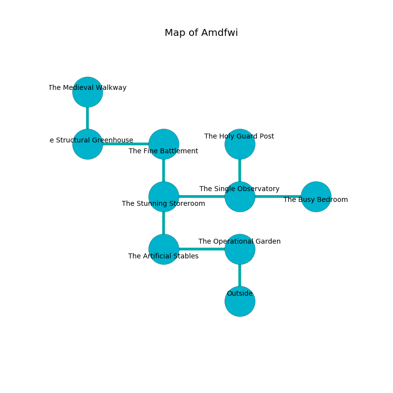

%Ruin Dogs

##Amdfwi
###Overview
Amdfwi is located on a flooded city. Regions of it are foggy. The ruin is burning. It is occupied by Githyanki. Allan High The Patronizing, a Cloud Giant is here. The Githyanki are ruled by Allan High The Patronizing. He  is trying to steal [Uefaeedaeum](#Uefaeedaeum). 

###Artifact
####Uefaeedaeum

Uefaeedaeum is a powerful artifact in the shape of a soft prism. It is a light orange color. Cacophony pours towards it. When held it turns surrounding objects to ashes. 

###Locations

####the operational garden
The stone walls are covered in mold. There are a Myconid Sprout, a Ghoul, a Giant Owl, a Giant Sea Horse, a Xorn, a Bugbear, and a Pegasus here. 

* To the west a hazy threshold leads to [the artificial stables](#the-artificial-stables).
* To the south is the entrance.

####the artificial stables
Gray lichens are decaying from the ceiling. The floor is cluttered with shells. The brick walls are covered in mold. There are a Kuo-Toa Whip, an Eagle, a Young White Dragon, an Acolyte, an Intellect Devourer, a Gnoll, and a Flying Sword here. 

* To the east a hazy threshold connects to [the operational garden](#the-operational-garden).
* To the north a torchlit artery connects to [the stunning storeroom](#the-stunning-storeroom).

####the stunning storeroom
Green moss is decaying in cracks in the floor. 

* To the east a torchlit corridor opens to [the single observatory](#the-single-observatory).
* To the north a long threshold opens to [the fine battlement](#the-fine-battlement).
* To the south a torchlit artery connects to [the artificial stables](#the-artificial-stables).

####the single observatory
White moss is swaying in broken urns. The obsidion walls are scratched. There are three Githyanki Warriors here. The floor is smooth. The Githyanki are performing a ritual. If not interrupted, [Allan High](#Allan-High) will be magically alarmed. 

* [Uefaeedaeum](#Uefaeedaeum) is here.
* [Allan High The Patronizing](#Allan-High-The-Patronizing) is here.
* To the west a torchlit corridor opens to [the stunning storeroom](#the-stunning-storeroom).
* To the east a torchlit path opens to [the busy bedroom](#the-busy-bedroom).
* To the north a dark walkway connects to [the holy guard post](#the-holy-guard-post).

####the fine battlement
Yellow razorgrass is swaying in cracks in the floor. There is a trap here. When activated, a magical rune will launch a fusillade of darts. There are three Githyanki Warriors here. The glass walls are covered in mold. One of the Githyanki is working a mechanism that can launch acid at the Ruin Dogs. 

There is an engraving on a tablet written in common. 

> Go away.
>

* To the west a dripping opening opens to [the structural greenhouse](#the-structural-greenhouse).
* To the south a long threshold leads to [the stunning storeroom](#the-stunning-storeroom).

####the busy bedroom
The floor is bloodstained. Green lichens are decaying in cracks in the floor. There are a Sprite, a Giant Lizard, a Giant Poisonous Snake, and a Fire Giant here. The brick walls are bloodstained. 

* To the west a torchlit path leads to [the single observatory](#the-single-observatory).

####the structural greenhouse
The stone walls are pristine. 

There is an engraving on a monolith written in Githyanki Script. 

> Leave at once.
>

* There is a hook here.
* To the east a dripping opening connects to [the fine battlement](#the-fine-battlement).
* To the north a windy hall connects to [the medieval walkway](#the-medieval-walkway).

####the medieval walkway
There are a Red Dragon Wyrmling, a Kuo-Toa Whip, and a Red Slaad here. White moss is decaying in cracks in the floor. 

* To the south a windy hall connects to [the structural greenhouse](#the-structural-greenhouse).

####the holy guard post
The stone walls are bloodstained. The floor is sticky. The air tastes like ylang here. Red mushrooms are sprouting in cracks in the floor. 

* There is a brake here.
* To the south a dark walkway leads to [the single observatory](#the-single-observatory).

