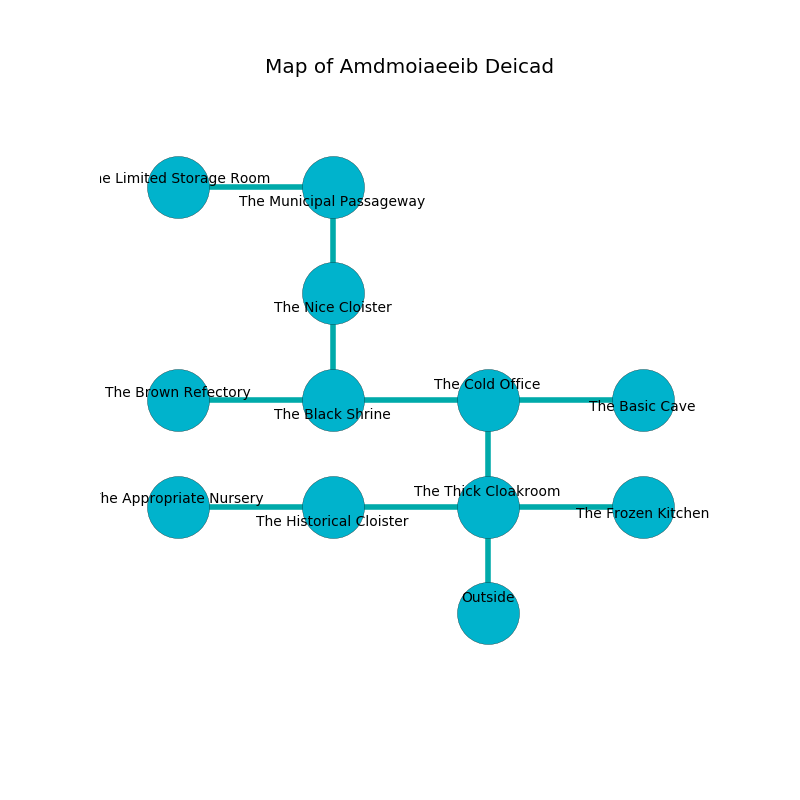

%Ruin Dogs

##Amdmoiaeeib Deicad
###Overview
Amdmoiaeeib Deicad is located in a flooded city. Some areas of Amdmoiaeeib Deicad are foggy. A lunar eclipse is happening outside. It is occupied by Cyclopses. Marci Lira The Mean, a Cloud Giant is here. The Cyclopses are ruled by Marci Lira The Mean. She  is founding a new religion. 

###Artifact
####The Restless Football

The Restless Football has the form of a glassy sphere. When worn it makes its owner invisible. 

###Locations

####the thick cloakroom
The crystal walls are bloodstained. The air smells like currant bud here. 

* There is a kettle here.
* To the west a narrow hallway connects to [the historical cloister](#the-historical-cloister).
* To the east a flooded hallway connects to [the frozen kitchen](#the-frozen-kitchen).
* To the north a hazy cavern opens to [the cold office](#the-cold-office).
* To the south is the entrance.

####the cold office
The air tastes like pimenta here. There are two Cyclopses here. The Cyclopses are willing to fight to the death. 

* There is a fish here.
* [The Restless Football](#The-Restless-Football) is here.
* To the west a dripping artery connects to [the black shrine](#the-black-shrine).
* To the east a dripping cave leads to [the basic cave](#the-basic-cave).
* To the south a hazy cavern leads to [the thick cloakroom](#the-thick-cloakroom).

####the black shrine
The floor is bloodstained. The air smells like apple skin here. There is a trap here. When activated, a magical rune will swing a tripping chain. 

* To the west a small path opens to [the brown refectory](#the-brown-refectory).
* To the east a dripping artery leads to [the cold office](#the-cold-office).
* To the north a twisted hallway leads to [the nice cloister](#the-nice-cloister).

####the historical cloister
Yellow lichens are swaying in cracks in the floor. There are two Cyclopses here. The Cyclopses are willing to negotiate. 

* There is a whistle here.
* There is a dress here.
* To the west a small walkway connects to [the appropriate nursery](#the-appropriate-nursery).
* To the east a narrow hallway leads to [the thick cloakroom](#the-thick-cloakroom).

####the frozen kitchen
The floor is cluttered with broken glass. The glass walls are bloodstained. Red lichens are swaying in broken urns. 

There is an engraving on the ceiling written in Cyclopses Script. 

> All of us are corrupted
>
> but faithful
>
> yet never integrated
>
> light and seasonal
>
> national and revolutionary
>
> you must never be hidden
>

* To the west a flooded hallway connects to [the thick cloakroom](#the-thick-cloakroom).

####the nice cloister
Red razorgrass is sprouting in broken urns. 

* To the north a flooded threshold leads to [the municipal passageway](#the-municipal-passageway).
* To the south a twisted hallway connects to [the black shrine](#the-black-shrine).

####the municipal passageway
Green moss is sprouting in a patch on the floor. The floor is sticky. 

* To the west a windy hall opens to [the limited storage room](#the-limited-storage-room).
* To the south a flooded threshold connects to [the nice cloister](#the-nice-cloister).

####the limited storage room
The air smells like bouillon here. White moss is sprouting in a patch on the floor. 

* To the east a windy hall opens to [the municipal passageway](#the-municipal-passageway).

####the appropriate nursery
The floor is cluttered with shells. Gray mushrooms are sprouting in cracks in the floor. 

* To the east a small walkway leads to [the historical cloister](#the-historical-cloister).

####the brown refectory
The floor is sticky. There is a trap here. When activated, a tripwire will make the ceiling slowly lower. The air tastes like egg yolk here. 

* There is an arch here.
* To the east a small path leads to [the black shrine](#the-black-shrine).

####the basic cave
Yellow razorgrass is swaying from the walls. The metallic walls are ruined. 

* [Marci Lira The Mean](#Marci-Lira-The-Mean) is here.
* To the west a dripping cave connects to [the cold office](#the-cold-office).

