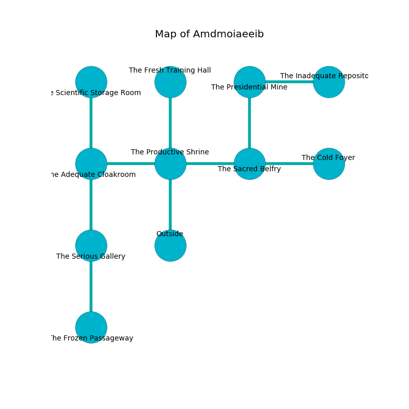

%Ruin Dogs

##Amdmoiaeeib
###Overview
Amdmoiaeeib is located under a giant rift. Regions of Amdmoiaeeib are flooded. A solar eclipse is happening outside. It is occupied by Giants. Claude Aiello The Stingy, a Drow Priestess of Lolth is here. The Giants are ruled by Claude Aiello The Stingy. He  is founding a new religion. 

###Artifact
####Dfuidacd

Dfuidacd is a powerful artifact in the shape of a soft blade. It smells like bitter orange. Light flows towards it. When held it grants power to its owner. 

###Locations

####the productive shrine
There is a Stone Giant here. Green moss is decaying in cracks in the floor. If the Stone Giant notice the Ruin Dogs, one of them will retreat and alert [Claude Aiello](#Claude-Aiello). 

* To the west a dark hall leads to [the adequate cloakroom](#the-adequate-cloakroom).
* To the east a torchlit opening opens to [the sacred belfry](#the-sacred-belfry).
* To the north a twisted pathway connects to [the fresh training hall](#the-fresh-training-hall).
* To the south is the entrance.

####the fresh training hall
The floor is flooded with five inch deep hot water. There is a trap here. When activated, a magical rune will launch a hail of needles. 

* To the south a twisted pathway opens to [the productive shrine](#the-productive-shrine).

####the adequate cloakroom

* To the east a dark hall leads to [the productive shrine](#the-productive-shrine).
* To the north a long threshold leads to [the scientific storage room](#the-scientific-storage-room).
* To the south a twisted gap leads to [the serious gallery](#the-serious-gallery).

####the sacred belfry
There are a Red Dragon Wyrmling, a Duergar, a Draft Horse, and an Air Elemental here. The air smells like carnation here. Green moss is swaying in broken urns. There is a trap here. When activated, a magical rune will extend a spring loaded spear. 

* To the west a torchlit opening leads to [the productive shrine](#the-productive-shrine).
* To the east a small gap opens to [the cold foyer](#the-cold-foyer).
* To the north a hazy gap connects to [the presidential mine](#the-presidential-mine).

####the presidential mine
The glass walls are bloodstained. The floor is sticky. Blue lichens are decaying in broken urns. There are a Giant Crocodile and a Griffon here. 

* [Claude Aiello The Stingy](#Claude-Aiello-The-Stingy) is here.
* To the east a small walkway connects to [the inadequate repository](#the-inadequate-repository).
* To the south a hazy gap connects to [the sacred belfry](#the-sacred-belfry).

####the cold foyer
Green lichens are swaying from the ceiling. The air tastes like spice here. There is a Stone Giant here. The metallic walls are bloodstained. The Stone Giant is willing to negotiate. 

There is an engraving on a tablet written in common. 

> I can not find [Dfuidacd](#Dfuidacd).
>
> Do not try swimming.
>

* There is a key here.
* To the west a small gap leads to [the sacred belfry](#the-sacred-belfry).

####the serious gallery
The air tastes like melon rind here. There are two Hill Giants here. The obsidion walls are pristine. The Giants are performing a ritual. If not interrupted, the ruin dogs will be weakened. 

There is an engraving on a stone written in common. 

> Maybe try fighting.
>

* [Dfuidacd](#Dfuidacd) is here.
* To the north a twisted gap leads to [the adequate cloakroom](#the-adequate-cloakroom).
* To the south a flooded path connects to [the frozen passageway](#the-frozen-passageway).

####the scientific storage room
There are a Silver Dragon Wyrmling, a Lizardfolk Shaman, a Crab, an Orc War Chief, and a Quadrone here. The floor is cluttered with rocks. 

There is an engraving on a tablet written in Giants Script. 

> I thought about running.
>

* To the south a long threshold opens to [the adequate cloakroom](#the-adequate-cloakroom).

####the inadequate repository
The air smells like pine here. 

There is an engraving on a monolith written in Giants Script. 

> I am hiding in Amdmoiaeeib.
>
> Do not try swimming.
>

* To the west a small walkway opens to [the presidential mine](#the-presidential-mine).

####the frozen passageway
There are two Hill Giants here. Blue lichens are decaying in a patch on the floor. The brick walls are unsettled. The Giants are willing to negotiate. 

* To the north a flooded path leads to [the serious gallery](#the-serious-gallery).

