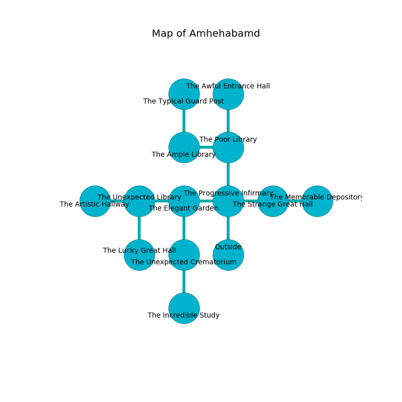

%Ruin Dogs

##Amhehabamd
###Overview
Amhehabamd is located under a spikey city. Some rooms of it are frozen. The ruin is collapsing slowly. It is occupied by Deep Gnomes. Neil Mcmullen The Gullible, an Assassin is here. The Deep Gnomes have been charmed by Neil Mcmullen The Gullible. He  is founding a new religion. 

###Artifact
####Maaehmduofmuul Chucc

Maaehmduofmuul Chucc is a powerful artifact in the shape of a soft cube. It smells like ginseng. When carried it illuminates its surroundings. 

###Locations

####the progressive infirmary
The floor is sticky. There are eighteen Deep Gnomes here. The Deep Gnomes are willing to negotiate. 

* There is a bee here.
* To the west a windy gap leads to [the elegant garden](#the-elegant-garden).
* To the east a hazy hall leads to [the strange great hall](#the-strange-great-hall).
* To the north a twisted hallway connects to [the poor library](#the-poor-library).
* To the south is the entrance.

####the strange great hall
Green lichens are growing from the walls. 

There is an engraving on the wall written in Deep Gnomes Script. 

> Dear me! the memory of you is woe
>
> impressive, aware, sweet
>
> it is always slow
>
> death is concrete
>

* [Neil Mcmullen The Gullible](#Neil-Mcmullen-The-Gullible) is here.
* To the west a hazy hall opens to [the progressive infirmary](#the-progressive-infirmary).
* To the east a windy pathway connects to [the memorable depository](#the-memorable-depository).

####the elegant garden

* To the west a windy hallway opens to [the unexpected library](#the-unexpected-library).
* To the east a windy gap opens to [the progressive infirmary](#the-progressive-infirmary).
* To the south a flooded pathway connects to [the unexpected crematorium](#the-unexpected-crematorium).

####the memorable depository
The obsidion walls are ruined. The air tastes like grilling here. The floor is cluttered with bones. 

* To the west a windy pathway connects to [the strange great hall](#the-strange-great-hall).

####the unexpected crematorium
The floor is flooded with nine inch deep hot water. There are an Imp, a Githzerai Zerth, a Pixie, a Sahuagin, a Bugbear Chief, and a Swarm of Bats here. The air smells like spice here. Red lichens are swaying in broken urns. 

* To the north a flooded pathway connects to [the elegant garden](#the-elegant-garden).
* To the south a dark cave leads to [the incredible study](#the-incredible-study).

####the poor library
Blue ferns are growing in a patch on the floor. The air smells like tomato here. There are eighteen Deep Gnomes here. One of the Deep Gnomes is pointing a ballista at the entrance. 

* To the west a long path leads to [the ample library](#the-ample-library).
* To the north a dripping cavern leads to [the awful entrance hall](#the-awful-entrance-hall).
* To the south a twisted hallway opens to [the progressive infirmary](#the-progressive-infirmary).

####the unexpected library
Yellow moss is sprouting from the ceiling. The floor is cluttered with bones. There are eighteen Deep Gnomes here. One of the Deep Gnomes is working a mechanism that can lock the exits. 

There is an engraving on the floor written in common. 

> Run away.
>

* To the west a hazy opening opens to [the artistic hallway](#the-artistic-hallway).
* To the east a windy hallway opens to [the elegant garden](#the-elegant-garden).
* To the south a flooded opening connects to [the lucky great hall](#the-lucky-great-hall).

####the ample library
The air tastes like chicken here. The wooden walls are ruined. 

There is an engraving on the floor written in Deep Gnomes Script. 

> O! terrible fate
>
> enthusiastic and great
>
> it is never right
>
> nothing is light
>

* [Maaehmduofmuul Chucc](#Maaehmduofmuul-Chucc) is here.
* To the east a long path opens to [the poor library](#the-poor-library).
* To the north a dripping passageway opens to [the typical guard post](#the-typical-guard-post).

####the lucky great hall
Gray ferns are growing from the ceiling. The concrete walls are pristine. 

* To the north a flooded opening opens to [the unexpected library](#the-unexpected-library).

####the artistic hallway
The floor is glossy. White lichens are swaying in broken urns. The mirrored walls are covered in mold. The air smells like tamarind here. 

* To the east a hazy opening connects to [the unexpected library](#the-unexpected-library).

####the incredible study
There are a Water Weird, a Hobgoblin Warlord, and a Gnoll here. Yellow ferns are decaying in broken urns. The air smells like mandarin here. The metallic walls are bloodstained. The floor is smooth. 

* To the north a dark cave leads to [the unexpected crematorium](#the-unexpected-crematorium).

####the awful entrance hall
The crystal walls are bloodstained. Green lichens are growing from the ceiling. There are eighteen Deep Gnomes here. The Deep Gnomes are willing to negotiate. 

* To the south a dripping cavern connects to [the poor library](#the-poor-library).

####the typical guard post
The air tastes like juice here. The floor is glossy. 

There is an engraving on a monolith written in common. 

> They are sorrowful
>
> yet artistic
>
> but never enjoyable
>
> holy and fair
>
> extraordinary and vacant
>
> All of us are cursed
>
> reasonable and productive
>
> but reliable
>
> They are sorrowful
>

* To the south a dripping passageway leads to [the ample library](#the-ample-library).

