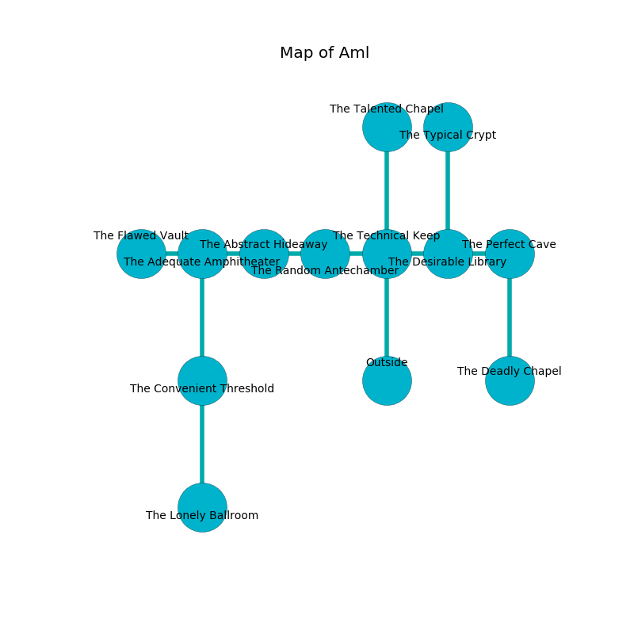

%Ruin Dogs

##Aml
###Overview
Aml is located under a poisoned mountain. Parts of Aml are incredibly hot. A blizzard is happening outside. It is occupied by Thri-Kreens. Mechelle Fite The Narrow-Minded, a Centaur is here. The Thri-Kreens are battling Mechelle Fite The Narrow-Minded. She  is founding a new religion. 

###Artifact
####Maeidufaeem

Maeidufaeem has the form of a soft doll. It smells like fir needle. When thrown it frightens children. 

###Locations

####the technical keep
The air tastes like lily here. 

* To the west a dripping artery opens to [the random antechamber](#the-random-antechamber).
* To the east a torchlit path leads to [the desirable library](#the-desirable-library).
* To the north a twisted opening leads to [the talented chapel](#the-talented-chapel).
* To the south is the entrance.

####the desirable library

* There is a feather here.
* [Mechelle Fite The Narrow-Minded](#Mechelle-Fite-The-Narrow-Minded) is here.
* To the west a torchlit path opens to [the technical keep](#the-technical-keep).
* To the east a windy opening opens to [the perfect cave](#the-perfect-cave).
* To the north a long corridor connects to [the typical crypt](#the-typical-crypt).

####the random antechamber
The floor is bloodstained. The air tastes like almond here. Blue lichens are growing from the ceiling. 

* There is a belt here.
* To the west a torchlit cave opens to [the abstract hideaway](#the-abstract-hideaway).
* To the east a dripping artery opens to [the technical keep](#the-technical-keep).

####the perfect cave
The floor is glossy. There is a trap here. When activated, a magical proximity detector will ring a bell. White moss is growing from the walls. 

* To the west a windy opening opens to [the desirable library](#the-desirable-library).
* To the south a long gap opens to [the deadly chapel](#the-deadly-chapel).

####the typical crypt
There is a trap here. When activated, a magical proximity detector will launch a poison dart. The obsidion walls are covered in mold. Blue mushrooms are sprouting in broken urns. 

* To the south a long corridor opens to [the desirable library](#the-desirable-library).

####the deadly chapel
Blue moss is decaying in a patch on the floor. There are three Thri-Kreens here. The glass walls are caving in. The Thri-Kreens are fighting amongst themselves. 

* To the north a long gap connects to [the perfect cave](#the-perfect-cave).

####the abstract hideaway
Red lichens are swaying in cracks in the floor. The floor is sticky. 

* To the west a dark cavern leads to [the adequate amphitheater](#the-adequate-amphitheater).
* To the east a torchlit cave leads to [the random antechamber](#the-random-antechamber).

####the adequate amphitheater
The floor is bloodstained. There are an Azer, a Sprite, a Flumph, and a Brass Dragon Wyrmling here. The air tastes like saffron here. The stone walls are covered in mold. Blue mushrooms are decaying from the ceiling. 

* There is a bucket here.
* To the west a torchlit opening connects to [the flawed vault](#the-flawed-vault).
* To the east a dark cavern leads to [the abstract hideaway](#the-abstract-hideaway).
* To the south a twisted hall leads to [the convenient threshold](#the-convenient-threshold).

####the flawed vault
The floor is smooth. Red mushrooms are decaying in a patch on the floor. The air smells like osmanthus here. The wooden walls are caving in. 

* To the east a torchlit opening leads to [the adequate amphitheater](#the-adequate-amphitheater).

####the convenient threshold
The air tastes like onion here. There is a trap here. When activated, a magical proximity detector will launch a fusillade of darts. 

There is an engraving on the floor written in common. 

> A tail is a flesh
>
> political, able, quiet
>
> A tail is a flesh
>

* [Maeidufaeem](#Maeidufaeem) is here.
* To the north a twisted hall connects to [the adequate amphitheater](#the-adequate-amphitheater).
* To the south a windy path leads to [the lonely ballroom](#the-lonely-ballroom).

####the talented chapel
The brick walls are ruined. The floor is cluttered with rocks. The air smells like raspberry here. 

* There is a berry here.
* To the south a twisted opening opens to [the technical keep](#the-technical-keep).

####the lonely ballroom
The obsidion walls are scratched. The floor is sticky. Gray lichens are decaying in a patch on the floor. The air tastes like myrrh here. 

* To the north a windy path connects to [the convenient threshold](#the-convenient-threshold).

