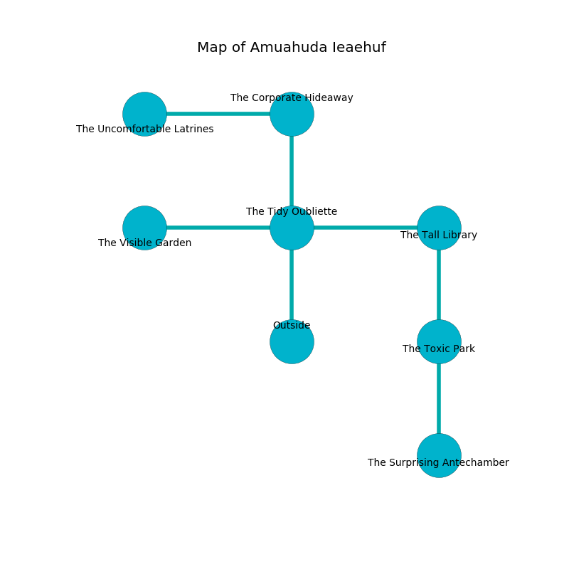

%Ruin Dogs

##Amuahuda Ieaehuf
###Overview
Amuahuda Ieaehuf is located under a broken city. Some rooms of Amuahuda Ieaehuf are foggy. A lunar eclipse is happening outside. It is occupied by Kuo-Toa. Emory Hargrave The Mean, a Bulette is here. The Kuo-Toa have been charmed by Emory Hargrave The Mean. He  is trying to destroy [Dfaecgeid](#Dfaecgeid). 

###Artifact
####Dfaecgeid

Dfaecgeid is a powerful artifact in the shape of a transparent rock. When thrown it sings the hymn of the damned. 

###Locations

####the tidy oubliette
The air tastes like clover here. The stone walls are caving in. There are two Kuo-Toa Whips, a Kuo-Toa Monitor, three Kuo-Toa,  here. One of the Kuo-Toa is pointing a ballista at the entrance. 

* There is a hook here.
* To the west a small artery opens to [the visible garden](#the-visible-garden).
* To the east a torchlit hall connects to [the tall library](#the-tall-library).
* To the north a dripping artery opens to [the corporate hideaway](#the-corporate-hideaway).
* To the south is the entrance.

####the corporate hideaway
The floor is sticky. There are a Triceratops and a Deer here. Green mushrooms are sprouting from the walls. 

* [Dfaecgeid](#Dfaecgeid) is here.
* To the west a twisted cave leads to [the uncomfortable latrines](#the-uncomfortable-latrines).
* To the south a dripping artery connects to [the tidy oubliette](#the-tidy-oubliette).

####the visible garden
There are two Kuo-Toa Monitors here. Gray razorgrass is swaying in broken urns. The floor is smooth. The Kuo-Toa are crazy with bloodlust. 

* To the east a small artery opens to [the tidy oubliette](#the-tidy-oubliette).

####the tall library
Yellow lichens are decaying in broken urns. There are a Minotaur, a Monodrone, and a Bearded Devil here. There is a trap here. When activated, a tripwire will open a trapdoor in the floor. The concrete walls are ruined. The air tastes like coriander here. 

* There is a gold coin here.
* To the west a torchlit hall connects to [the tidy oubliette](#the-tidy-oubliette).
* To the south a small hallway opens to [the toxic park](#the-toxic-park).

####the toxic park
The floor is bloodstained. There is a Night Hag here. 

* [Emory Hargrave The Mean](#Emory-Hargrave-The-Mean) is here.
* To the north a small hallway opens to [the tall library](#the-tall-library).
* To the south a small artery leads to [the surprising antechamber](#the-surprising-antechamber).

####the surprising antechamber
The floor is sticky. Yellow razorgrass is growing from the walls. The concrete walls are unsettled. 

* To the north a small artery leads to [the toxic park](#the-toxic-park).

####the uncomfortable latrines
Blue mushrooms are swaying in a patch on the floor. 

* To the east a twisted cave opens to [the corporate hideaway](#the-corporate-hideaway).

