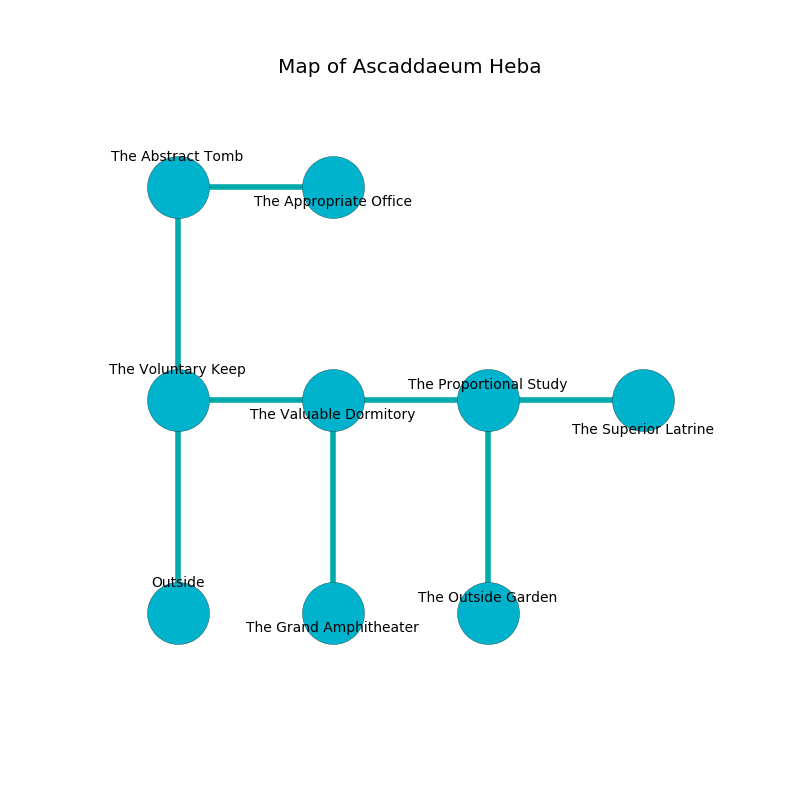

%Ruin Dogs

##Ascaddaeum Heba
###Overview
Ascaddaeum Heba is constructed on an obsidion plain. Some areas of Ascaddaeum Heba are somewhat cold. A windstorm is happening outside. It is occupied by Harpies. Raphael Arnold The Harsh, a Vampire Spawn is here. The Harpies are battling Raphael Arnold The Harsh. He  is founding a new religion. 

###Artifact
####Dmuduhfedmwi

Dmuduhfedmwi is a powerful artifact in the shape of a broken sphere. It smells like pomegranate. When touched it becomes lost. 

###Locations

####the voluntary keep

* To the east a flooded cavern leads to [the valuable dormitory](#the-valuable-dormitory).
* To the north a narrow path leads to [the abstract tomb](#the-abstract-tomb).
* To the south is the entrance.

####the valuable dormitory
Blue moss is growing in broken urns. The air smells like cucumber here. 

* There is a bird here.
* To the west a flooded cavern connects to [the voluntary keep](#the-voluntary-keep).
* To the east a dark cavern connects to [the proportional study](#the-proportional-study).
* To the south a twisted opening connects to [the grand amphitheater](#the-grand-amphitheater).

####the grand amphitheater

* To the north a twisted opening opens to [the valuable dormitory](#the-valuable-dormitory).

####the abstract tomb
The air smells like plum skin here. The metallic walls are caving in. 

* To the east a small passageway leads to [the appropriate office](#the-appropriate-office).
* To the south a narrow path opens to [the voluntary keep](#the-voluntary-keep).

####the proportional study
The floor is smooth. The air tastes like alfalfa here. There are four Harpies here. The brick walls are scratched. The Harpies are performing a ritual. If not interrupted, the ruin dogs will be weakened. 

* [Dmuduhfedmwi](#Dmuduhfedmwi) is here.
* To the west a dark cavern opens to [the valuable dormitory](#the-valuable-dormitory).
* To the east a small hall opens to [the superior latrine](#the-superior-latrine).
* To the south a twisted corridor leads to [the outside garden](#the-outside-garden).

####the appropriate office
The air smells like pine here. The floor is bloodstained. 

* To the west a small passageway leads to [the abstract tomb](#the-abstract-tomb).

####the superior latrine
Gray lichens are sprouting in a patch on the floor. The floor is sticky. There are four Harpies here. If the Harpies notice the Ruin Dogs, one of them will retreat and alert the others. 

* To the west a small hall opens to [the proportional study](#the-proportional-study).

####the outside garden
There are a Thug, a Will-O’-Wisp, a Constrictor Snake, and a Shadow Demon here. The air smells like watermelon here. Yellow mushrooms are swaying from the ceiling. 

* There is a fish here.
* [Raphael Arnold The Harsh](#Raphael-Arnold-The-Harsh) is here.
* To the north a twisted corridor opens to [the proportional study](#the-proportional-study).

