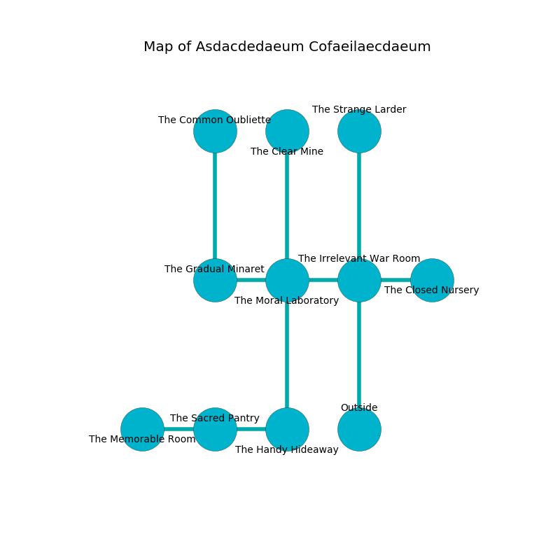

%Ruin Dogs

##Asdacdedaeum Cofaeilaecdaeum
###Overview
Asdacdedaeum Cofaeilaecdaeum is located on a poisoned rift. Some areas of it are flooded. The ruin is coming to life. It is occupied by Orc. Trevor Crouse The Impatient, a Myconid Sovereign is here. The Orc are ruled by Trevor Crouse The Impatient. He  is founding a new religion. 

###Artifact
####Faeca

Faeca is a powerful artifact in the shape of a wet blade. It is a shifting green color. When worn it burns the mind. 

###Locations

####the irrelevant war Room
The air smells like weed here. The mirrored walls are ruined. Green razorgrass is swaying in broken urns. 

* To the west a dark passageway leads to [the moral laboratory](#the-moral-laboratory).
* To the east a flooded cave opens to [the closed nursery](#the-closed-nursery).
* To the north a twisted hallway leads to [the strange larder](#the-strange-larder).
* To the south is the entrance.

####the moral laboratory
There are four Orcs here. The air smells like immortelle here. The metallic walls are unsettled. The floor is sticky. The Orc are performing a ritual. If not interrupted, [Trevor Crouse](#Trevor-Crouse) will be magically alarmed. 

* [Trevor Crouse The Impatient](#Trevor-Crouse-The-Impatient) is here.
* To the west a torchlit cave connects to [the gradual minaret](#the-gradual-minaret).
* To the east a dark passageway connects to [the irrelevant war Room](#the-irrelevant-war-Room).
* To the north a dripping gap leads to [the clear mine](#the-clear-mine).
* To the south a dripping passageway connects to [the handy hideaway](#the-handy-hideaway).

####the handy hideaway
The floor is glossy. Red razorgrass is swaying in cracks in the floor. The wooden walls are pristine. 

* To the west a dark passageway opens to [the sacred pantry](#the-sacred-pantry).
* To the north a dripping passageway connects to [the moral laboratory](#the-moral-laboratory).

####the strange larder
The floor is sticky. There are four Orcs here. The Orc are meditating. 

* There is a map here.
* To the south a twisted hallway opens to [the irrelevant war Room](#the-irrelevant-war-Room).

####the sacred pantry
The air smells like oakmoss here. There is a Poltergeist here. 

* [Faeca](#Faeca) is here.
* To the west a narrow opening connects to [the memorable room](#the-memorable-room).
* To the east a dark passageway opens to [the handy hideaway](#the-handy-hideaway).

####the gradual minaret
There is a trap here. When activated, a magical sound detector will launch a hail of needles. 

* To the east a torchlit cave leads to [the moral laboratory](#the-moral-laboratory).
* To the north a small cavern connects to [the common oubliette](#the-common-oubliette).

####the closed nursery
The glass walls are bloodstained. The floor is sticky. The air smells like sarsaparilla here. There are four Orcs here. One of the Orc is on watch, the rest are celebrating. 

* There is a cup here.
* To the west a flooded cave leads to [the irrelevant war Room](#the-irrelevant-war-Room).

####the clear mine
There is a trap here. When activated, a tripwire will launch an arrow. 

* To the south a dripping gap opens to [the moral laboratory](#the-moral-laboratory).

####the common oubliette
There are four Orcs here. One of the Orc is pointing a ballista at the entrance. 

There is an engraving on the ceiling written in Orc Script. 

> We are dying
>
> balanced and controversial
>

* To the south a small cavern connects to [the gradual minaret](#the-gradual-minaret).

####the memorable room
The crystal walls are scratched. Blue moss is decaying from the walls. The floor is glossy. The air smells like solvent here. There is a trap here. When activated, a pressure plate will blast flames. 

* To the east a narrow opening connects to [the sacred pantry](#the-sacred-pantry).

