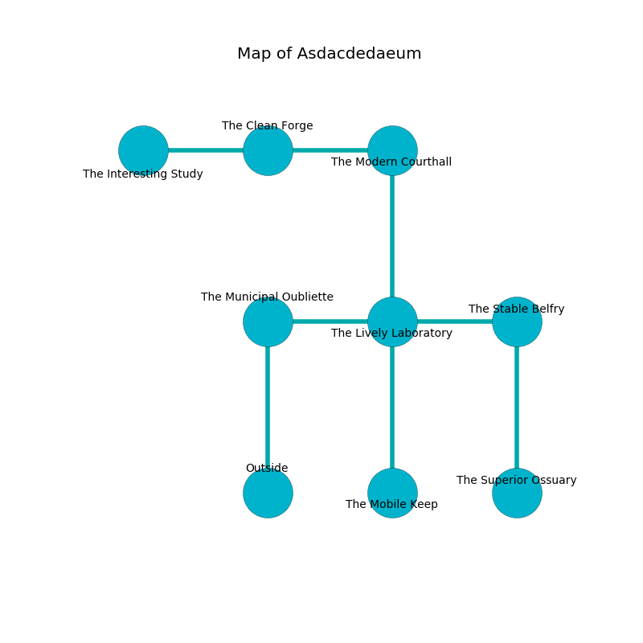

%Ruin Dogs

##Asdacdedaeum
###Overview
Asdacdedaeum is located on an alien plain. Parts of Asdacdedaeum are somewhat cold. A massive storm is happening outside. It is occupied by Satyrs. Monty Bender The Harsh, a Cult Fanatic is here. The Satyrs are ruled by Monty Bender The Harsh. He  is founding a new religion. 

###Artifact
####Doda Heduofaf

Doda Heduofaf is a powerful artifact in the shape of a hard blade. Gravity glows away from it. When gazed upon it becomes a shielding force. 

###Locations

####the municipal oubliette
Yellow lichens are sprouting from the ceiling. The air smells like graham cracker here. 

* There is a wand here.
* [Monty Bender The Harsh](#Monty-Bender-The-Harsh) is here.
* To the east a windy cave leads to [the lively laboratory](#the-lively-laboratory).
* To the south is the entrance.

####the lively laboratory
The floor is glossy. The air smells like oak wood here. There are six Satyrs here. The Satyrs are celebrating. 

* [Doda Heduofaf](#Doda-Heduofaf) is here.
* To the west a windy cave leads to [the municipal oubliette](#the-municipal-oubliette).
* To the east a flooded hall leads to [the stable belfry](#the-stable-belfry).
* To the north a twisted opening connects to [the modern courthall](#the-modern-courthall).
* To the south a windy walkway opens to [the mobile keep](#the-mobile-keep).

####the modern courthall
Green moss is swaying in cracks in the floor. There are six Satyrs here. The Satyrs are willing to negotiate. 

* To the west a twisted passageway connects to [the clean forge](#the-clean-forge).
* To the south a twisted opening connects to [the lively laboratory](#the-lively-laboratory).

####the clean forge
There is a trap here. When activated, a magical rune will open a large pit in the floor. The floor is flooded with six inch deep cold water. Red ferns are decaying in cracks in the floor. The concrete walls are unsettled. There are six Satyrs here. One of the Satyrs is pointing a ballista at the entrance. 

* To the west a dark path leads to [the interesting study](#the-interesting-study).
* To the east a twisted passageway leads to [the modern courthall](#the-modern-courthall).

####the stable belfry
There are six Satyrs here. The brick walls are ruined. Gray mushrooms are sprouting from the ceiling. The floor is cluttered with shells. If the Satyrs notice the Ruin Dogs, one of them will retreat and alert [Monty Bender](#Monty-Bender). 

* There is a bowl here.
* To the west a flooded hall connects to [the lively laboratory](#the-lively-laboratory).
* To the south a dripping walkway opens to [the superior ossuary](#the-superior-ossuary).

####the superior ossuary
The air smells like raw	reseda here. 

* To the north a dripping walkway opens to [the stable belfry](#the-stable-belfry).

####the interesting study
The floor is flooded with six inch deep scalding water. The metallic walls are bloodstained. The air tastes like rose here. 

* To the east a dark path opens to [the clean forge](#the-clean-forge).

####the mobile keep
There is a trap here. When activated, a magical rune will close a portcullis. The floor is smooth. Gray razorgrass is swaying in broken urns. 

There is an engraving on a monolith written in Satyrs Script. 

> I found [Doda Heduofaf](#Doda-Heduofaf).
>
> A trap ahead.
>

* There is a cart here.
* To the north a windy walkway opens to [the lively laboratory](#the-lively-laboratory).

